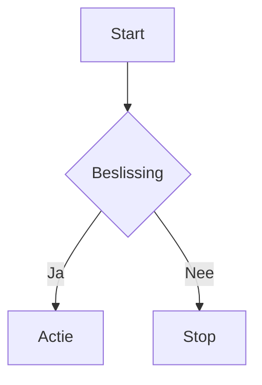

# LT-Wiki — Migration & Feature Update Log
**Datum:** 27 april 2026  
**Van:** Material for MkDocs → Zensical  

---

## Wat is er veranderd?

De wiki is gemigreerd van **Material for MkDocs** naar **Zensical** — de officiële opvolger van hetzelfde team. Alle 37 pagina's en 114 afbeeldingen zijn overgezet. De config is herschreven van `mkdocs.yml` naar `zensical.toml`.

---

## Nieuwe features voor contributors

### 1. Mermaid diagrammen

Schrijf diagrammen direct in Markdown. Geen plaatjes nodig.

````markdown

````

**Ondersteunde types:** `flowchart`, `sequenceDiagram`, `classDiagram`, `stateDiagram`, `gantt`, `pie`, `gitGraph`

Gebruikt op: `2_basisvaardigheden/2_1_gevechtsorde.md`, `2_2_reageren_op_contact.md`, `3_vuurteam_rollen/3_4_medic.md`

---

### 2. Admonitions (waarschuwingsblokken)

````markdown
!!! note "Titel"
    Tekst hier.

!!! warning "Opgelet"
    Tekst hier.

!!! danger "Gevaar"
    Tekst hier.

!!! tip "Tip"
    Tekst hier.

!!! info "Info"
    Tekst hier.

!!! success "Gelukt"
    Tekst hier.

!!! failure "Fout"
    Tekst hier.
````

**Inklapbaar** (standaard open):
````markdown
??? note "Klik om te openen"
    Verborgen inhoud.
````

**Inklapbaar** (standaard gesloten):
````markdown
???+ note "Standaard open"
    Zichtbare inhoud.
````

---

### 3. Tabbladen in content

````markdown
=== "Tab 1"
    Inhoud van tab 1.

=== "Tab 2"
    Inhoud van tab 2.
````

Tabs van hetzelfde label klikken op alle pagina's tegelijk door (`content.tabs.link` feature).

---

### 4. Kaartgrids (card grids)

````markdown
<div class="grid cards" markdown>

- :fontawesome-solid-user: **Titel kaart**

    ---

    Beschrijving van de kaart.

    [Meer info](pad/naar/pagina.md)

</div>
````

Gebruikt op alle 7 sectie-indexpagina's.

---

### 5. Generieke grids (twee kolommen)

````markdown
<div class="grid" markdown>

Linkerkolom inhoud.

Rechterkolom inhoud.

</div>
````

Bruikbaar voor admonitions naast elkaar, tabellen, tekst.

---

### 6. Code blokken met annotaties

````markdown
```python
code_hier = True  # (1)!
```

1. Dit is een annotatie bij regel 1.
````

Kopieerknop staat standaard aan op alle code blocks.

---

### 7. Voetnoten

```markdown
Dit is tekst met een voetnoot.[^1]

[^1]: De voetnoot verschijnt onderaan de pagina.
```

---

### 8. Toetsenbord-toetsen

```markdown
Druk op ++ctrl+alt+del++ om te herstarten.
```

Rendert als visuele toetsen.

---

### 9. Doorgestreept / gemarkeerd / superscript

```markdown
~~Doorgestreept~~
^^Onderstreept^^
==Gemarkeerd==
H~2~O (subscript)
X^2^ (superscript)
```

---

### 10. Inline afbeeldingen met uitlijning

```markdown
{ align=left }
{ align=right }
```

Zonder uitlijning: standaard gecentreerd met schaduw (via `custom.css`).

---

### 11. Sectie-indexpagina's

Elke sectie heeft nu een `index.md` die automatisch laadt als je op de sectietab klikt. Bewerk `docs/[sectie]/index.md` om de sectie-overzichtspagina aan te passen.

---

### 12. Instant link previews

Hover over interne links → floating preview kaart verschijnt zonder navigeren. Werkt automatisch, geen extra markup nodig.

---

### 13. Lichte/donkere modus toggle

Knop rechtsboven in de header. Gebruikers kunnen zelf wisselen. Standaard: donker (slate).

---

## Wijzigingen per bestand

| Bestand | Wijziging |
|---------|-----------|
| `zensical.toml` | Volledige herschrijving van `mkdocs.yml`. Navigatie, thema, extensies, social links. |
| `docs/custom.css` | Nieuwe CSS: compacte header, nav hover-effect, h1 oranje lijn, h2 scheidingslijn, kaartanimaties, scrollbar, tabel-styling, link-styling. |
| `docs/index.md` | Herschreven met LT-homepage inhoud + 2-kaart grid. |
| `docs/*/index.md` (×7) | Nieuwe sectie-indexpagina's met kaartgrids voor elke sectie. |
| `docs/2_basisvaardigheden/2_1_gevechtsorde.md` | Afbeelding vervangen door mermaid ORBAT-diagram. |
| `docs/2_basisvaardigheden/2_2_reageren_op_contact.md` | Mermaid ROE-flowchart toegevoegd + cross-links. |
| `docs/3_vuurteam_rollen/3_4_medic.md` | Mermaid triage-flowchart toegevoegd + cross-links. |
| `docs/4_voertuigen/4_4_heli_pilot.md` | Stub bijgewerkt naar `!!! warning "In ontwikkeling"` |
| `docs/4_voertuigen/4_5_jet_pilot.md` | Stub bijgewerkt naar `!!! warning "In ontwikkeling"` |
| `docs/5_speciale_rollen/5_3_sniper.md` | Stub bijgewerkt naar `!!! warning "In ontwikkeling"` |
| `docs/5_speciale_rollen/5_4_mortier.md` | Stub bijgewerkt naar `!!! warning "In ontwikkeling"` |

---

## Lokaal draaien

```bash
# Activeer de virtual environment (PowerShell)
.\.venv\Scripts\activate

# Start de lokale server
zensical serve
```

Wiki beschikbaar op: `http://localhost:8000`

---

## Navigatielabels aanpassen

Navigatielabels staan in `zensical.toml` onder `nav = [...]`. Paginanummers zijn bewust weggelaten uit de labels (enkel in bestandsnamen). Voorbeeld:

```toml
{"Gevechtsorde" = "2_basisvaardigheden/2_1_gevechtsorde.md"},
```

---

## Nieuwe pagina toevoegen

1. Maak `docs/[sectie]/bestand.md` aan met frontmatter:
   ```markdown
   ---
   layout: doc
   title: Paginatitel
   author: "Naam Auteur"
   date_created: "DD-MM-YYYY"
   date_updated: "DD-MM-YYYY"
   updated_by: "Naam"
   ---
   # Paginatitel
   ```
   Auteur/datum info verschijnt automatisch onderaan de pagina — geen `<span>` nodig.  
   Laat `date_updated` en `updated_by` weg als de pagina nog nooit bijgewerkt is.

2. Voeg de pagina toe aan `nav` in `zensical.toml`.
3. Sla op — de server herlaadt automatisch.
