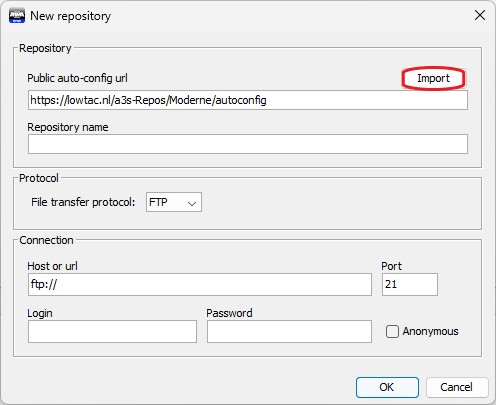
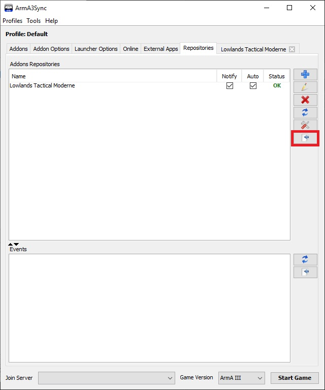
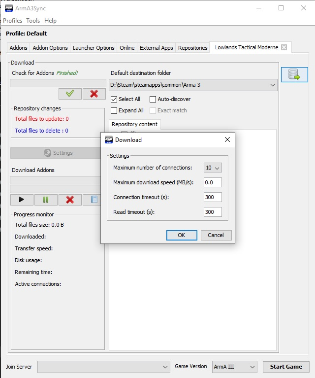
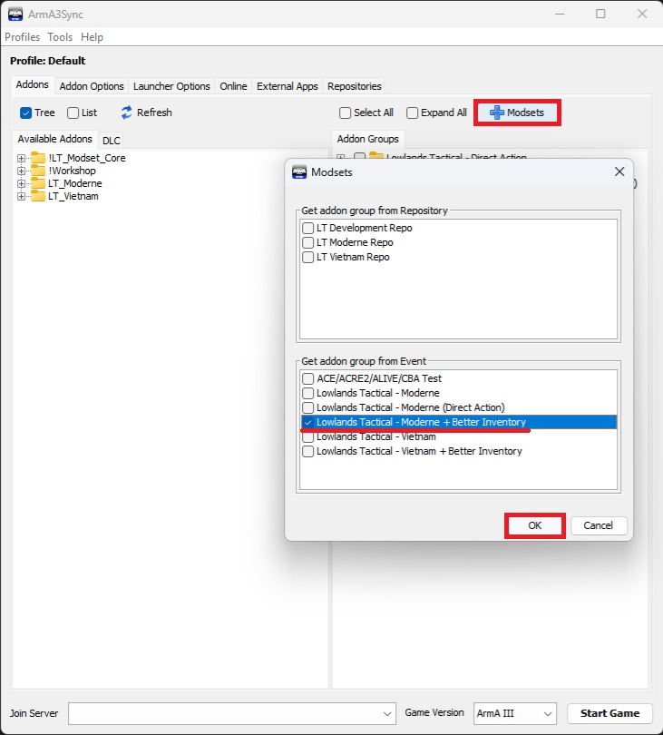
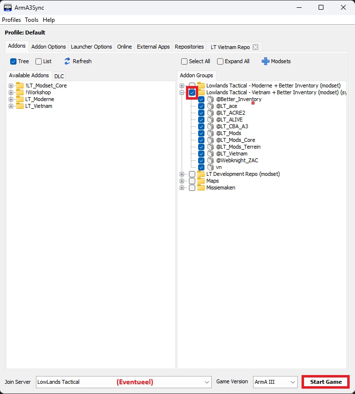

# 1.2. Modset Installeren
<span style="font-size:0.7em;">
    :fontawesome-solid-user: Auteur: **Brainless_Ben** | :material-calendar-plus: Aangemaakt: **26-08-2025**
</span>

Welkom bij de installatiehandleiding voor de Lowlands Tactical modset. Volg de onderstaande stappen zorgvuldig om je voor te bereiden op onze Arma 3-sessies.

## Benodigdheden

!!! warning "Voordat je begint, zorg ervoor dat je het volgende hebt:"
    - Een legale en werkende versie van Arma 3.
    - De volgende DLC's: APEX, Contact, Western Sahara, Global Mobilization, *Optioneel maar aanbevolen:* S.O.G. Prairie Fire
    - Een werkende headset.
    - Een Discord-account en toegang tot onze server.

## Voorbereiding

Voor je begint:

- Plan tijd in, de modset is ± 58 GB.
- Zorg dat je deze software hebt geïnstalleerd:
  - [TeamSpeak (64-bit)](https://www.teamspeak.com/en/downloads/#ts3client)
  - [Java (laatste versie)](https://java.com/getjava)
  - [Arma3Sync 1.7.102](https://arma3sync.lowtac.nl/Wiki/arma3sync-installer-1-7-102.exe)

!!! warning "Let op!"
    Wij gebruiken **geen** Steam Workshop-mods. Alleen onze eigen modset werkt met onze servers.

## Arma3Sync instellen

**Start Arma3Sync op**

- Bij eerste opstart: wijs de juiste `arma3.exe` of `arma3_x64.exe` aan.
- Vermijd `arma3battleye`, `arma3launcher`, of `arma3server`.


**Controleer installatielocatie**
- Ga naar **Addons Options**.
- Controleer of het pad naar je Arma 3-installatie klopt.


**Launcher-opties configureren**
Ga naar het tabblad **Launcher Options** en vink deze aan:

| Optie              | Effect                                                |
|--------------------|-------------------------------------------------------|
| No Pause           | Arma blijft draaien bij Alt+Tab                       |
| No Splash Screen   | Slaat splash screens over                             |
| Default World Empty| Geen map in hoofdmenu → snellere laadtijd             |


## Modset downloaden via Repository

1. Ga naar tab **Repositories**.
2. Klik op het blauwe plusje (+).
3. Voeg deze URL toe bij *Public auto-config url*: 

```text
https://arma3sync.lowtac.nl/a3s-Repos/Moderne/autoconfig
```


4. Klik op **Import**, dan **OK**.



**Verbind met de repository**
- Klik op **Connect to Repository**.



**Verhoog je downloadsnelheid**
- Klik op de grote settingsknop.
- Zet **Maximum number of connections** op **10**.



**Mods verifiëren en downloaden**
1. Klik op de groene **V** om bestaande mods te controleren.
2. Klik op **Select All**.
3. Start de download.


> ☕ Tijd voor koffie! Dit kan een tijd duren.

## Addongroep toevoegen

### Voeg de modset toe
1. Ga naar **Addons** tab.
2. Klik op de blauwe plus onder **Modsets**.
3. Kies **Lowlands Tactical - Moderne**, klik op **OK**.



### Standaardmenu herstellen
- Bij het opstarten kan het hoofdmenu in DLC-stijl staan.
- Ga naar **Options > Standaard Main Menu** en **Standaard Multiplayer Menu**.

## Server toevoegen (optioneel)

1. Ga naar het tabblad **Online**.
2. Klik op het blauwe plusje (+).
3. Vul de servergegevens in:

| Veld                | Waarde                |
|---------------------|------------------------|
| Description         | Lowlands Tactical      |
| IP Address          | games.lowtac.nl        |
| Port                | 2302                   |
| Password            | TacLow                 |
| Join with Modset    | ❌ Laat leeg            |


4. Ga terug naar **Addons** en selecteer de modset onderaan om alles in één keer te laden.

## Klaar om te spelen

Zorg dat bij het opstarten van Arma 3 de juiste opties zijn aangevinkt.


## Thema-repositories

Soms gebruiken we extra modsets voor thema-operaties.

### Vietnam Modset

Gebruik deze URL bij *Public auto-config url*:

```text
https://arma3sync.lowtac.nl/a3s-Repos/Vietnam/autoconfig
```

