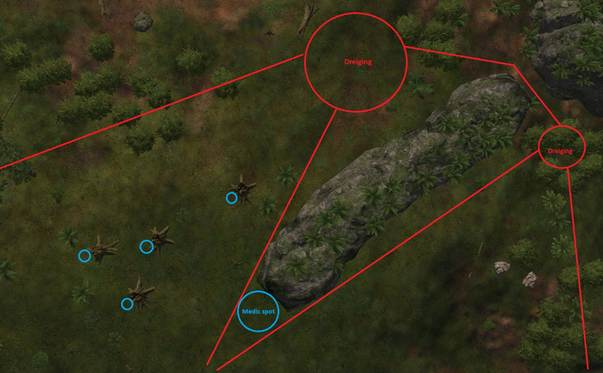
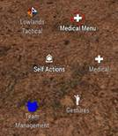
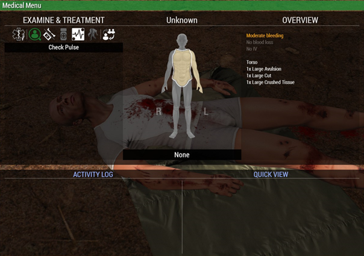
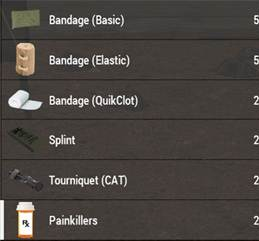
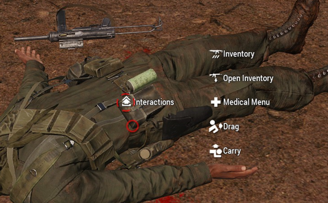
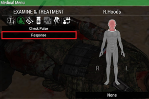

# 2.1. Basis EHBO

    :fontawesome-solid-user: Auteur: **R. Hoods** | :material-calendar-plus: Aangemaakt: **26-08-2025**

??? info
    In deze gids leer je over de basisbeginselen van het bieden van EHBO. We verwachten van alle spelers dat zij bekend zijn met simpele levensreddende handelingen. Zo kunnen ze zichzelf en anderen tijdelijk stabiliseren, tot de Medic dit later kan overnemen. Na het doornemen van deze gids en het volgen van de bijbehorende training heb je de volgende doelstellingen behaald. Daarnaast ontvang je een trainingsvinkje in de ledenlijst.

    -	De cursist weet dat eerst het vuurgevecht gevochten wordt, voordat er wordt gestart met medische handelingen.
    
    -	De cursist weet eerst een beschutte plek te zoeken, voordat gestart wordt met medische handelingen.

    -	De cursist weet zichzelf of een ander tijdelijk te stabiliseren om door te kunnen vechten, zodat later een Medic gezien kan worden.

    -	De cursist weet een gewonde of locatie waar een Medic nodig is met groene smoke te markeren.

    -	De cursist is bekend met het ACE-Medical Menu en dat je daar via H en ACE-interact kan komen.

    -	De cursist weet de functies van medische spullen.

    -	De cursist kan bij zichzelf of anderen bloedingen stoppen tijdens vuurcontact.

    -	De cursist kan bij zichzelf of anderen wonden verzorgen voor het zien van de Medic.

    -	De cursist kan bij zichzelf of anderen pijnmedicatie toedienen voor het zien van de Medic; morfine en painkillers.

    -	De cursist kan anderen reanimeren.

    -	De cursist kan anderen slepen of tillen.

    -	De cursist weet wanneer een speler nog te redden is en wanneer een speler dood (respawn) is.

## Jouw rol als vuurteamlid

Tijdens vuurgevechten kun je gewond raken. Toch is het overwicht houden in een vuurgevecht belangrijker dan direct starten met medische handelingen. Als meerdere mensen stoppen met schieten zal de vijand het vuurgevecht winnen. Dit kan juist leiden tot meerdere gewonden of een squad wipe.

Laat de vuurteamleider (VTL) weten dat je gewond bent en blijf vuur uitbrengen. Als er voldoende vuur uitgebracht wordt, kun je jezelf tijdelijk stabiliseren. Wanneer je kan starten met medische handelingen, zorg dan voor een beschutte plek. Een grote steen, dikke boomstronk, stenen muur, etc. kunnen voldoende bescherming bieden. Houd er rekening mee dat de vijand door o.a. houten muren kan schieten.

Gebruik het terrein en zorg voor een veilige werkplek:  

Stabiliseer jezelf eerst, voordat je direct een Medic om hulp roept. Met veel wonden kun je, na een 'quick fix', prima doorvechten. Als een teamlid neer is, geef dit dan door aan de VTL en Medic.

## Stabiliseren

Het uitvoeren van medische handelingen doe je in het Medical Menu. Open deze met `H` of via ACE-interact. Wanneer je close range naar een speler kijkt en op `H` drukt, krijg je het Medical Menu van diegene.

**Self interact:**

**Medical Menu:**  

- Links bovenin onder **EXAMINE & TREATMENT** kun je langs de verschillende medische handelingen klikken.  
- In het midden zie je de status van de gewonde. Je kan op alle lichaamsdelen drukken. Om het geselecteerde lichaamsdeel staat nu een witte rand. Gekleurde lichaamsdelen zijn gewond (licht geel → donkerrood).  
- Rechts bovenin zie je het **OVERVIEW**. Hier zie je per lichaamsdeel welke verwondingen er zijn en of deze nog open of dicht zijn.

## Basis EHBO gear

Elke infanterist draagt een beperkt aantal medische spullen op het lichaam of in het vest. Een Medic draagt veel meer supplies dan een voetsoldaat en beschikt daarnaast ook over Medic-specifieke gear.  

  

- **Bandage (Basic)**: Plaatsen op een lichaamsdeel met een wond.  
- **Bandage (Elastic)**: Plaatsen op een lichaamsdeel met een wond. *Vaak het meest effectief!*  
- **Bandage (QuikClot)**: Plaatsen op een lichaamsdeel met een wond.  
- **Splint**: Gebruik op een lichaamsdeel met een breuk.  
- **Tourniquet (CAT)**: Gebruik op arm/been om het bloeden tijdelijk te stoppen.  
- **Painkillers**: Gebruik op hoofd om pijn te bestrijden.  

## Stappenplan stabiliseren
1. Maak wonden op **borst en hoofd** dicht met Elastic Bandage / Field Dressing / QuikClot.  
2. Plaats een Tourniquet op gewonde armen of benen.  
3. Plaats een splint op gebroken benen (met gebroken arm kun je doorvechten).  

### Groene smoke

Groene smoke geeft een medische noodsituatie aan. Gebruiksvoorbeelden:  
- Vuurteamlid markeert locatie van een gewonde voor de Medic.  
- Medic geeft aan dat iemand neer is.  
- Medic markeert noodhospitaal.  
- Hoog in de lucht gooien om noodsituatie voor ander team te markeren.  

### Gewonden slepen of dragen

Verplaats gewonden alleen als dit veilig kan via:  
1. ACE-interact → `Drag` of `Carry`.  
2. Of druk `H` bij de gewonde → selecteer `Drag/Carry` in het Medical Menu.  

### Gewonde of dood (respawn)

- Druk op het hoofd van een speler → selecteer `Response` in het Medical Menu om status te checken.  
- Dode spelers: krijgen zwart triagelabel of bodybag. Ragdoll = dood.  
