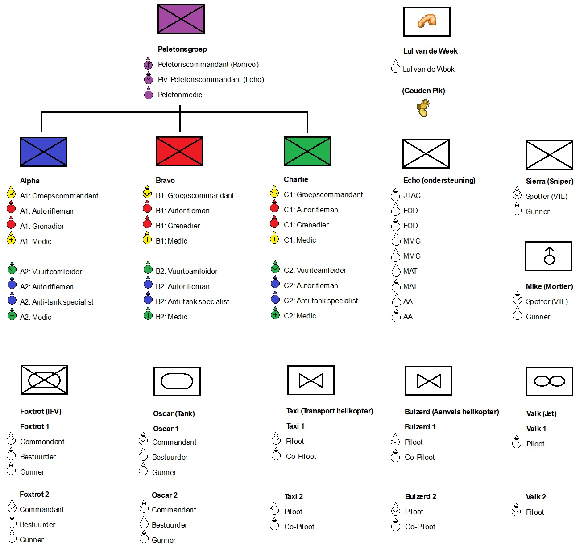

# 2.1. Gevechtsorde

    :fontawesome-solid-user: Auteur: **R.Hoods** | :material-calendar-plus: Aangemaakt: **03-04-2026** | :material-calendar-edit: Laatste update: **05-04-2026** door **R.Hoods**

## Gevechtsorde a.k.a. ORBAT
Bovenstaande afbeelding geeft de gevechtsorde, bij ons bekend als ORBAT, van LowTac weer. De ORBAT zijn de sloten die tijdens missies gekozen kunnen worden. De ORBAT is gebaseerd op de opbouw van een Nederlandse infanteriegroep, maar heeft wel een 'LowTac sausje' gekregen. Een missiemaker kan de ORBAT 'uitkleden' als dit beter past bij het scenario.

## Speelstijl
Bij LowTac spelen we tactisch en serieus, maar er is ook ruimte voor een geintje. Tijdens de missies en contactmomenten stellen we ons serieus en tactisch op. Tijdens gevechtspauzes is er ruimte voor een geintje. 
Voor de sessie kun je op Kamp Holland trainen, kloten, vliegen en rijden in de aangegeven zones. Zorg hierbij dat anderen geen last van je ondervinden.

!!! failure "Een geintje is anders dan kloten. Elkaar beschieten, gooien met smokes/granaten, overal op klimmen en soortgelijke acties worden niet gewaardeerd. Pas nadat de missie is gecalled door de admin, kun je jouw inventory legen."

## Chain of Command
    1. De **Peletonscommandant (Romeo)** heeft de leiding over de sessie. De PC bepaalt welke sloten er gekozen kunnen worden en maakt het grove plan. 
    2. De **plaatsvervangende Peletonscommandant (Echo)** kan geslot worden als second in command (2IC) en neemt de rol van PC over als deze neer gaat. Deze rol kan ook geslot worden door spelers die graag de rol van PC willen leren.
    3. De **Groepscommandant** heeft de leiding over een vuurteam van max. 8 spelers. De GC van Alpha neemt de rol van Romeo over als de peletonsgroep neer is. Bij splitsing van het vuurteam neemt de GC 4 spelers mee.
    4. De **Vuurteamleider** is 2IC van een vuurteam en neemt bij opsplitsing van het vuurteam 4 spelers mee.

Spotters, Voertuigcommandanten en Piloten hebben de leiding over hun team/voertuig.

## Manier om te slotten
De manier van slotten dient altijd afgestemd te worden op het spelersaantal. De Peletonscommandant wordt **altijd** en **als eerste** geslot. Er zijn meerdere manieren mogelijk. Hieronder enkele voorbeelden:
    - 8 man vuurteams: De volledige vuurteams worden opgevuld. De vuurteamleider is standaard de 2IC.
    - 6 man vuurteams: Er wordt besloten om twee sloten uit een vuurteam niet te vullen. Dit kan bijvoorbeeld één medic en één autorifleman zijn. De vuurteamleider en AT-specialist worden in dit geval een buddypaar.
    - 4 man vuurteams: Elk mini-team bestaat uit een Groepscommandant en 3 naar wens geslotte rollen. 
    - Extra ondersteuningsteam: Wanneer er een onhandig spelersaantal is kan er ook gekozen worden om een klein ondersteuningsteam met GC + enkele ondersteuningsrollen bij elkaar te klikken in bijvoorbeeld Charlie.

## Vuurteam
Een volledig gevuld vuurteam van 8 pax bestaat uit 4 buddyparen. Elk buddypaar heeft een eigen kleur: geel - rood - groen - blauw.
De Groepscommandant heeft de leiding over het gehele vuurteam en staat in contact met de Peletonscommandant.
De Vuurteamleider is de 2IC en heeft ook een communicatielijn naar de Peletonscommandant. De Vuurteamleider neemt de rol van GC over als deze neer gaat en stelt de PC dan in kennis.
Een vuurteam kan gemakkelijk opslitsen in twee groepjes van 4. De GC en VTL pakken dan beide de leiding (2x4) en hebben beide een eigen medic.

## Ondersteuning
Het Echo team is een ondersteuningsteam. Echo is bedoeld om aan te klikken bij een andere groep. Een Echo slot vervangt altijd een ander slot, zodat er teams van maximaal 8 spelers zijn.
    - J-TAC: Drone operator, communicatiespecialist en schakel tussen (lucht)voertuigen en de Peletonscommandant.
    - EOD (Explosieve OpruimingsDienst): Demolitie-expert, verantwoordelijk voor het opruimen van mijnen, breachen met explosieven en opblazen van verschillende doelen.
    - MMG (Medium Machine Gun): Autorifleman+. Rifleman met een extra groot groepswapen om extra vuursteun te bieden op de grond.
    - MAT (Medium Anti Tank): Anti-Tank specialist+. AT'er met een extra sterke AT-buis, die gepanserde voertuigen op afstand met lock kan uitschakelen.
    - AA (Anti Air): Rifleman met Anti Air launcher die de mogelijkheid heeft om helikopters en vliegtuigen uit de lucht te schieten.

## Lul van de Week
De Lul van de Week is een slot die je NIET wil. De lul van de week wordt aan het einde van elke sessie uitgedeeld aan degene die iets stoms heeft gedaan zoals; granaat in de groep laten ontploffen, klooien, teamkills, etc. Bij de volgende sessie moet je de Lul van de Week slot pakken en zul je een tijd met een 'Lul van de Week Vlag' op je tas lopen. Deze vlag hindert soms in je zicht.

## Gouden Pik
De Gouden Pik is geen slot, maar WEL iets wat je wil hebben. Het is een troffee die na elke sessie wordt doorgegeven aan degene die iets goeds heeft gedaan en een compliment verdient. De Gouden Pik van de week ervoor mag bepalend wie de troffee krijgt. Als de Gouden Pik van de week ervoor afwezig is, worden er nominaties gedaan en bepalen de meeste stemmen wie de Gouden Pik van de week wordt. 