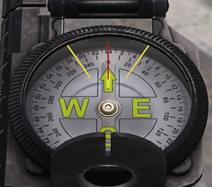
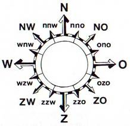
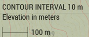

# 2.2. Navigeren

    :fontawesome-solid-user: Auteur: **R. Hoods** | :material-calendar-plus: Aangemaakt: **26-08-2025**

??? info
    In deze gids leer je over de basis van het navigeren. We verwachten dat iedereen kan navigeren, zodat je kan kaartlezen, kan communiceren over terrein en jij gemakkelijk je weg kan vinden. Na het doornemen van deze gids en het volgen van de bijbehorende training heb je de volgende doelstellingen behaald. Daarnaast ontvang je een trainingsvinkje in de ledenlijst.

    -	De cursist kan verschillende landschappen op de kaart herkennen; bossen, water, heuvels, stedelijk gebied, rotsen, bergen, wegen.

    -	De cursist kan hoogtelijnen lezen en waar nodig daarmee positie bepalen.

    -	De cursist kan markante punten (herkenningspunten) herkennen en waar nodig daarmee positie bepalen.

    -	De cursist kan (lucht)foto's vertalen naar posities op de kaart.

    -	De cursist kan zonder GPS bepalen waar hij is door het lezen van de omgeving.

    -	De cursist kan zonder GPS met kaart navigeren, eigen positie bijhouden of naar een gemarkeerd punt op de kaart navigeren.

    -	De cursist kan windrichtingen herkennen.

    -	De cursist weet hoe een kompasgraden werken; graden kunnen uitroepen of richting graden navigeren.

    -	De cursist weet hoe GRID-lijnen werken; een GRID bepalen op de kaart, coördinaat herkennen of bepalen en weet dat de rode marker hoogtelijnen aangeeft.

    -	De cursist kan door middel van de kaart afstand bepalen via de liniaal en GRID-lijnen.

    -	De cursist kan vijanden herkennen en intekenen op de kaart middels de kleur van de factie; OPFOR, BLUFOR, INDEP.

    -	De cursist kan uitgeschakelde vijanden aangeven op de kaart door; de marker zwart te maken of een kruis te plaatsen.

    -	De cursist weet dat een stip op een gebouw geplaatst wordt als deze gecleard is.

    -	De cursist kan gevaar herkennen op de kaart; omgeving gebruiken als dekking, ambush plekken herkennen, veilig bewegen door de omgeving.
    
    -	De cursist kan via beschutting naar een aangegeven locatie bewegen.

## Terreinherkenning
Door je omgeving te 'lezen' kun je jouw positie bepalen wanneer je een kaart hebt. Hier heb je geen GPS voor nodig. Zoek in de omgeving naar opvallende wegen, water, bossen of markante punten. Dit zijn referentiepunten die heel herkenbaar zijn op de kaart zoals een kerk, windmolen of watertoren. Deze techniek gebruik je ook als voetsoldaat, wanneer je geen GPS tot je beschikking hebt.

??? info "Voorbeeld 1"
    Herkenbaar = rotonde, waterstrook, scherpe bochten, gebouwen.
    
    

??? info "Voorbeeld 2"
    Herkenbaar = pier, zand- en verharde wegen, watertoren, hoofdgebouw, bebossing.
    
    

??? info "Voorbeeld 3"
    Herkenbaar = Tankstation, brug met klif, schuine helling i.r.t. hoogtelijnen.
    
    

## Hoogtelijnen
Op een kaart staan hoogtelijnen weergegeven. Hoe dichter deze lijnen bij elkaar zitten, hoe steiler het terrein zal zijn. Wanneer lijnen bijna op elkaar staan spreken we van een klif/afgrond. Door deze lijnen kun je de hoogte en vormen van heuvels inschatten.

## Kompas
Wanneer je een kompas hebt kun je de windrichtingen en graden bepalen. Het aantal graden kun je aflezen op jouw kompas bij de rode lijn. Een kaart is altijd gericht op het noorden. Dingen die hoger op de kaart staan, zijn dus noordelijker.

Noord – Oost – Zuid – West zijn de meest voorkomende windrichtingen. Tussen deze windrichtingen zitten nog verschillende specifiekere richtingen, zoals weergegeven op onderstaande afbeelding. 

## GRID Lijnen
Kaarten hebben een rastergrid. Dit zijn de dunne vierkante lijnen die samen een raster van vierkanten maken. Al deze lijnen hebben een nummer. Door deze te combineren en af te lezen krijg je een coördinaat en een bijbehorende vakje. De rode lijnen geven jouw cursor aan op de kaart. Daarbij staat een coördinaat vermeldt. Onder het coördinaat staan de hoogtemeters. Dit helpt je bij het snel aflezen van gegevens op de kaart en het bepalen van jouw hoogte.

*Blauwe nummers geven de rasterlijnen aan. Blauwe vierkant is bijbehorend rastergrid.*

### Liniaal en afstand bepalen
Rechts onderin de kaart staat een liniaal met een afstand. Hoe verder je inzoomt, hoe kleiner het aantal meters. Hiermee kun je, door ook de rasterlijnen te bekijken, een inschatting maken hoe ver iets weg is. Zo kun je bijvoorbeeld zonder rangefinder bepalen op hoeveel meter je jouw wapen of granade launcher moet instellen.

### Tekenen op de kaart

Op de kaart kun je gemakkelijk tekenen. Hierdoor kun je een plan maken en dingen aangeven op de kaart:  

- `Control + LMB`: lijn tekenen  
- `Control + Shift + LMB`: rechte lijn tekenen  
- `2x LMB`: marker (+ eventuele tekst en kleur) neerzetten  

We gebruiken de **BLUFOR**, **OPFOR** en **INDEP** kleuren om units van die factie aan te geven. Veelal betekent het daarom dat je vijanden weergeeft met de **OPFOR** kleur. Door een marker zwart te maken, kun je aangeven dat iets uitgeschakeld is. Gebruik waar nodig de optie *timestamp* om duidelijk te maken hoe laat iets ergens was.  

- Door **stippen op huizen** te zetten kun je aangeven dat een gebouw is gecleard.  
- Door **stippen met uitleg in vijandelijke kleur** neer te zetten kun je aangeven waar de vijand is en om wat voor vijand het gaat.  

*In dit voorbeeld zijn de blauwe en helder rode stippen geclearde huizen van de vuurteams. De vijand staat met OPFOR gemarkeerd. De lijnen geven looproutes aan. De 4x pax in het zwart is uitgeschakeld.*
