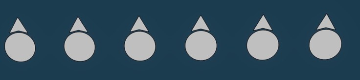
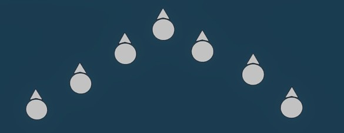
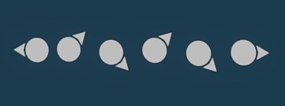
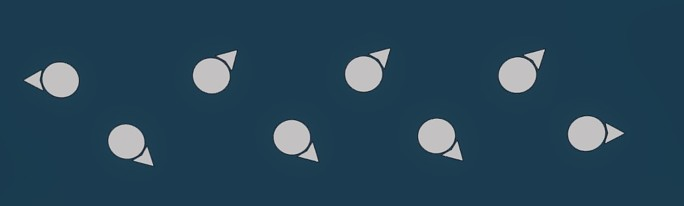

# 2.4. Reageren op contact

    :fontawesome-solid-user: Auteur: **R.Hoods** | :material-calendar-plus: Aangemaakt: **02-10-2025**

??? info
    In deze gids leer je over de basisbeginselen van reageren op contact. We verwachten dat iedereen basiskennis heeft over het omgaan met contact. Dit helpt om contact zo veilig en tactisch mogelijk aan te grijpen. Na het doornemen van deze gids en het volgen van de bijbehorende training heb je de volgende doelstellingen behaald. Daarnaast ontvang je een trainingsvinkje in de ledenlijst.

    -   De cursist is bekend met wapenveiligheid en hoe miskliks en per ongeluk schieten voorkomen kunnen worden.

    -   De cursist weet de Rules Of Engagement (ROE) en hoe deze toegepast moeten worden in de praktijk.

    -   De cursist weet welke factoren meewegen bij de ROE.

    -   De cursist weet hoe Frienly Fire voorkomen kan worden en hoe ermee om te gaan als het toch gebeurt.

    -   De cursist is bekend met de wapencommando's en hoe deze toegepast moeten worden in de praktijk.
    
    -   De cursist kan adequaat omgaan met contact en contacten kenbaar maken.

    -   De cursist weet regelmatig een buddycheck uit te voeren en op gepaste afstand van teamgenoten te blijven.

    -   De cursist kent, en kan bewegen in, de aangegeven formaties.
    
    -   De cursist kan een aanval naar voren inzetten door te springen of flanken.

## Wapenveiligheid
Een simpele skill die al snel voor lief wordt genomen is 'Wapenveiligheid'. Een misklik is zo gemaakt. Je wil voorkomen dat je lul van de week bent, doordat je met een misklik een teamgenoot neerschiet of je de vijand per ongeluk alarmeert.

Er zijn een aantal simpele trucjes die je kan toepassen om bovenstaande te voorkomen:

- Druk 2x op control om je wapen te laten zakken tijdens overlegmomenten. Als je per ongeluk een klik zou maken, dan gaat eerst je wapen omhoog. Daarna kun je pas vuren.
- Houd je 'triggerfinger' op je middelste muisknop als je niet actief in gevecht bent. Dit verkleint de kans op miskliks.
- Als je om welke reden dan ook moet alt-tabben (de focus tijdelijk van Arma naar een ander programma verplaatsen), druk dan eerst op de Escape-toets of open je in-game map voordat je dat doet. Wanneer je terugkeert naar Arma, kan een muisklik namelijk worden geïnterpreteerd als een schot door Arma. Door het Esc-menu of je kaart open te hebben, voorkom je het ongewenste schot.

## Rules Of Engagement (ROE)

Tijdens de Arma 3 sessies zijn  'Rules Of Engagement' van kracht. Deze basisafspraken geven aan hoe en wanneer je in contact mag treden.
Deze regels zijn altijd van kracht, tenzij anders aangegeven bij de missiebriefing of door de groepscommandant. 

De richtlijnen voor de ROE zijn als volgt:

- Wanneer de situatie het toelaat, vraag je altijd toestemming aan de vuurteamleider om te vuren voordat je actie onderneemt. Dit geldt in situaties waarin jij en je teamgenoten het initiatief hebben, zoals wanneer je vijanden tegenkomt die jou nog niet hebben opgemerkt. Dit stelt de leiding in staat om het vuur meer gecontroleerd te openen, wat meestal effectiever is. Vroegtijdige waarschuwing geeft teamgenoten bovendien de kans om betere posities in te nemen voordat de gevechten beginnen.
- Je mag altijd terugvuren wanneer je wordt beschoten. **Identificeer je doelwitten** voordat je ze uitschakelt, maar aarzel niet om te vuren wanneer de vijand jou aanvalt. Controleer goed of het daadwerkelijk om een vijandelijke bedreiging gaat en voorkom burger- of teamkills. 
- Je mag altijd handelen ter verdediging van jezelf en je teamgenoten. Als de vijand op het punt staat een bondgenoot aan te vallen, hoef je geen toestemming te vragen om te vuren. Handel direct, red je eigen leven of dat van je teamgenoot en doe daarna een contactrapport.

Bij te toepassing van ROE dient er met de volgende factoren rekening gehouden te worden:

- De **Afstand** van een vijandelijke eenheid tot jou kan voor grotere dreiging zorgen. Vijanden die dichtbij zijn, vormen veelal een grotere dreiging. Vijanden die dichtbij zijn en zich niet bewust zijn van jouw positie (of andere eenheden), hoeft niet direct aangevallen te worden.
- De **Informatie** die de vijand heeft over jouw aanwezigheid of locatie kan voor dreiging zorgen. Vijanden die zich bewust zijn van jouw aanwezigheid zijn een hoge prioriteit. Zij kunnen reinforcements inroepen, wat extra dreiging veroorzaakt.
- De **Dreiging** is bepalend voor het wel/niet direct aangrijpen van het contact. Verschillende soorten vijanden kunnen de mate van dreiging sterk beinvloeden. Wanneer vijanden met elkaar in radioverbinding staan, kunnen ze elkaar oproepen wat zorgt voor meer dreiging. Een technical .50 is een grote dreiging voor een vuurteam, maar een mindere dreiging voor een IFV team. Een anti-tank vijand is een grote dreiging voor een eigen voertuig, maar weer minder voor een vuurteam. Dit zijn enkele voorbeelden. Roep daarom vijanden/contacten altijd uit via de **RAD-procedure**, zodat zoveel mogelijk het tactisch initiatief aan onze kant blijft. Als we nog niet in contact zijn, wordt de informatie gebruikt om de dreiging zo tactisch mogelijk aan te pakken. Wanneer we in contact zijn, vergroot deze informatie  de situational awareness van de leiding.

## Friendly fire
Vuur op eigen troepen moet ter allen tijde voorkomen worden! Dit doe je eerst te identificeren, voordat je schiet. Zo weet je zeker dat het om een vijand gaat. Mocht iemand toch de fout ingaan, roep dan gelijk op de radio **'BLUE ON BLUE' OF 'EIGEN TROEPEN'** uit, zodat het andere team weet dat ze moeten stoppen met vuren. De **wiggle** (oftewel naar links en rechts bewegen met `Q` en `E`) helpt om elkaar op grote afstand te herkennen. Met de wiggle geef je aan dat je friendly bent. Het is ieders taak om te weten waar eigen troepen zitten. Veelal geeft de vuurteamleider het aan wanneer er een kans onstaat op frienly fire of vuurlijnen die elkaar doorkruisen in verstedelijkt gebied. Soms komt het voor dat eigen troepen zicht moeten verplaatsen in een vijandelijk voertuig. Roep het ALTIJD uit via de radio als je hier gebruik van moet maken, zodat andere teams weten dat ze niet moeten vuren.

## Wapencommando's vuurteamleider
Doorgaans bepalend de vuurteamleiders voor het vuurteam welk commando er geldt. Zij staan in contact met de groepscommandant en stemmen vuur waar nodig op elkaar af.

- Bij **Wacht met vuren** mag je alleen het vuur openen wanneer er een directe dreiging is voor jou of een teamlid en dan ook alleen zolang dat noodzakelijk is. Als een element onder effectief vijandelijk vuur komt te liggen, is het toegestaan terug te schieten om vuuroverwicht te behalen en de vijand te onderdrukken of uit te schakelen. Als er nog geen contact is, wordt van het vuurteam verwacht dat het vuur wordt ingehouden. Dit is veelal bij 'Stealth' situaties van toepassing.
- Bij **Vuren met toestemming** vuur je alleen op vijanden die positief zijn geïdentificeerd en en enkel met toestemming van de vuurteamleider voordat je de eerste schoten van een contact lost. Deze ROE wordt toegepast wanneer de kans op contact met burgers groot is. “Positieve identificatie” komt vaak voort uit het uniform dat de vijand draagt, de aanwezigheid van een wapen en het vuren in de richting van bondgenoten. Houd er rekening mee dat 'Vuren met toestemming' zelden op zichzelf wordt gegeven, maar een organisch onderdeel vormt het reageren op contact.
- Bij **Vuur vrij** mag je elk doelwit aanvallen waarvan je met zekerheid weet dat het vijandig is. Dit commando wordt vaak gegeven wanneer iedereen in positie is en aangelegd is op doelen vanuit een stealth situatie. Ook wordt het commando gegeven wanneer de situatie is geëscaleerd. Hierbij ligt de nadruk minder op het melden van contacten, deze zijn immers al bekend. Nieuwe contacten moeten nog wel worden uitgeroepen.

## Reageren op contact
Wanneer jouw team onverhoopt in contact komt, moet het team hier adequaat op reageren om het initatief van het vuurgevecht te behouden. Hierbij doorlopen we de volgende stappen:

- Schiet twee keer op je doel.
- Ga knielen/liggen of zoek 'hard cover' als deze dichtbij beschikbaar is.
- Roep het contact uit via de RAD-prodedure (Richting - Afstand - Doel). Zo weet iedereen wat de dreiging is.
- Blijf om de paar seconden schoten uitbrengen en volg de aanwijzingen van de vuurteamleider op.

Met de eerste schoten zorg je ervoor dat de vijand de dekking opzoekt, zo houden wij het initiatief in het vuurgevecht. Hierna stel je jezelf zoveel mogelijk in veiligheid. Vervolgens maak je de dreiging bekend bij je teamgenoten en vuurteamleider. De vuurteamleider maakt zo snel mogelijk een plan om de dreiging adequaat aan te grijpen en het team in veiligheid te houden.

## Buddycheck
Elke speler heeft een buddy. Dit duo is aan elkaar vebonden en houdt elkaar in de gaten. Een vuuteamleider zal vaak dezelfde kleur aan een tweetal geven binnen het vuurteam, zodat je elkaar gemakkelijk kunt herkennen (ook via de HUD). Binnen een vuurteam van 6 zijn er dus 3x2 buddyparen. Een buddypaar blijft altijd binnen hoorafstand van elkaar. Je houdt elkaar in de gaten en controleert met regelmaat of je buddy nog op is; de **Buddycheck**. Wanneer je constateert dat je buddy neer is, dan stel je de vuurteamleider en medic in kennis. Je checkt kort hoe zwaar je buddy gewond is, maar houdt je wapen omhoog om overwicht te houden in het vuurgevecht. Wanneer de vuurteamleider jouw vuurlijn kan missen, dan kun je basis EHBO op je buddy toepassen of je buddy verplaatsen naar de medic. Mocht de medic ^^veilig^^ naar jouw buddy kunnen komen, dan kun je de locatie zichtbaar maken door groene smoke in de buurt te poppen.

## Formaties
Om het vuurteam tactisch te laten verplaatsen, kan er door de vuurteamleider een formatie worden uitgeroepen. Formaties zijn flexibel en nooit 100% nauwkeurig en dienen aangepast te worden als de situatie daarom vraagt. De vuurteamleider neemt hierin het initiatief.
Bij het aannemen van een formatie dient er voldoende tussenafstand ('Spacing') gehouden te worden tussen de spelers.

| Terrein              | Overdag    | Nacht           |
|----------------------|------------|------------------|
| Open terrein         | 15 meter   | Zichtafstand     |
| Bebost gebied        | 10 meter   | Zichtafstand     |
| Verstedelijkt gebied | 10 meter   | Locatiebepalend  |

Een **Vuurlinie / Linie** wordt gebruikt om het gevecht vanaf één zijde met zoveel mogelijk gewegren tegelijkertijd aan te grijpen. Er is veel vuurkracht. Buddyparen kunnen elkaar gemakkelijk in de gaten houden.

Een **Arrowhead** wordt gebruikt voor verplaatsing te voet met waarschijnlijke dreiging vanaf de voorzijde. Deze is redelijk gemakkelijk aan te houden en heeft vuurkracht naar voren. Daarnaast kunnen de buitenste teamleden ook de zijflanken in de gaten houden. Het op linie komen is snel te organiseren.

Een **Enkele Colonne** heeft als doel het team te laten verplaatsen, waarbij meerdere zijdes in de gaten gehouden worden. Elk teamleid heeft ee neigen waarnemingsveld; het ezelsbruggetje **LOER**.
LOER = ^^L^^inks ^^O^^neven, ^^E^^ven, ^^R^^echts, Oftewel: De voorste man dekt de voorkant, de tweede man dekt rechts, de derde man dekt links. Dit wisselt elkaar af. De laatste man dekt de achterzijde.

Een **Dubbele Colonne** wordt gebruikt om te verplaatsen via wegen of in verstedelijkt gebied. Het voordeel van deze formatie is dat de groep beide zijden van een weg kan dekken of beide zijdes van gebouwen worden gedekt.

Een **360** is een rondom beveiliging die wordt ingezet bij langdurig halthouden, het uitsteigen evan voertuigen, het verbreken van contact of re-armen. De vuurteamleider stuurt van aan wie welke windrichting dekt, zodat alle kanten beveiligd zijn.

## Gewonden
Een uitgebreidere weergave over dit onderwerp staat beschreven onder '2.1. Basis EHBO'. 