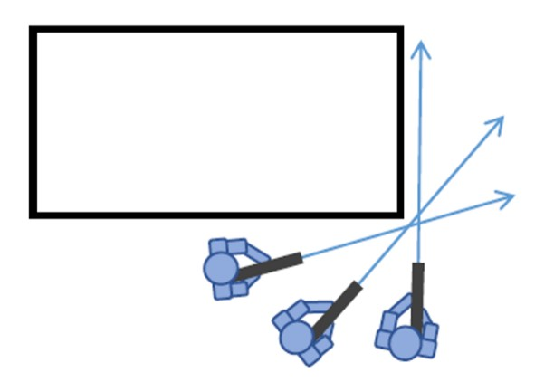
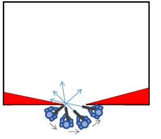
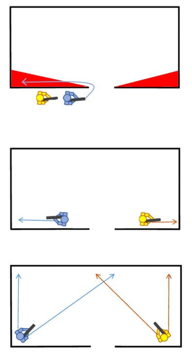
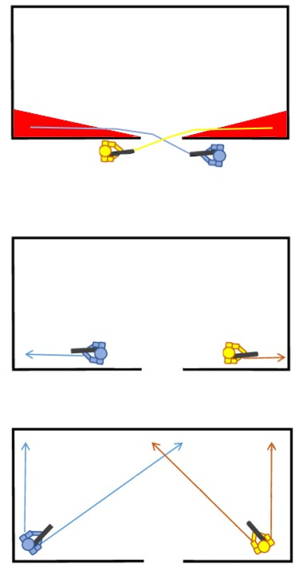

# 2.8. Optreden in verstedelijkt gebied (OVG)

Conflicten vinden niet alleen in bossen plaats maar ook steeds meer in en rondom verstedelijke gebieden. Het optreden in steden stelt specifieke eisen aan spelers, materiaal, voertuigen, (onbemande) systemen en commandovoering. Het operationeel voordeel van lange-afstand wapensystemen en het optreden met grote vuurkracht en mobiliteit is in vele gevallen geringer. Het belang van het optreden met militairen (boots on the ground) tussen de bevolking (war amongst the people) is des te groter. Het succesvol optreden in verstedelijkt gebied (OVG) wordt dan ook in belangrijke mate bepaald door de kennis en vaardigheden van het individu. De benodigde vaardigheden in verstedelijkt gebied zijn afwijkend van de vaardigheden die nodig zijn in andere omstandigheden. 

Optreden in verstedelijkt gebied (OVG) wordt ook wel MOUT (Military Operations in Urban Terrain) of CQB (Close Quarters Battle) genoemd en is een van de meest uitdagende onderdelen van Arma 3.
De korte zichtlijnen, vele hoeken en verticale dreiging maken de SA (Situational Awareness) complex. 
Hier lees je de basisprincipes om als team een bebouwde omgeving veilig te doorkruisen en gebouwen te zuiveren.

## Basisprincipes van OVG
In de stad gelden andere regels voor verplaatsing dan in het open veld.

- ^^**Situational Awareness**^^: Zorg dat je te allen tijden op de hoogte bent van jouw eigen positie in het gebied zodat je snel, veilig en effectief door het oord kunt verplaatsen.
- ^^**Veiligheid**^^: Veiligheid gaat voor snelheid! Minimaliseer blootstelling aan vijandig vuur en houd rekening met dreiging van 360° om je heen.
- ^^**360° Beveiliging**^^: In verstedelijkt gebied komt de dreiging niet alleen van voor-, achter- en/of zijkant maar ook van boven en onder.
- ^^**Snelheid en Verrassing**^^: Handel snel om het initiatief te behouden en vermijd voorspelbare routes en patronen.
- ^^**Gebruik van dekking en verplaatsing**^^: Beweeg van dekking naar dekking en vermijd open terreinen. Gebruik rook of vuurdekking zodra de dreiging hoog is.
- ^^**Communicatie**^^: Gebruik heldere en eenvoudige communicatie, gebruik bij voorkeur voice chat en waar nodig je radio. Prio meldingen zoals voertuigen, Fixed of Rotary wing en gewonden moeten altijd over de radio gemeld worden, zodat iedereen binnen het team dit weet.
- ^^**Samenwerking**^^: Voorwaarts met je buddy is leuk maar denk als commandant ook aan het inzetten van eventuele EOD, medische ondersteuning, vuursteun of logistiek.
- ^^**Beheersen van sleutelterrein**^^: Controleer kruispunten, bruggen, hoge gebouwen en toegangswegen. Dominantie over deze locaties vergroot de bewegingsvrijheid.
- ^^**Zuiveren en doorzoeken**^^: Gebouwen systematisch benaderen, binnengaan en doorzoeken. Voorkom dat ruimtes opnieuw onbeveiligd raken en de vijand je kan verrassen zodra je het gebouw wilt verlaten.
- ^^**Bescherming van burgers**^^: Houd rekening met aanwezigheid van burgers, beperk nevenschade en volg de geldende geweldsinstructies.
- ^^**Flexibiliteit**^^: De situatie verandert snel. Wees voorbereid om plannen direct aan te passen.
- ^^**Logistiek**^^: Aanvoer van munitie, medische middelen en evacuatie is moeilijker in stedelijk gebied. Plan dit zorgvuldig en behoud controle.

## Verplaatsen over wegen
Bij lagere dreiging kan ervoor gekozen worden om over de wegen te verplaatsen. Denk aan sociale patrouilles of als je door de voorwijken verplaatst voordat je bij de daadwerkelijke AO aankomt.

- Maak bij voorkeur gebruik van de dubbele colonne waar de spelers i.p.v. naar buiten te kijken kruislinks over elkaar heen kijken. Dit omdat je vanaf de overkant van de straat makkelijker de hogere verdiepingen in de gaten kunt houden. De voorste 2 personen houden waarneming in front en dekken eventuele zijstraten af.
- Zodra de dreiging omhoog gaat kan er voor gekozen worden om tussen de huizen door te verplaatsen om de zichtbaarheid te beperken. Eventuele eigen voertuigen zullen dan zonder dekking van uitgestegen eenheden moeten verplaatsen aangezien deze vaak niet door smalle straatjes kunnen en bij het langzaam verplaatsen al hun tactische voordeel verliezen (snelheid, wendbaarheid en wapensystemen).

## Bochten/zijstraten peaken 
Ren nooit blindelings een hoek om of voorbij. Gebruik de techniek die ook wel "Slicing the Pie" of "Popping" wordt genoemd:

^^**Slicing the Pie**^^: 

- Houd afstand van de muur (ongeveer 1 à 2 meter) om te voorkomen dat je loop door de muur steekt.
- Beweeg zijwaarts (met `Q` of `E` om te leunen) en neem de hoek in kleine stapjes ("partjes").
- Scan de diepte bij elk stapje. Zo zie jij de vijand vaak eerder dan hij jou ziet.

 

^^**Popping**^^: 

- Popping kan zowel staand, knielend als liggend worden uitgevoerd afhankelijk van o.a. het obstakel, terrein, dreiging of beoogde verrassingselement, maar de voorkeur heeft staand in verband met de mobiliteit. 

## Stacken en Binnentreden van een ruimte

Normaliter zul je met je hele team of sectie een woning zuiveren. Omdat dit binnen Arma 3 dusdanig veel vertraging oplevert zie je in de praktijk vaak dat woningen per buddypaar gezuiverd worden. Dit kan op 2 manieren.

^^**Enkele Stack**^^: 

- Buddypaar staat achter elkaar aan 1 zijde van de deur.
- Achterste man geeft teken "gereed".
- Voorste man geeft teken "gereed" en telt af van 3 tot 1 en opent dan de deur.
- Voorste man loopt naar binnen en de 2e man volgt **Direct** achter hem aan.
- Voorste man treedt binnen en loopt via de muur waar ze stonden naar de eerste hoek toe.
- De 2e man treedt binnen en steekt diagonaal door naar de eerste hoek.

^^**Dubbele Stack**^^: 

- Buddypaar staat tegenover elkaar aan beide zijde van de deur.
- 2e man geeft teken "gereed".
- Voorste man geeft teken "gereed". 2e man telt af van 3 tot 1 en opent dan de deur.
- Voorste man loopt naar binnen en de 2e man volgt **Direct** achter hem aan.
- Voorste man treed binnen steekt diagonaal naar binnen de ruimte in naar de eerste hoek.
- De 2e man treed binnen en steekt diagonaal door naar de eerste hoek.

In beide gevallen kan er tijdens hoge dreiging voor gekozen worden om al vurend naar binnen te gaan (3-5 patronen) om de vijand te laten dekken en te overrompelen. Indien dit de eerste woning van een dorp is zal direct iedereen weten dat je daar bent. 

## Gebruik van granaten 
Granaten zijn essentieel om kamers te zuiveren zonder eigen verliezen, maar wees uiterst voorzichtig met teamleden en civies.

- ^^**ACE Throw**^^: Gebruik Shift + G voor de nauwkeurige gooi-modus.
- ^^**Flash vs Frag**^^: Gebruik flashbangs voor kamers waar mogelijk burgers zijn. Gebruik frag-granaten alleen als de vijandpositie bevestigd is en er geen eigen troepen achter de muur staan.
- ^^**Procedure**^^: Roep altijd luid "Frag out!" of "Flash out!" voordat je gooit. Wacht op de knal en treed direct daarna binnen om de vijand uit te schakelen.

## Gebouwen markeren
Zodra een gebouw volledig gezuiverd is, moet dit direct gecommuniceerd en geregistreerd worden om 'Blue-on-Blue' te voorkomen.

- ^^**Kaartmarker**^^: Plaats een stip op het gebouw op de kaart.
- ^^**Kleurgebruik**^^: Gebruik de kleur van je eigen vuurteam (bijv. blauw voor Alpha). Hiermee weet de Pelotonscommandant precies welk team waar zit en welke sectoren veilig zijn.

**Let op: Een gebouw is pas 'Clear' als elk hoekje en elke verdieping is gecheckt.**

## Tips & Tricks
- Het percentage gewonden zal tijdens OVG meer dan verdubbelen. Laat eventuele medics hier rekening mee houden met hun uitrusting.
- Het verbruik van munitie en granaten zal toenemen. houd hier rekening mee met logistieke en je uitrusting.
- Probeer altijd onder dekking van een ander buddypaar of vuurteam te verplaatsen. zo hoef jij alleen ogen te houden op de volgende woning.
- Alvorens een deur te openen, check op eventuele boobytraps of struikeldraden.
- Indien er burgers aanwezig zijn beperk het gebruik van granaten en ga over op flashbangs. Deze zijn ook irritant maar zijn niet direct dodelijk voor de bevolking.
- Richt fallback posities en Medic points in over de geplande route. 
- "Slow is steady, Steady is Safe" hoe harder je gaat rammen hoe meer gewonden er vallen waardoor het momentum snel kwijt is.
- **BLIJF ALTIJD BIJ JE BUDDY.** De voorste vent leidt, de 2e beveiligt en volgt!