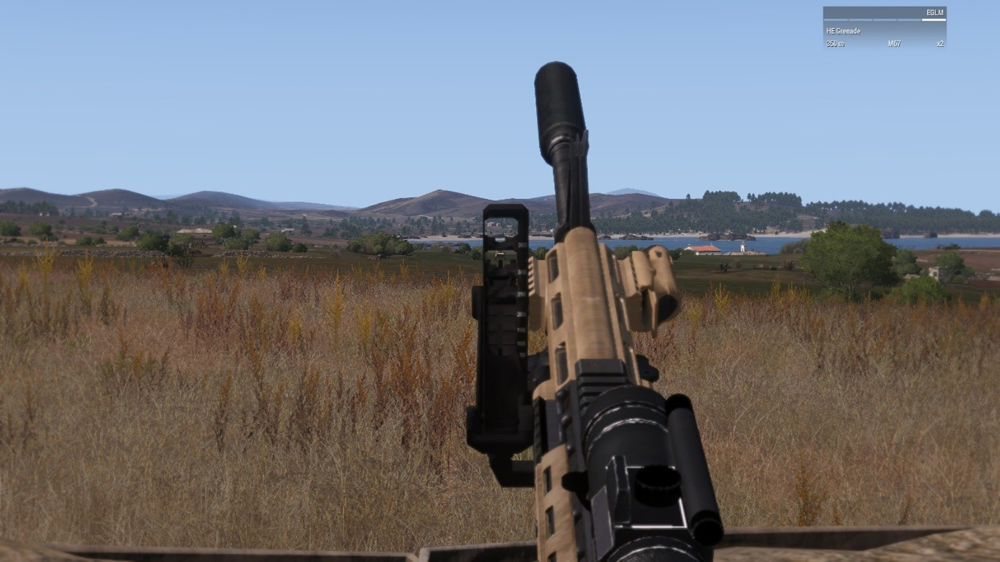
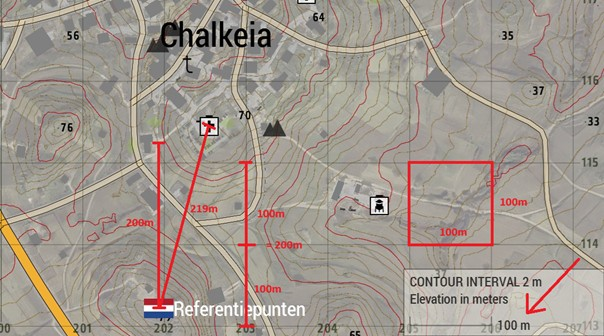
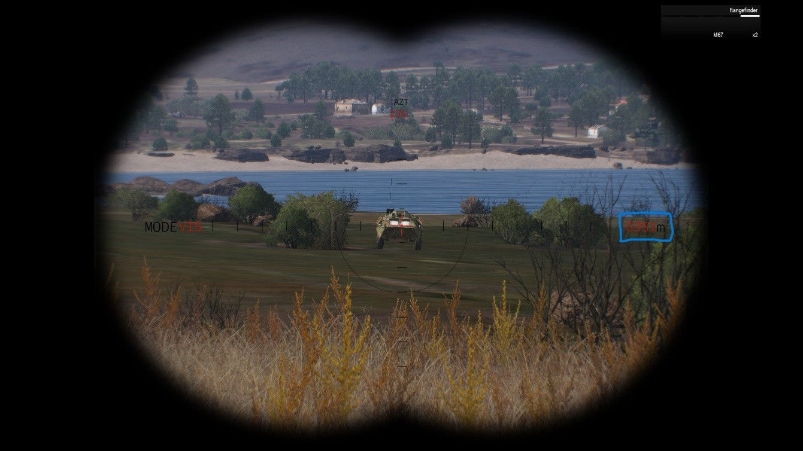

# 3.1. Grenadier

    :fontawesome-solid-user: Auteur: **R. Hoods** | :material-calendar-plus: Aangemaakt: **26-08-2025**

??? info
    In deze gids leer je over de rol van de grenadier. Na het doornemen van deze gids en het volgen van de bijbehorende training heb je de volgende doelstellingen behaald. Daarnaast ontvang je een trainingsvinkje in de ledenlijst. 

    - De cursist is bekend met de rol en de verantwoordelijkheden van de grenadier.

    - De cursist weet hoe de grenade launcher (underslung) gebruikt moet worden.

    - De cursist kan de afstand tot doelen bepalen via kaartlezen of met een rangefinder.

    - De cursist is bekende met de verschillende munitietypen en het herladen hiervan.

## De rol van de grenadier 
Als grenadier ben je een infanterist oftewel rifleman met een grenade launcher. Deze kan onder je wapen gemonteerd zitten (underslung) of je draagt een losse grenade launcher (zoals AT). Als grenadier volg je de aanwijzingen op van de vuurteamleider (VTL). Deze kan jou vragen om verschillende doelen op afstand uit te schakelen. Het gebruik van de grenade launcher gaat altijd in overleg of na order van de VTL. Doordat je explosieven op afstand kunt schieten kun je ook onwenselijke nevenschade aan doelen, burgers of eigen troepen aanrichten. 

## Gebruik van de grenade launcher 

Door op F te drukken wissel je van vuurmodus. Na single shot en autofire volgt ook de underslung optie. Je ziet dit op jouw wapen weergegeven. Deze komt in de underslung vuurpositie. 

Rechts bovenin zie je hoe jouw wapen op dat moment geranged is. Vaak staat deze default op 50 meter. De range is aan te passen met page up en page down. Hierdoor schiet het wapen minder ver of verder als je op het doel mikt. Het is belangrijk dat de range tussen jouw positie en het doel overeen komen met hetgeen rechts bovenin is geselecteerd om het doel te kunnen raken. 

Wanneer je een aparte grenade launcher zoals AT draagt, wissel je hier naartoe via de nummers op je toetsenbord. Vaak is dit de 2 of de 3.

## Rangen op verschillende manier 
Zoals gezegd moet de range tussen jouw positie en het doel overeen komen met hetgeen rechts bovenin is geselecteerd om het doel te kunnen raken. Dit noem je ‘Rangen’. 

Rangen kan op verschillende manieren: via een teamgenoot, via kaartlezen of via een rangefinder. 

### Via een teamgenoot 

Wanneer een teamgenoot de afstand tot het doel heeft kan die dat aan jou doorgeven. Het is daarbij belangrijk dat jullie dicht bij elkaar staan om een gelijke afstand tot het doel te hebben. 

### Via kaartlezen 

Elke kaart heeft rechts onderin een liniaal. Over de kaart staan rasterlijnen die allemaal vierkanten vormen. Via de liniaal kun je bepalen hoe groot een rastervierkant is. In het onderstaande voorbeeld is dit 100 meter bij 100 meter. Let op dat de afstanden veranderen als je in- en uitzoomt op de kaart! 

Nu je de grootte van een rastervierkant weet kun je deze tellen van jouw positie tot het doel. In het voorbeeld staan wij op ‘Referentiepunten’ en rangen we tot aan de kerk. Tussen ons en het doel zitten ruim twee rastervierkanten van 100 meter, oftewel 200 meter. Wanneer je op de kerk zou willen vuren, stel je rechts bovenin dus in op 200 meter en zul je een heel klein beetje hoger moeten mikken, omdat de daadwerkelijke afstand 219 meter betreft. 

### Via een rangefinder 

Als je een rangefinder bij je draagt selecteer je die door op B te drukken. Via de rechtermuisknop gebruik je de rangefinder. Richt op het doel en druk op T. Aan de rechter zijde van de rangefinder zie je nu de actuele afstand tussen jou en het doel. Deze voer je rechts bovenin in met page up en page down en je bent klaar om te vuren. 

## Munitietypen 
Er zijn verschillende munitietypen. Je kunt wisselen tussen munitie via het scroll menu. Er staat dan een optie zoals ‘Reload 40 mm HE Grenade Rounds’. Wanneer je de grenade launcher geselecteerd hebt zie je rechts bovenin de geselecteerde munitie. 

| Type         | Effect             |
|---------------|------------------|
| 40 mm HE Grenade Round | Standaard High Explosive (HE) grenade. Wordt gebruikt om lichte doelen uit te schakelen zoals pax en technicals. Is effectief in gebouwen door ze naar binnen te schieten. Gebouwen raken licht beschadigd. Niet effectief tegen gepanserde voertuigen en materieel. |
| Smoke Round (diverse kleuren) | Een smoke round om op afstand doelen te markeren. Wit voor maskering. Rood voor vijanden. Groen voor eigen troepen of gewonden. Paars of geel voor gespecificeerde doelen of locaties. |
| Flare Round (diverse kleuren) | Een flare round die hoog de lucht in geschoten kan worden. Wit ter verlichting van de omgeving. Rood voor het markeren van vijanden. Groen voor eigen troepen of gewonden. Paars of geel voor gespecificeerde doelen of locaties. |
| Shotgun shells | Dodelijk munitietype dat gebruikt kan worden bij het clearen van gebouwen. Fungeert als ‘shotgun round’ vanuit de underslung. |

