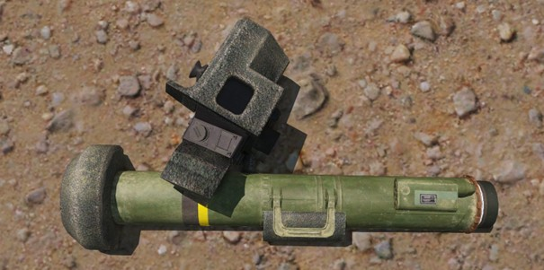

# 3.2. Anti-Tank

    :fontawesome-solid-user: Auteur: **R. Hoods** | :material-calendar-plus: Aangemaakt: **26-08-2025**

??? info
    In deze gids leer je over de rol van Anti Tank specialist (AT). We verwachten van alle spelers die de AT rol willen slotten, dat zij bekend zijn met de kennis en handelingen uit deze gids. Zo kunnen ze (voertuig)dreiging adequaat aangrijpen en namens het team weerstand bieden aan deze zware dreigingen. Na het doornemen van deze gids en het volgen van de bijbehorende training heb je de volgende doelstellingen behaald. Daarnaast ontvang je een trainingsvinkje in de ledenlijst. 

    - De cursist is bekend met de verschillende AT-wapens uit de Lowtac modset; Panzerfaust (PzF3), NLAW, Javelin, M136 launcher en RPG-7. 

    - De cursist is bekend met de verschillende soorten AT-wapens; fire and forget (LAT), herlaadbare (LAT) en geavanceerde AT (HAT). 

    - De cursist weet de voor- en nadelen van de verschillende AT-wapens. 

    - De cursist weet het verschil tussen verschillende voertuigdreigingen. 

    - De cursist weet de zwakke plekken van voertuigen. 

    - De cursist weet wanneer het AT-wapen gereedgemaakt moet worden; bij directe voertuigdreiging, waarneming of op commando van VTL/GC. 

    - De cursist weet dat AT-wapens terugslag kunnen hebben, welke in woningen gebruikt kunnen worden en dat terugslag schadelijk is voor teamgenoten. 

    - De cursist weet hoe de range van verschillende AT-wapens ingesteld kan worden; page up / page down en T bij automatisch rangen. 

    - De cursist weet hoe de verschillende vuurmodussen gebruikt kunnen worden bij een HAT-wapen. 

    - De cursist weet hoe de juiste schietafstand bepaald kan worden door de tekens in de richtkijker. 

    - De cursist is bekend met de LAT-schietprocedure: 1. AT gereedmaken 2. AT gereed 3. Richt op doel 4. Back blast clear. 5. Clear 6. Fire 

    - De cursist is bekend met de HAT-schietprocdedure: 1. Switch naar FLTR 2. Zoom (indien vereist) 3. Switch fire mode (indien vereist) 4. Lock target 5. Back blast clear 6. Clear 7. Fire 

    - De cursist weet het verschil tussen verschillende munitietypen.

## Rol van de AT-specialist
De rol van de Anti Tank specialist (rifleman AT) is voornamelijk het bieden van weerstand tegen zware voertuigdreiging. Ook kan de AT’er worden ingezet bij lichte voertuigen, groepen infanterie of het neerhalen van gebouwen of muren.

De AT’er heeft kennis van verschillende voertuigen, AT-wapensystemen en munitietypes.

## Soorten AT-wapens
In Arma 3 worden verschillende soorten AT-wapens gebruikt. Elk wapen heeft zijn eigen voor- en nadelen. In deze gids worden de meest gebruikte wapensystemen en range systemen besproken.
We maken onderscheid tussen de onderstaande wapenssystemen:

- **Fire and forget**: Eén keer schieten en daarna niet meer bruikbaar

- **Herlaadbaar**: Meerdere keren te gebruiken, omdat ze herlaadbaar zijn. Meer munitietypen.

- **Geavanceerd**: Meerdere munitietypen, vuuropties, visions en afstand mogelijkheden.

Bijna alle AT-wapens hebben terugslag en kunnen jou of jouw teamgenoten verwonden. Dit wordt backblast genoemd. Bij het vuren is daarom het belangrijk dat er geen teamgenoot of obstakel/muur achter je staat. Het afvuren van AT-wapens in gebouwen wordt daarom sterk afgeraden!

## Schietprocedures
Om verwondingen aan jezelf of anderen te voorkomen houden we de schietprocedure aan bij het gebruik van AT. De AT’er maakt het AT-wapen gereed bij directe voertuigdreiging, eigen waarneming of op commando van de VTL/GC. De volgende stappen worden gevolgd:
!!! info
    1.	De VTL/GC roept ‘AT gereedmaken!’.
    2.	De AT’er roept ‘AT gereed’ als dit is gedaan.
    3.	De AT’er richt op het doel.
    4.	De AT’er roept ‘Clear backblast’, om er zeker van te zijn te kunnen schieten.
    5.	De VTL/GC roept ‘Backblast clear’, wanneer er veilig geschoten kan worden.
    6.	De AT’er vuurt op doel.

Wanneer er met een geavanceerde wapensysteem wordt geschoten worden deze stappen gevolgd:
!!! info
    1.	De VTL/GC roept ‘AT gereedmaken!’.
    2.	De AT’er roept ‘AT gereed’ als dit is gedaan.
    3.	De AT’er switcht naar FLTR, zoomt waar nodig en switcht waar nodig de fire mode.
    4.	De AT’er richt en locked op het doel.
    5.	De AT’er roept ‘Clear backblast’, om er zeker van te zijn te kunnen schieten.
    6.	De VTL/GC roept ‘Backblast clear’, wanneer er veilig geschoten kan worden.
    7.	De AT’er vuurt op doel.

## Voertuigzijdes
De meeste voertuigen hebben aan de voorkant extra bepantsering. Probeer daarom een voertuig altijd aan de zij- of achterkant aan te grijpen. Daardoor is de kans op uitschakeling zo groot mogelijk.

## Munitietypen
- HE = High Explosive (op infanterie)
- HEAT = High Explosive Anti Tank (op lichte/medium pantservoertuigen)
- HEDP = High Explosive Dual Purpose (lichte voertuigen)
- AP = Armor Piercing (op zware pantservoertuigen)
- AA = Anti Air (op luchtdoelen)

## Verschillende wapensystemen

### Fire and forget: NLAW
De NLAW is een fire and forget systeem met een uitgebreidere scoop. Het systeem kan automatisch rangen door op T te drukken, vergelijkbaar met een rangefinder.
{ width="600" }
{ width="600" }

### Herlaadbaar: RPG en M136
De RPG en M136 zijn beide wapens die herlaadbaar zijn. Er kunnen verschillende munitietypen op worden gebruikt. Het nadeel is dat de scope mogelijkheden zeer beperkt zijn. Door op page up/page down te drukken kun je de range instellen. Deze zie je rechts bovenin beeld. Je zal dus via de kaart of met een rangefinder de afstand moeten (laten) bepalen, voordat je een schot kunt uitbrengen. Vuren op bewegende doelen is daardoor erg lastig.
{ width="600" }
{ width="600" }
{ width="600" }

### Herlaadbaar: Panzerfaust
De Panzerfaust 3 is in het echt een terugslagloos antitankwapen. Het doel daarvan is dat je uit kleine nauwe ruimtes kan vuren, zonder dat het jou of je omgeving schade oplevert. In de praktijk in Arma zit er echter wel een terugslag in. Dit is niet genoeg om iemand te doden of ernstig te verwonden, maar dit kan wel lichte verwondingen opleveren. 

Het wapen heeft een effectief bereik van 300 meter (bewegende doelen) of 400 meter op stilstaande doelen.  

De variant die het meeste gebruikt wordt is de versie met het DM12A2 projectiel. 
Dit is een HEAT-RA (High Explosive Anti-Tank-Rocket Assisted). 

Ook is de Panzerfaust 3 een wegwerpproduct. Het wapen bestaat uit een wegwerplanceerbuis, maar de richtkijker kan hergebruikt worden. In de praktijk van Arma maak je gebruik van vuurklare Panzerfaust 3 antitankwapens en hoeven we niets toe te passen na gebruik. 
Na het afvuren van de Panzerfaust 3 kan je de trajectie van het projectiel via de richtkijker volgen. Nadat je de richtkijker verlaat, zal je personage in Arma automatisch het restant van de Panzerfaust 3 wegwerpen. 

{ width="600" }
/// caption
Zicht van de Panzerfaust 3, door de richtkijker. De aantallen aan de zijkant geven aan hoe hoog je moet mikken voor welke afstanden.
///

### Geavanceerd: Javelin en Titan
De Javelin en Titan zijn geavanceerde wapensystemen. Met deze systemen kun je locken op voertuigen, de systemen zijn herlaadbaar en hebben nauwelijks backblast. Deze systemen zijn dus vanuit verdekte positie te gebruiken. Dit komt omdat de raket zich eerst uit de schietbuis werpt, waarna de raketmotor pas van start gaat. De systemen zijn op zeer grote afstand, tot zo’n 2 kilometer effectief. Door de verschillende vuurmodussen kunnen doelen ook vanaf de bovenkant worden geraakt.

Deze wapensystemen en de bijbehorende munitie zijn een stuk zwaarder dan een simpelere buis.

{ width="600" }
/// caption
Initieel zicht zoals een vuurklaar, op de schouder gedragen Javelin.
///

{ width="600" }
/// caption
Het eerste zicht door de herlaadbare Command Launch Unit (CLU). Deze staat nu op DIR, voor Direct-attack mode.
///

{ width="600" }
/// caption
Door CTRL-TAB tegelijk in te drukken, kan je van Direct-attack mode wisselen naar Top-attack mode. Dit zie je aan de rechterzijde doordat DIR verandert naar TOP.
///

{ width="600" }
/// caption
Door op N te drukken wissel je van Day-mode naar Night-mode. 
**Opgelet**: Het locken is niet mogelijk in Day-mode of Night-mode, maar alleen in Thermal-mode. 
///

{ width="600" }
/// caption
Door nogmaals op N te drukken ga je uit night-modus en naar Thermal sight. Dit zie je bevestigd worden doordat FLTR gaat branden. 
///

{ width="600" }
/// caption
Zodra je je target gevonden hebt, houd je TAB ingedrukt. Je ziet dan een witte box verschijnen die steeds dichter naar je doel geleid wordt. Dit duurt ongeveer 5 seconden. Tijden het “locken” geeft de Javelin een hoge pieptoon.
///

{ width="600" }
/// caption
Zodra je een andere zwaardere toon hoort, heb je daadwerkelijk een lock. Je ziet dan ook een wit kruis verschijnen op je target. 
///

{ width="600" }
/// caption
Je kan ook nog inzoomen, waardoor hij van WFOV (Wide Field Of View), naar NFOV (Narrow Field Of View).
///

!!! warning "Zodra je TAB los laat, vergeet de Javelin ook de lock. Via de linkermuisknop kan je de Javelin afvuren."

## Verschillende soorten voertuigen
Hieronder een overzicht van veel voorkomende voertuigdreigingen. Houd er rekening mee dat pax met AT of een statisch wapen ook een serieuze dreiging kunnen vormen. Evenals artillerie/mortieren.
Voor lichte Technicals is het uitschakelen van de gunner en driver al voldoende om een voertuig te neutralizeren. Beter bepantserde voertuigen worden door de AT’er aangegrepen.

{ width="600" }
/// caption
Onbewapende technical: minimale dreiging. Rekening houden met infanterie die kan uitstappen.
///

{ width="600" }
/// caption
Technicals met .50: bewapende voertuigen zoals een .50 of HMG. Wanneer de gunner uitgeschakeld kan worden is dit voertuig vaak geen dreiging meer. AT dan niet gebruiken. 
///

{ width="600" }
/// caption
Technicals met AT, SPG of GMG: zware dreiging door het AT wapen, de raket of granaatwerper. AT inzetten! 
///

{ width="600" }
/// caption
APC voertuigen: (Armored Personal Carrier) zwaarder bepantserde voertuigen met serieuze vuurkracht; bijvoorbeeld BTR of IFV. Zware dreiging. AT inzetten. 
///

{ width="600" }
/// caption
AA voertuigen: Door de serieuze vuurkracht en mogelijkheid om ook grondtroepen aan te vallen, ook wel ‘Anti-Anything’ genoemd. Zware dreiging. AT gebruiken. 
///

{ width="600" }
/// caption
Tanks: Zwaar bepantserde voertuigen met serieuze vuurkracht. Zware dreiging. AT inzetten! 
///

