# 3.3. Medic

    :fontawesome-solid-user: Auteur: **R. Hoods** | :material-calendar-plus: Aangemaakt: **26-08-2025**

??? info
    In deze gids leer je over de rol van de Medic. Het slot waar geen vuurteam zonder kan. Na het doornemen van deze gids en het volgen van de bijbehorende training heb je de volgende doelstellingen behaald en mag je de rol van Medic slotten. Daarnaast ontvang je een trainingsvinkje in de ledenlijst.
    -	De cursist weet hoe belangrijk de rol is voor de overleving van het team.

    -	De cursist weet dat de medic op 'safe' speelt, achteraan beweegt en alleen gewonden pakt/sleept als dit veilig kan.

    -	De cursist weet dat eerst het vuurgevecht gevochten wordt, voordat er gestart kan worden met medische handelingen.

    -	De cursist weet hoe een beschutte plek moeten worden ingericht, zodat gestart kan worden met medische handelingen.

    -	De cursist kan tijdens een vuurgevecht andere spelers roepen of wegsturen bij het uitvoeren van medische taken, zodat er overwicht blijft tijdens een vuurgevecht.

    -	De cursist weet dat direct voice voor extra aandacht van vijanden zorgt.

    -	De cursist kan anderen slepen of tillen.
    
    -	De cursist is bekend met het ACE-medical menu en dat je daar via H en ACE-interact kan komen.
    
    -	De cursist weet dat communiceren belangrijk is om de VTL, maar ook de gewonde (met een zwart scherm) op de hoogte te houden.
    
    -	De cursist weet de functies van medische spullen en geavanceerde medische spullen.
    
    -	De cursist kan bij zichzelf of anderen bloedingen stoppen.
    
    -	De cursist kan bij zichzelf of anderen wonden verzorgen en definitief dicht maken met de surgical kit.
    
    -	De cursist kan bij zichzelf of anderen breuken verhelpen.
    
    -	De cursist kan bij zichzelf of anderen bloed toedienen.
    
    -	De cursist kan bij verschillende typen bloedverlies de juiste hoeveelheid bloed toedienen.
    
    -	De cursist kan de bloeddruk meten.
    
    -	De cursist kan anderen reanimeren.
    
    -	De cursist kan de hartslag meten en weet wanneer een patient levensvatbaar is voor een epineferine.
    
    -	De cursist weet wanneer een speler nog te redden is en wanneer een speler dood (respawn) is.
    
    -	De cursist kan bij zichzelf of anderen pijnmedicatie toedienen: morfine en painkillers.
    
    -	De cursist kan teamleden instuctie geven hoe medische handelingen uitgevoerd moeten worden.
    
    -	De cursist weet hoe meerdere patienten in leven gehouden kunnen worden, zonder dat deze bij bewustzijn zijn.
    
    -	De cursist kan op een beschutte plek een noodhospitaal inrichten.
    
    -	De cursist kan door middel van groene smoke een patient markeren of een noodhospitaal aangeven met een andere kleur.
    
    -	De cursist kan triage toepassen en weet hoe patienten met kleur gemarkeerd kunnen worden van lage naar hoge urgentie.
    
    -	De cursist weet op tijd een resupply aan te vragen, zodat er altijd voldoende spullen aanwezig zijn.

## Bewustzijn van een Medic
Als Medic heb je een enorm belangrijke rol in het team. Jij bent verantwoordelijk voor het in leven houden van alle teamleden en het verhelpen van verwondingen. Realiseer je goed dat alléén de Medic deze specialistische handelingen kan uitvoeren. Als je zelf neer gaat is dit een groot probleem voor jouw vuurteam. Als Medic speel je op een veilige manier. Je bent onmisbaar voor het team en mag niet neergaan. Beweeg in de achterhoede, neem zo min mogelijk risico en pak of sleep gewonden zo veilig mogelijk. Zorg voor een goede SA (Situational Awareness). Weet waar de dreigingen zijn, hoe zwaar de dreiging is en wat voor cover je nodig hebt om veilig te zijn.

Zonder gevecht geen gewonden. Het is aanlokkelijk om gelijk op gewonden te duiken. Toch is het overwicht houden in een vuurgevecht belangrijker dan direct starten met medische handelingen. Als meerdere mensen stoppen met schieten zal de vijand het vuurgevecht winnen. Dit kan juist leiden tot meerdere gewonden of een squad wipe. 
Wanneer je kan starten met medische handelingen, zorg dan voor een beschutte plek. Een grote steen, dikke boomstronk, stenen muur, etc. kunnen voldoende bescherming bieden. Houd er rekening mee dat de vijand door o.a. houten muren kan schieten.

Soms is iemand zo zwaar gewond dat je extra hulp nodig hebt. Roep deze dan ook in van je team. Dit kan alleen als het vuurgevecht dit toelaat. Het vuurgevecht gaat vóór de gewonden. Het kan ook zijn dat iemand je helpt, terwijl je de situatie prima zelf af kan. Stuur diegene dan naar de vuurteamleider (VLT) voor extra vuurkracht. Wanneer je praat in Arma 3, kunnen vijanden je horen. Zij zullen naar je toe komen. Soms kun je beter zo stil mogelijk werken om minder tot geen aandacht te trekken.

!!! info "Gebruik het terrein en zorg voor een veilige werkplek"
    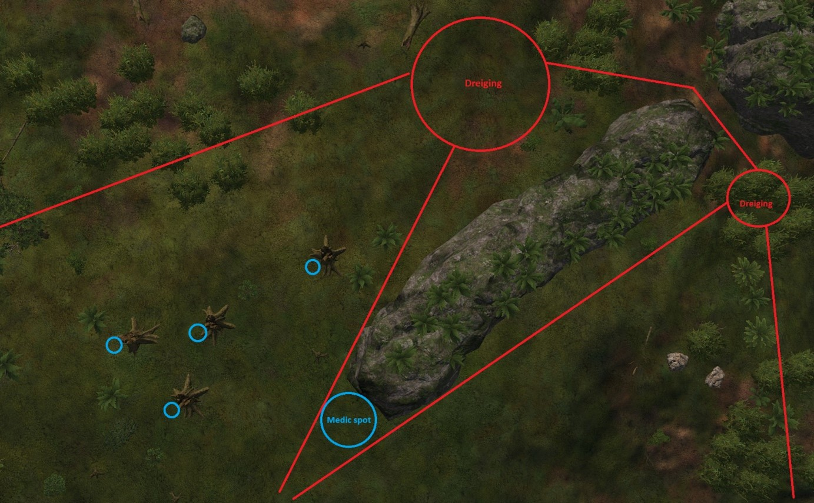

## ACE-medical menu en ACE-interact
Vaak liggen gewonden op een onveilige plek met weinig beschutting. Verplaatst gewonden door ze te slepen of dragen. Doe dit alleen als dit veilig kan.

Je gebruikt hiervoor ACE-interact en drukt op ‘Drag’ of ‘Carry’.
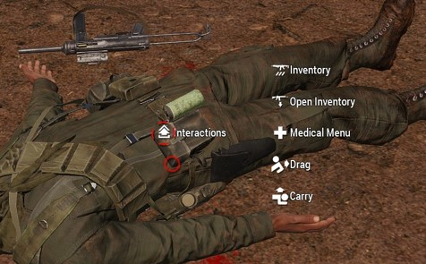
Een tweede optie is door op ‘H’ te drukken, terwijl je naar de gewonde kijkt. Het ACE-Medical Menu opent dan. Door bovenin links op ‘Drag/Carry’ te drukken, kun je de gewonde verplaatsen.
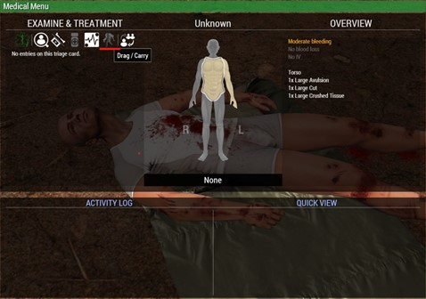
Wanneer de dreiging hoog is en een gewonde ver van je weg ligt, kun je het beste ACE-interact gebruiken. Hierdoor kun je een gewonde van een veel verdere afstand naar je toe halen door op ‘Drag’ te drukken.

Het Medical Menu gebruik je ook voor het toepassen van alle medische handelingen.

## Communicatie als Medic
Als medic heb jij de leiding over de gewonden. Communicatie is erg belangrijk. Zo laat je de VTL weten hoeveel gewonden er zijn en wat de medische status is. Ook grote updates geef je door.
Daarnaast communiceer je naar de gewonde. Deze speler ziet tenslotte enkel een zwart scherm. Het is fijn om te laten weten wat je doet en hoe lang het duurt voor diegene op is. Dit biedt perspectief en je weet of je nog een drankje kan halen. Tot slot communiceer je naar teamleden als je ze nodig hebt of als ze overbodig zijn. Als Medic moet je spelers met minder ervaring kunnen uitleggen welke medische acties ze uit moeten voeren. Communiceer kort en krachtig. Bijvoorbeeld: ‘Speler, maak de benen dicht’, ‘Speler, plaats tourniquets op de armen en benen’ of ‘Speler, geef twee maal CPR’. Leg waar nodig uit waar de knoppen zitten.

## Medic gear
De Medic draagt een grote rugzak met medische spullen. Een Medic draagt veel meer supplies dan een voetsoldaat en beschikt daarnaast ook over Medic-specifieke gear.
!!! info
    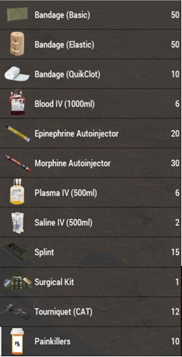{ align=left }
    **Bandage (Basic)**: plaatsen op een lichaamsdeel met een wond.
    
    **Bandage (Elastic)**: plaatsen op een lichaamsdeel met een wond.	Vaak het meest effectief!

    **Bandage (QuikClot)**: plaatsen op een lichaamsdeel met een wond.

    **Blood IV (1000ml)**: gebruik op arm/been om veel bloed aan te vullen.

    **Epinephirine Autoinjector**: gebruik op arm/been om iemand op te krijgen wanneer diegene een stevige hartslag heeft.
    
    **Morphine Autoinjector**: gebruik op arm/been om pijn te bestrijden.
    
    **Plasma IV (500ml)**: gebruik op arm/been om wat bloed aan te vullen.
    
    **Saline IV (500ml)**: gebruik op arm/been om wat bloed aan te vullen.
    
    **Splint**: gebruik op een lichaamsdeel met een breuk.
    
    **Surgical Kit**: gebruik op een lichaamdeel met een wond, zodat de wond niet opnieuw gaat bloeden.
    
    **Tourniquat (CAT)**: gebruik op arm/been om het bloeden tijdelijk te stoppen.
    
    **Painkillers**: gebruik op hoofd om pijn te bestrijden.

## Uitvoeren van medische handelingen
Het uitvoeren van medische handelingen doe je in het Medical Menu. Open deze met ‘H’ door naar de gewonde te kijken (close range). 
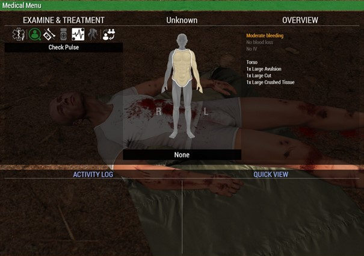
Links bovenin onder ‘EXAMINE & TREATMENT’ kun je langs de verschillende medische handelingen klikken.

In het midden zie je de status van de gewonde. Je kan op alle lichaamsdelen drukken. Om het geselecteerde lichaamsdeel staat nu een witte rand. Gekleurde lichaamsdelen zijn gewond. Dit loopt van licht geel > geel > donkergeel > oranje > rood > donkerrood. 

Rechts bovenin zie je het ‘OVERVIEW’. Hier zie je per lichaamsdeel welke verwondingen er zijn en of deze nog open of dicht zijn.

## Stappenplan bij lichtgewonde
Voorbeelden van spelers die licht gewond zijn:

- 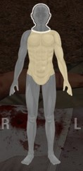
- 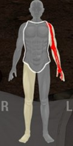
- 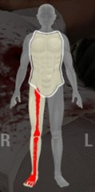
- 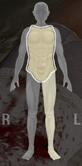

-   **1.** Maak alle wonden dicht met Elastic Bandage / Field Dressing / QuikClot ([B] van Bleeding).
    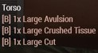

-   **2.** Use Surgical Kit op de de lichaamsdelen met een wond ([S] van Stitched).
    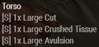

-   **3.** Apply Splint op gebroken lichaamdelen.
    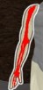

-   **4.** Give Blood IV (1000ml) bij ‘Lost a lot of blood’ of erger. Geef Plasma of Saline (500ml) bij ‘Lost some blood’.
    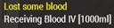

-   **5.** CPR twee maal op de borst. Check pulse. CPR één maal. Check pulse. CPR één maal. Check pulse. Wanneer er een hartslag hoger dan 60 à 80 is, ga door naar stap 6.

!!! warning "Let op: wanneer je een hartslag van 30 ziet, komt dit enkel door de CPR van een andere speler."

-   **6.** Inject Epinephrine om de gewonde op te krijgen.

-   **7.** Inject Morphine / Administer Painkillers tot alle pijn weg is.

!!! warning
    Let op: Bij ‘Lost a lot of blood’ of erger zal een gewonde met een hartslag NIET opkomen. Je zult eerst meer bloed moeten toedienen. Bij ‘Lost some blood’ kan de gewonde WEL opkomen.

## Stappenplan bij zwaargewonde
Voorbeeld van een speler die zwaargewond is:
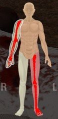

-   **1.** Plaats Tourniquets op alle armen en benen om het bloeden te stoppen.
    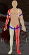

-   **2.** Maak de hoofdwonden en borstwonden dicht.
    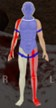

-   **3.** Haal de tourniquet van één arm en maak deze waar haalbaar dicht.

-   **4.** Dien bloed (1000ml) toe via een arm. Dit kan alleen **zonder** tourniquet.

-   **5.** Use surgical kit op het hoofd en de borst, zodat wonden niet opnieuw open gaan.

-   **6.** Geef tussentijd CPR, om de gewonde levensvatbaar te houden.

-   **7.** Maak de rest van de wonden en breuken dicht, stitch/split deze en verwijder tourniquets.

-   **8.** Geef CPR en Epinephrine tot de gewonde op is. Dien Morphine of Painkillers toe tegen de pijn.

!!! warning
    Let op: Bij zwaar bloedverlies heeft de gewonde zo snel mogelijk meerdere keren 1000ml bloed nodig!

## Gewonde of dood (respawn)
Verspil geen tijd aan dode spelers. Door op het hoofd van een speler te drukken en vervolgens te drukken op ‘Response’ geeft het medical menu aan of een speler dood of bewusteloos is. Een dode speler kan het zwarte triagelabel krijgen en eventueel door de medic in een bodybag worden geplaatst. Een speler die ragdollt is ook dood.
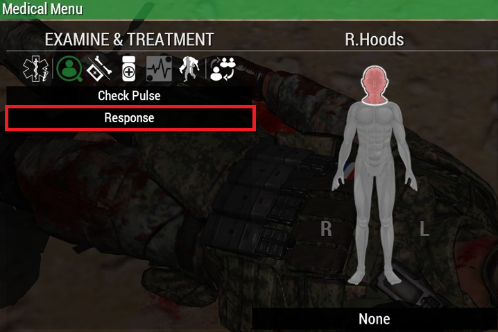

##Mass-cass situaties
Wanneer er veel spelers tegelijkertijd neer zijn is het belangrijk om voldoende hulp in te schakelen als dit mogelijk is. Maak een beschutte noodhospitaal en markereer deze met gekleurde smoke; 
- ‘Urgent Mass-Cass, medische ondersteuning nodig, locatie gele smoke’.
- ‘Noodhospitaal, locatie paarse smoke. Verplaats gewonden naar paarse smoke’.
Pas triage toe. Maak de gewonden stabiel door bloed toe te dienen, tourniquets op alle ledenmaten te plaatsen en hoofd en borst dicht te maken.. Blijf voldoende bloed toedienen en verdeel je aandacht over alle gewonden. Je zult tussentijd CPR moeten geven aan de gewonden. Waar mogelijk maak je wonden dicht en gebruik je de Surgical Kit.
Laat andere vuurteamleden vooral CPR geven of tourniquets plaatsen. Zij hebben aanzienlijk minder bandages, dus probeer deze taken vooral zelf uit te voeren.
Probeer eerst andere Medic(s) op te krijgen. Zij kunnen je dan verder helpen met andere gewonden. Vervolgens zorg je dat de Groepscommandant (GC) of Vuurteamleider (VTL) op komt, zodat zij de leiding kunnen nemen over het vuurgevecht. Tot slot zorg je voor de andere spelers.

## Triage
Bij meerdere gewonden pas je triage toe. Met triage bepaal je per gewonde hoe erg ze eraan toe zijn en wie het eerste hulp nodig heeft. Wanneer iemand dood is geef je dit ook aan, zodat een andere speler hier geen onnodige tijd en middelen aan geeft. 
De triagekaart met bijbehorende kleuren zit onderaan in het midden. Druk op ‘None’:
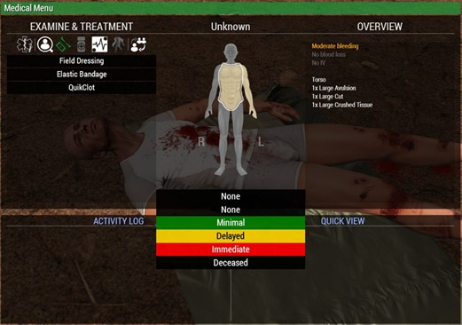
Als de triage goed is toegepast kunnen andere vuurteamleden of Medics gemakkelijk zien wie ze als eerst moeten helpen. Door op ACE-interact te drukken zie je per speler welke triage-kleur ze hebben, zonder dat je het Medical Menu hoeft te openen.

## Groene smoke
Groene smoke geeft een medische noodsituatie aan. Zo kan er in veel gevallen, zonder communicatie of pauze in het vuurgevecht toch een medische situatie worden aangegeven. Dit kan op meerdere manieren worden gebruikt;
- Vuurteamlid geeft met groene smoke de locatie van een gewonde aan voor de Medic.
- Medic gebruikt groene smoke om de vuurteamleider te zeggen dat iemand neer is.
- Medic gebruikt groene smoke om locatie noodhospitaal aan te geven.
- Vuurteamlid of Medic gooit smoke hoog in de lucht om noodsituatie voor een ander team te markeren.

## Resupply
Na al dat harde werken zal je soms onvoldoende medische supplies hebben. Houd dit goed in de gaten en trek tijdig bij de vuurteamleider aan de bel. Als je op 1/3e van je spullen zit is het raadzaam een resupply aan te vragen. Als dit bijvoorbeeld enkel voor het bloed geldt, is dit ook een reden om aan de bel te trekken.

