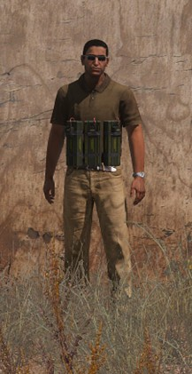
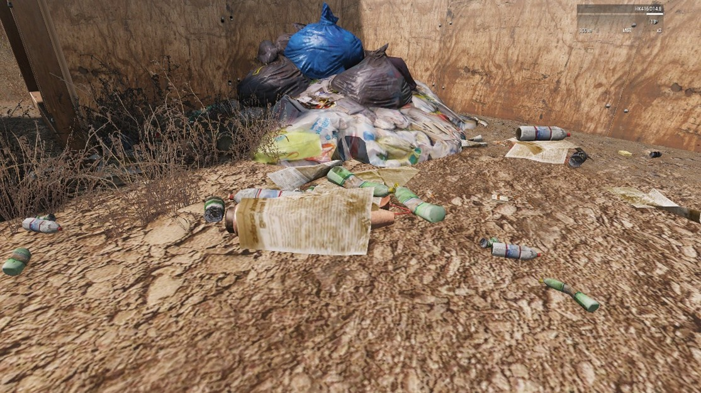
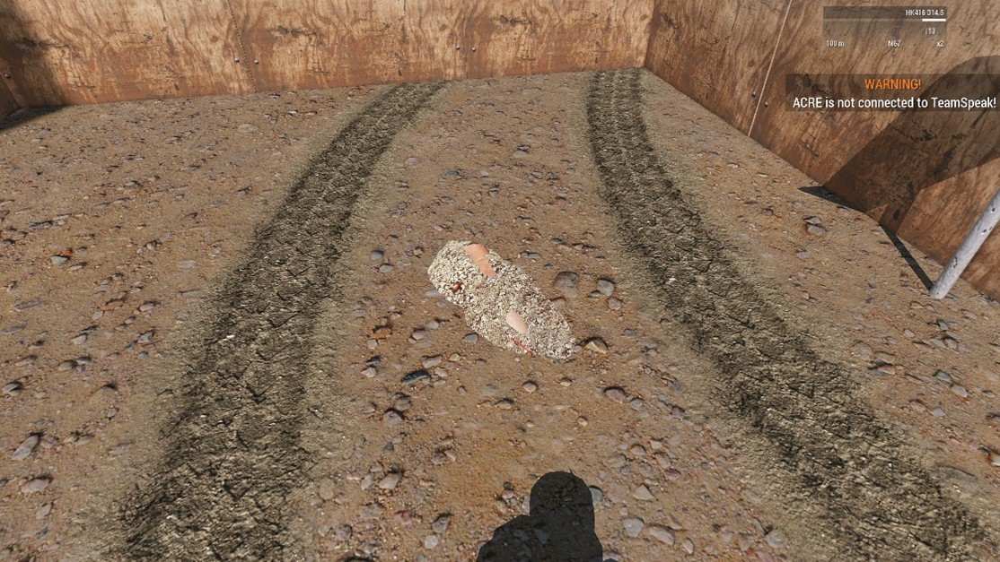

# 3.4. Engineer

    :fontawesome-solid-user: Auteur: **R. Hoods** | :material-calendar-plus: Aangemaakt: **26-08-2025**

??? info
    In deze gids leer je over de rol van de engineer. We verwachten van alle spelers die de engineer rol willen slotten, dat zij bekend zijn met de kennis en handelingen uit deze gids. Zo kunnen ze adequaat de handelingen zowel het repair gedeelte als het demolition gedeelte uitvoeren. Na het doornemen van deze gids en het volgen van de bijbehorende training heb je de volgende doelstellingen behaald. Daarnaast ontvang je een trainingsvinkje in de ledenlijst.
    
    -	De cursist weet wat de specifieke items zijn voor de engineer.

    -	De cursist weet dat je als voertuigbemanning ook de engineer rol krijgt.

    -	De cursist weet hoe je een voertuig moet repareren en het verschil tussen light en full repair.

    -	De cursist weet hoe je banden moet repareren en vervangen.

    -	De cursist weet hoe je een voertuig moet laden en unloaden.

    -	De cursist weet hoe een voertuig getankt, gerearmed moet worden en hoe pylons aangepast moeten worden.

    -	De cursist weet dat de engineer slot ook de rol van explosive specialist krijgt.

    -	De cursist weet welke items specifiek voor demolition zijn.

    -	De cursist weet hoe de mine detector werkt een aangezet moet worden.

    -	De cursist weet een mijnenveld, IED’s en losse mijnen te herkennen.

    -	De cursist weet hoe verschillende mijnen onschadelijk gemaakt moeten worden.

    -	De cursist weet de veiligheidsprocedures.

    -	De cursist weet een suicide bomber te herkennen en hoe ermee te dealen.

    -	De cursist weet hoe marker flags geplaatst moeten worden om een veilige route aan te geven.

## Rol van de Engineer
De engineer is een slot dat vaak cruciaal is voor het slagen van een missie. In veel missies zitten onderdelen waar een engineer (soms DEMO genoemd) voor nodig is. Als engineer heb je de volgende verantwoordelijkheden:

-	Herstellen van voertuigen en statische installaties

-	Het plaatsen van explosieven en daarbij vernietigen van aangewezen doelen

-	Het plaatsen en clearen van mijnen en IED’s.

-	Ondersteuning bij mobiliteit (bruggen, sleepacties, bevoorrading, etc.)

In onze modset heeft voertuigbemanning ook de mogelijkheid tot het repairen van voertuigen.

## Uitrusting
| Item                  | Functie                                                                 |
|-----------------------|-------------------------------------------------------------------------|
| Toolbox               | Benodigd om voertuigen te kunnen repareren (tot aan geel).              |
| Wirecutter            | Voor het verwijderen van obstakels of door hekken knippen                |
| Detonator / timer     | Wordt gekoppeld aan explosieven voor detonatie                          |
| Mine Detector         | Detecteert mijnen en IED’s.                                             |
| Repair vehicle/station| Benodigd voor full repairs (tot aan wit).                               |
| Explosievenpakket     | Kan per missie verschillen. M112 blocks zijn het meest gangbaar.        |
| Marker flags          | Flaggen die geplaatst kunnen worden om een veilige route of explosief te markeren voor friendly units. |

De items zijn beschikbaar via ACE self-interact en interact door op de windows toets en de ctrl + windows toets te drukken.

- Wirecutter: windows toets terwijl je naar een knipbaar object zoals een hek kijkt.

- Mine Detector: Aan te zetten via de ] [ haken.

- Explosievenpakket: Via ctrl + windows te selecteren onder ‘Explosieven’. Moet vervolgens via windows toets gekoppeld worden aan een firing device of timer (detonator).

- Marker flags: Via ctrl + windows onder equipment. 

## Explosieven & Demolition
### A. Soorten explosieven
| Soort mijn              | Bijzonderheden                                                                                                                                         |
|--------------------------|--------------------------------------------------------------------------------------------------------------------------------------------------------|
| Trainingsmijn            | Rood van kleur en bovengronds. Kan gebruikt worden om ontmantelen te oefenen. Ontploft niet, maar er komt een vlag omhoog als hij af gaat.             |
| Mine dispenser           | Kan kleine mijnen afvuren naar een gewenste zijde. Houd afstand tijdens het afvuren (kleine explosie). Wordt gebruikt om achtervolgers te hinderen of een gebied te beveiligen. |
| Toe-Popper               | Meest gangbare mijn die gebruikt wordt tegen infanterie.                                                                                              |
| Tripwire mine            | Explosieve kop, gekoppeld aan een draad. Wanneer de draad wordt geraakt, gaat de mijn af. Veelal gebruikt in verstedelijkt gebied.                      |
| Claymore                 | Mijn met een bewegingssensor. Gaat af als je dichtbij aan de getriggerde zijde komt. Moet van je af worden geplaatst.                                  |
| SLAM mine                | Wordt van je af ingesteld met een laser. Gaat af wanneer vijand door de laser loopt.                                                                   |
| AT-mine                  | Zware anti-tank mijn. Sommige varianten gaan alleen af bij een hoog gewicht (zoals een voertuig). Kan soms worden gekoppeld aan een firing device.      |
| Zeemijn                  | Zit aan een ketting onder het wateroppervlak. Ontploft wanneer een schip de mijn raakt → zeer grote explosie.                                          |
| Bounding mine            | Moeilijk te ontmantelen. Springt omhoog als je dichtbij komt en ontploft direct. Te herkennen aan de ‘kop’ die uit de grond steekt.                     |
| M1112 demolition block   | Licht explosief uit de basisuitrusting van een engineer. Gebruikt om muren of voertuigen op te blazen.                                                 |
| Satchel charge           | Zwaar explosief. Wordt gebruikt om gebouwen op te blazen.                                                                                             |

### B.	Plaatsen van explosieven

1.	De GC of de VTL bepalen welke doelen er uitgeschakeld moeten worden. Denk aan voertuigen, gebouwen of het doorbreken van een muur.

2.	Pak een explosief :material-arrow-right: plaats via ACE interact :material-arrow-right: bevestig een detonator/timer.

3.	Trek terug naar veilige afstand.

!!! warning "Let op de richting (bijvoorbeeld bij een claymore)."

### C.	Detonatie

1.	Overleg met de VTL of het gebied veilig is en dat andere teams uit de buurt zijn.

2.	Na een GO van de VTL roep je over de radio 3x ‘Fire in the hole’.

3.	Detoneer door via self interact via je firing device. Bij loslaten ontploffen de explosieven gelijk!

### D.	Ontmantelen

1.	Lokaliseer de explosieven zoals een mijn of IED. Gebruik hiervoor ook de Mine Detector.

2.	Overleg met de VTL dat er een ruime veilige omgeving is waar niemand in komt.

3.	Ga ruim voor het explosief liggen en kruip er naartoe. Hierdoor beweeg je langzamer en is de kans of fouten kleiner.

4.	Gebruikt de windows toets om de mine onschadelijk te maken (disarm).

!!! warning "Veiligheidspunten"

    -	Gebruik altijd de radio bij het herkennen of plaatsen van explosieven

    -	Altijd na toestemming van GC / VTL detoneren

    -	Geen detonatie binnen 100 meter van friendly units

    -	Check altijd op burgers/friendly units, vooral bij ontmantelingen

## Voertuigreparatie
### A. Repareren in het veld

1.	Ga naar het voertuig en open ACE interactiemenu (Windows toets).

2.	Kies "Repareren" → selecteer component (wiel, motor, etc.).

3.	Zonder repair truck ben je beperkt tot "veldherstel" (light repair).

4.	Banden kunnen verwisseld worden. Uit de cargo van het voertuig kun je reserve band(en) pakken en deze wisselen. Zorg dat de nieuwe band dichtbij de as ligt en dat de oude is opgeborgen, voordat je hem plaatst. Dit voorkomt verwarring.

### B. Volledige reparatie

1.	Zorg dat je in de buurt bent van een repair truck of repair station.

2.	Ga naar het voertuig en open ACE interactiemenu (Windows toets).

3.	Kies "Full repair".

## Fuel, ammo en pylons
Fuel, ammo en pylons werken anders dan de repair. Hiervoor heb je een fuel/ammo truck of station nodig. Door met de windows toets naar een fuel/ammo truck of station te kijken zie je de mogelijkheden. Bij fuel moet je de nozzle in het voertuig plaatsen, alvorens je kan tanken. Bij ammo kies je eerst welk voertuig je wil re-armen. 

Als jouw voertuig pylons heeft, dit zijn soorten munitie zoals raketten op een helikopter, dan heb je een ammo truck of station nodig om deze te wisselen. Via de windows toets op het voertuig kun je ‘configure pylons’ selecteren en de verschillende pylons selecteren. De bestuurder of piloot van het voertuig bepaald welke pylons die wil.

### Suicide bomber
Suicide bombers zijn vijanden die op je af komen rennen met een zichtbaar of onzichtbaar bomvest. Als ze in de buurt zijn blazen ze zichzelf op. Ze zijn zichtbaar vijandelijk, maar kunnen er ook als civilian uitzien. Als een persoon dus hard op je af komt rennen, bekijk dan of je een bomvest ziet, creëer afstand en schakel uit waar nodig in overleg met de VTL.

Na het neerhalen is het belangrijk om afstand te behouden. Sommige suicide bombers hebben een dead mans trigger. Dit betekent dat de bom een x % kans heeft om te ontploffen, omdat de vijand de trigger niet meer dicht kan knijpen. Als engineer behandel je een bomvest als een mijn qua ontmanteling.

### IED’s
IED’s zijn ‘Improvised Explosive Devices’, oftewel bernbommen. Deze zijn er in verschillende soorten en zijn vaak goed verhuld. Als engineer behandel je een IED als een mijn qua ontmanteling. 

Hierbij enkele voorbeelden van verhulling:

