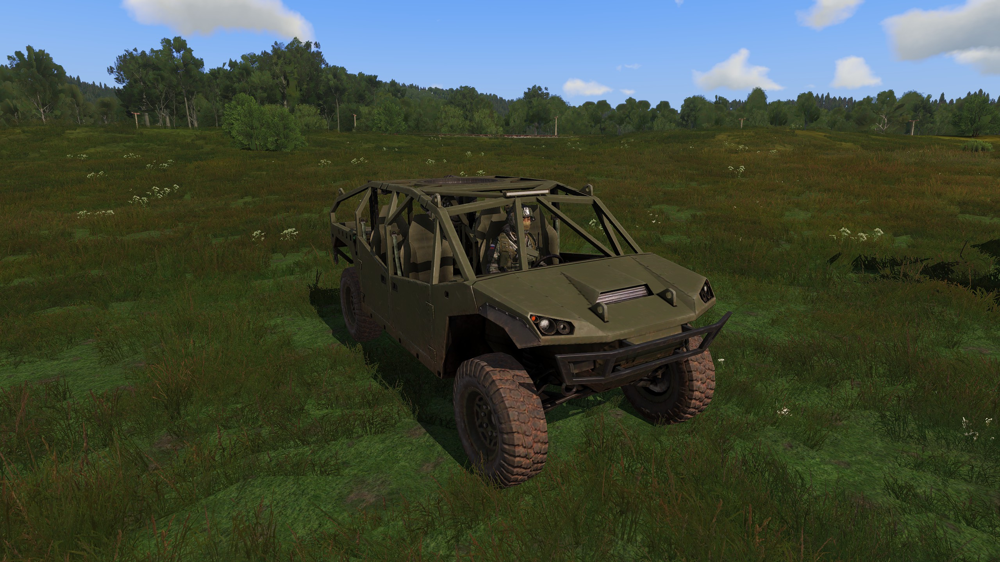
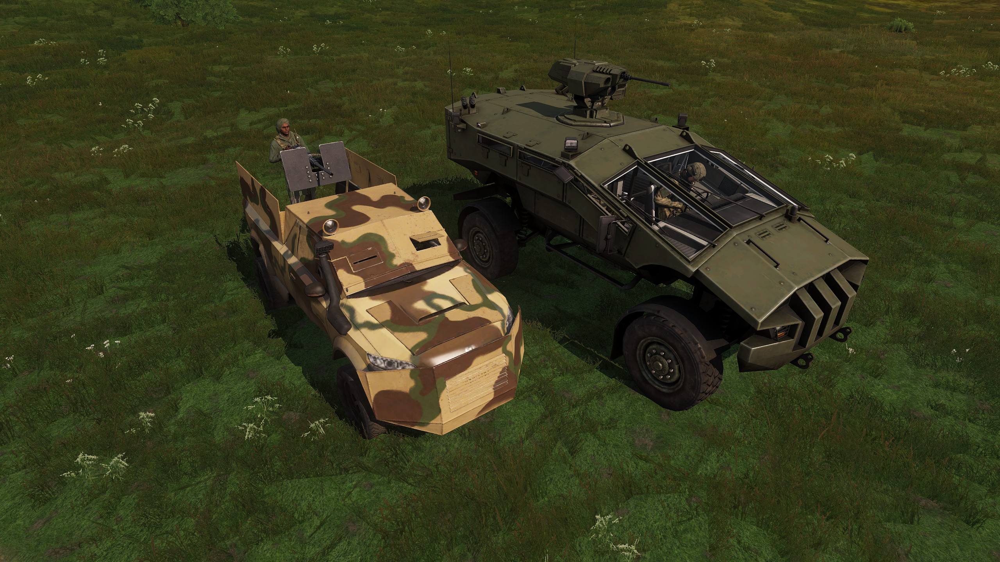
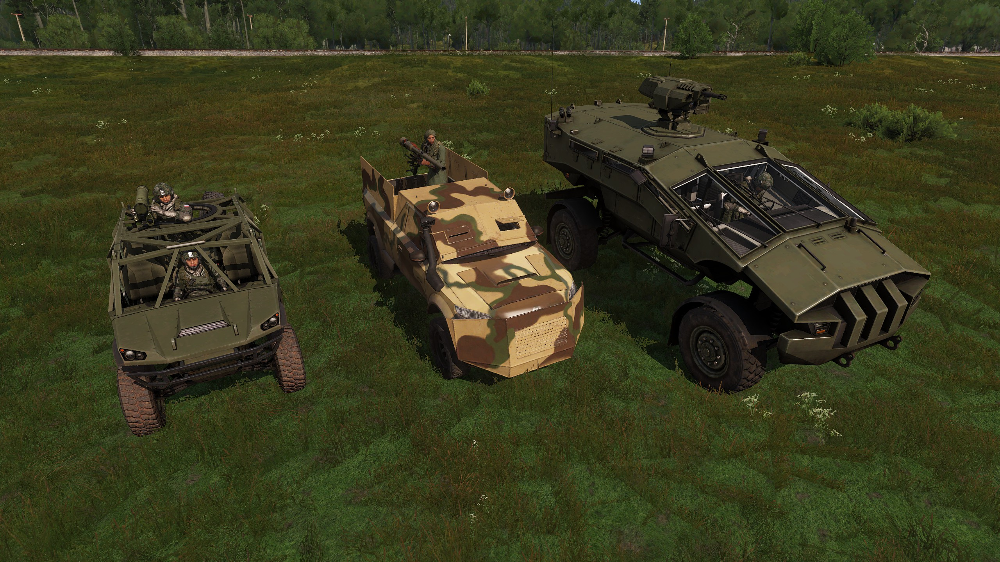
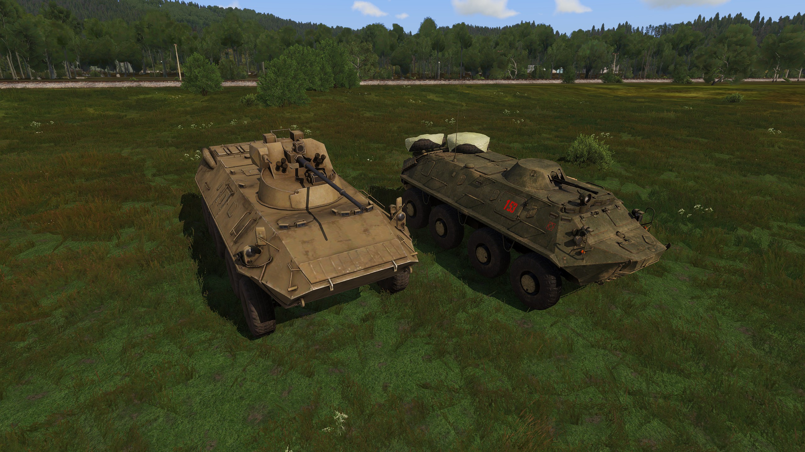
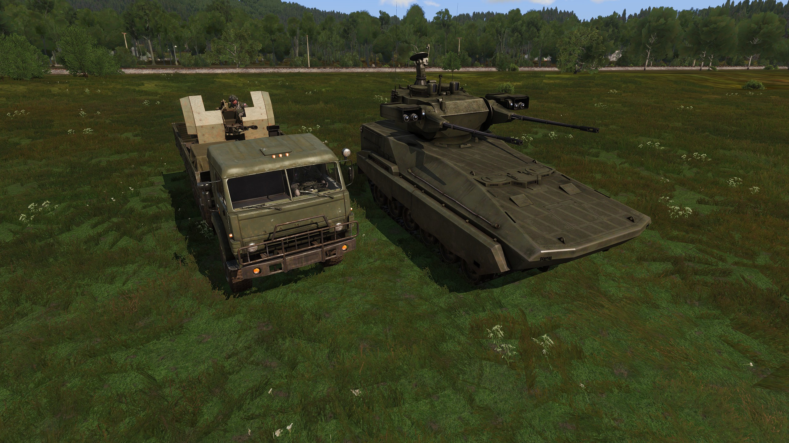
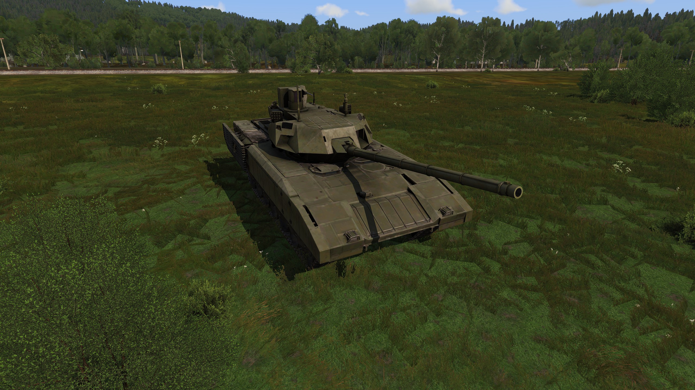

# 4.1. Voertuigen

    :fontawesome-solid-user: Auteur: **R. Hoods** | :material-calendar-plus: Aangemaakt: **26-08-2025** | :material-calendar-edit: Laatste update: **N/A** door **N/A**

??? info
    In deze gids leer je over het gebruik van voertuigen, het werken in konvooi-formatie, rollen en verantwoordelijkheden, communicatie en signalen, zichtzijdes en reactie op dreigingen of contact. Hierdoor kun je veilig en verantwoord een rol aannemen in een voertuig. Na het doornemen van deze gids en het volgen van de bijbehorende training heb je de volgende doelstellingen behaald. Daarnaast ontvang je een trainingsvinkje in de ledenlijst.
    
    -	De cursist weet hoe een voertuig bestuurd moet worden.

    -	De cursist weet hoe er tussen verschillende plaatsen in het voertuig gewisseld moet worden.

    -	De cursist weet de inventory van voertuigen te bekijken.

    -	De cursist weet hoe de kijkpositie in een voertuig aangepast kan worden middels ctrl page up / page down.

    -	De cursist weet hoe de cruise control gebruikt kan worden middels insert en de speed limiter middels delete (standaard keybinds).

    -	De cursist weet dat de vuurteamleider voor het voertuig of de groepscommandant voor de konvooi de snelheid bepaalt. 

    -	De cursist weet hoe de konvooi snelheid, afwijkende rijrichtingen of veranderingen hierin uitgeroepen worden.

    -	De cursist weet dat de driver van een voertuig verantwoordelijk is voor het voertuig en beslissingen van een VTL/GC kan overrulen als dit met zijn visuele inschatting beter is.

    -	De cursist weet afspraken te maken over de zichtzijdes in relatie tot de grootte van het konvooi. Daarbij weet de cursist wat gebruikelijke zichtzijdes zijn per aantal.

    -	De cursist weet dat zichtzijdes bepaalt worden middels LOER (Links oneven, even Rechts). Het voorste voertuig pakt front. Achterste voertuig achter.

    -	De cursist weet hoe en wanneer er op linie gekomen moet worden.

    -	De cursist weet kan gevaarherkenning doen en inschatten of de vijand sterker is dan het eigen voertuig.

    -	De cursist weet hoe met een voertuig grondtroepen ondersteund kunnen worden (ook in stedelijk gebied); bochten pieken, voertuig als dekking.

    -	De cursist weet hoe een voertuig in een combined arms situatie ingezet kan worden; voertuig dicht bij infanterie, voertuig sturen via markers, SA in voertuig, toestemming voordat je iets gaat aangrijpen.

    -	De cursist weet hoe cargo in en uitgeladen kan worden.

## Gebruik van voertuigen
De leidinggevende van de missie, lees GC of VTL, bepaalt tijdens een missie of en welke voertuigen en worden gebruikt. De beschikbare voertuigen kunnen kapot en soms beperkt inzetbaar. Daarom is het belangrijk om af te stemmen of een voertuig gebruikt mag worden. De leidinggevende zal ook bepalen wie welke rol binnen het voertuig aanneemt. Rijd waar mogelijk over de veilige paden en voorkom roekeloos gedrag. Dit voorkomt onnodige schade, tijd om te repareren en dreiging tot blootstelling aan de vijand.

## Besturing van een voertuig
Het besturen van een voertuig werkt via de W-A-S-D toetsen. Via het scroll-menu kan je in de verschillende plaatsen van het voertuig gaan zitten. De inventory van het voertuig is ook via dit menu bereikbaar. 

- Door de knoppen page up en page down te gebruiken kun je jouw zichtpositie aanpassen omhoog en naar beneden. Soms is het fijn om dit te doen om niet tegen een dak, raam of stuur aan te kijken. Het kan zorgen voor meer overzicht. 

- Door op insert te drukken kun je de snelheid die je rijdt vasthouden. Dit is cruise control.

- Door op delete te drukken schakel je de snelheidslimiter in. Je gaat dan niet harder dan de ingestelde snelheid.

- Via het ace-interact menu kan cargo in en uit het voertuig worden geladen.

## Solo-voertuig of voertuig-konvooi
Wanneer je met een team allemaal in één voertuig past en losstaande opdrachten uitvoert, ben je een solo-voertuig. Wanner verschillende voertuigen met elkaar optrekken wordt er gesproken van een voertuigkonvooi. Bij een solo-voertuig heeft de VTL de leiding over het voertuig en neemt de beslissingen. Bij een voertuigkonvooi is dit ingewikkelder, omdat er meer moet worden afgestemd. De konvooileider, doorgaans de GC, heeft dan de leiding over alle voertuigen.

## Rollen en verantwoordelijkheden

-	Konvooileider: verantwoordelijk voor de algehele leiding en communicatie. Vaak de GC.

-	Voertuigcommandant: verantwoordelijk voor een voertuig, communiceert met de konvooileider, geeft bevelen aan de driver en gunner en monitort de situatie. Vaak de VTL. Neem plaats in commander seat.

-	Bestuurder: richt zich uitsluitend op het besturen van het voertuig, volgt order op van de voertuigcommandant en kan deze overrulen als er een betere inschatting van de situatie gemaakt kan worden met het betere zicht. Neemt plaats in driver seat.

-	Schutter: bedient de wapensystemen en houdt vijandelijke dreigingen in de gaten, is bekend met de besturing van het wapensysteem en de verschillende soorten wapens, stemt af met de driver om betere zichtlijnen te krijgen en vuurt alleen met toestemming. Neemt plaats in de gunner seat.

-	Passagiers: bemanning aan boord zonder specifieke rol. Kunnen waar nodig ‘turn out’ gebruiken om een vuurlijn te creëren. 

## Opstellen van een konvooi
De konvooileider bepaalt de volgorde van de voertuigen. Daarbij wordt er rekening gehouden met de verschillende typen voertuigen in het konvooi en het beschermen van waardevolle vracht.

1.	Voorste voertuig: Bevat vaak de konvooileider en een scout-, wapen of aanvalselement. 

2.	Hoofdvoertuigen: Vervoeren infanterie en materieel.

3.	Zwaar bewapende voertuigen: Op strategische posities binnen het konvooi.

4.	Achterhoede: Bewaakt de achterzijde en dekt de terugtocht.

## Afstand en snelheden
Voordat een konvooi gaat rijden zal de voertuigleider tussenafstanden en de konvooisnelheid bepalen. Bij geringe dreiging is een tussenafstand van 50-100 meter prima. Dit is aanpasbaar afhankelijk van terrein en dreigingen). Een afgesproken konvooisnelheid en tussenafstand zorgt voor meer veiligheid. Vermijd abrupt stoppen en zorg voor een vloeiende beweging.

## Communicatie en signalen
Via de vooraf afgesproken radiokanalen communiceert de konvooileider met de voertuigcommandanten. Dit gebeurt middels korte communicatie:

- Konvooi rollen: het konvooi begint met rijden.

- Konvooi halt: het konvooi komt tot stilstand.

- Konvooi link: het konvooi slaat links af.

- Konvooi rechts: het konvooi slaat rechts af.

- Konvooisnelheid [snelheid], tussenafstand [afstand]: kaders waarin het konvooi beweegt.

- Konvooi uitstappen: infanterie stapt uit om dreiging aan te grijpen (hinderlaag of noodsituatie).

## Zichtzijdes
Verschillende voertuigen houden verschillende zichtzijdes in de gaten. Het voorste voertuig houdt ‘Front’ in de gaten. Daarna gebruiken we de ezelsbrug LOER. ‘Links oneven, even rechts’. De oneven voertuigen (3-5-7) houden de linkerkant in de gaten. De even voertuigen (2-4-6) houden de rechterkant in de gaten. Het achterste voertuig dekt de achterzijde van het konvooi.

## Reageren op dreiging

- Hinderlaag: waar mogelijk gas geven, uit de killzone bewegen en aanvalspositie bepalen.

- Mijn- of IED-dreiging: konvooi stoppen en een specialist de dreiging laten onderzoeken.

- Lucht- of artilleriedreiging: snel verspreiden en dekking zoeken.

- Contact front: aanvalsvoertuigen op linie laten komen om de dreiging aan te laten grijpen.

- Contact aan de flanken: aanvalsvoertuigen aan laten grijpen, terwijl het konvooi beweegt.

## Noodprocedures
Voertuig defect: voertuig wordt naar de zijkant geleid en waar mogelijk opgelapt. Bemanning kan ook worden verdeeld over andere voertuigen, waardoor het konvooi kan blijven bewegen.

- Uitval van een leider: de volgende in de commandostructuur neemt het over. Als de GC neer gaat is dit de VTL van het eerste team. Wanneer een VTL uitvalt is het degene die vooraf is benoemd tot 2nd in command.

- Onvoorzien obstakel: alternatieve route bepalen of voetpatrouille inzetten.

## Voertuig als dekking voor infanterie
Een voertuig kan altijd gebruikt worden als dekking voor infanterie. Door een voertuig bij contact schuin op te stellen, kan een volledig team achter een voertuig schuilen. Bij AT-dreiging is het verstandig om een andere beschutte plek te zoeken in verband met explosiegevaar. Het voertuig is dan een magneet voor de vijandelijke AT. Bij combined ops, waarbij een IFV eigen troepen ondersteund kan een voertuig ook gebruikt worden om achter te schuilen terwijl er naar voren wordt bewogen.

## Verschillende soorten voertuigen
Hieronder een overzicht van veel voorkomende voertuigdreigingen. Houd er rekening mee dat pax met AT of een statisch wapen ook een serieuze dreiging kunnen vormen. Evenals artillerie/mortieren.
Voor lichte Technicals is het uitschakelen van de gunner en driver al voldoende om een voertuig te neutralizeren. Beter bepantserde voertuigen worden door de AT’er aangegrepen.

{ width="600" }
/// caption
Onbewapende technical: minimale dreiging. Rekening houden met infanterie die kan uitstappen.
///

{ width="600" }
/// caption
Technicals met .50: bewapende voertuigen zoals een .50 of HMG. Wanneer de gunner uitgeschakeld kan worden is dit voertuig vaak geen dreiging meer. AT dan niet gebruiken. 
///

{ width="600" }
/// caption
Technicals met AT, SPG of GMG: zware dreiging door het AT wapen, de raket of granaatwerper. AT inzetten! 
///

{ width="600" }
/// caption
APC voertuigen: (Armored Personal Carrier) zwaarder bepantserde voertuigen met serieuze vuurkracht; bijvoorbeeld BTR of IFV. Zware dreiging. AT inzetten. 
///

{ width="600" }
/// caption
AA voertuigen: Door de serieuze vuurkracht en mogelijkheid om ook grondtroepen aan te vallen, ook wel ‘Anti-Anything’ genoemd. Zware dreiging. AT gebruiken. 
///

{ width="600" }
/// caption
Tanks: Zwaar bepantserde voertuigen met serieuze vuurkracht. Zware dreiging. AT inzetten! 
///

