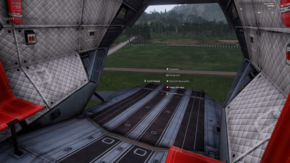
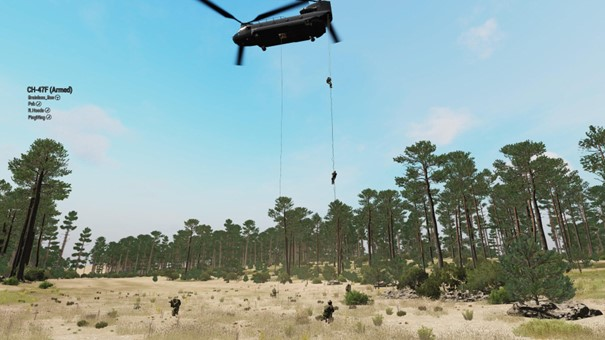

# 4.2. Fastrope

    :fontawesome-solid-user: Auteur: **R. Hoods** | :material-calendar-plus: Aangemaakt: **26-08-2025** | :material-calendar-edit: Laatste update: **N/A** door **N/A**

??? info
    In deze gids leer je over de rol van passagier in helikopters. Na het doornemen van deze gids en het volgen van de bijbehorende training heb je de volgende doelstellingen behaald en kun je veilig een kist in. Daarnaast ontvang je een trainingsvinkje in de ledenlijst.

    -	De cursist weet dat de piloot eindverantwoordelijk is voor de veiligheid, aanvliegroute en commando wanneer touwen gedeployed/gecut kunnen worden.

    -	De cursist weet dat de piloot tevens loadmaster is, wanneer de loadmaster niet geslot is.

    -	De cursist weet wat de verantwoordelijkheden zijn van de loadmaster; verzorgt communicatie tussen piloot en VTL en is verantwoordelijk voor de lading en het gebruik van de wapensysstemen.

    -	De cursist weet dat via ACE-interact het fast rope systeem kan worden gebruikt: 1. Prepare/stow fast rope system; 2. Deploy 36m ropes; 3. Cut ropes.

    -	De cursist weet dat de piloot verantwoordelijk is voor 'Prepare fast rope system'.

    -	De cursist weet dat de piloot het sein 'Deploy ropes' geeft. De VTL/loadmaster deployed de ropes. De VTL geef aan wie wanneer mag fastropen. De piloot/loadmaster cut de ropes.

    -	De cursist weet dat de VTL in de helikopter aangeeft wie bij landing welke sector dekt voor een 360 en hoe dit uitgevoerd dient te worden.

    -	De cursist weet dat bij benadering van een helikopter de VTL verantwoordelijk is voor het gefaseerd instappen en zo lang mogelijk vuurmogelijkheid behouden.

## Rollen en veiligheid
In een helikopter zijn de piloot en co-piloot verantwoordelijk voor het besturen van het voertuig.  Zij bepalen de aanvliegroutes en LZ's (Landing Zones) en voeren de communicatie met troepen op de grond of in het voertuig. Wanneer beide sloten geslot zijn zal de piloot meer focussen op het vliegen en de co-piloot op de communicatie en instrumenten. Doorgaans wordt bij Lowtac gevlogen met één piloot per voertuig. Ook kan ervoor gekozen worden om een loadmaster aan te stellen. Een loadmaster is verantwoordelijk voor de lading, wapensystemen en passagiers van het voertuig. Wanneer er geen loadmaster geslot is zal de groepscommandant (GC) of VTL (vuurteamleider) de acties omtrent de bemanning voor zich nemen.

CG, VTL en piloot kunnen vóór een vlucht een plan maken over aanvliegroutes en LZ's. GC en VTL spreken wensen uit.  De piloot blijft eindverantwoordelijk voor het veilig vervoeren van de passagiers en/of lading. Bij dreigende situaties kan enkel de piloot inspelen op de dreiging en een veilige uitweg zoeken.

## LZ's bepalen
LZ's oftewel Landing Zones worden gemarkeerd op de kaart en krijgen een naam. Een leidinggevende mag altijd wensen uitspreken over LZ's. De piloot bepaalt uiteindelijk waar er daadwerkelijk veilig geland kan worden, rekening houdend met de fysieke omgevingskenmerken en actuele dreiging. Het is raadzaam om vooraf meerdere LZ’s te bepalen, zodat er in korte tijd geschakeld kan worden naar een vooraf bepaald beck-up plan. Dit is handig wanneer er bijvoorbeeld toch plotseling dreiging is.

De communicatie tussen grondtroepen en piloot is cruciaal. De piloot geeft aan de passagiers aan wanneer het veilig is om uit en in te stappen. Daarom wordt vaak gebruik gemaakt van de long-range radio tussen CG/VTL en piloot. De grondtroepen kunnen een gewenste ophaallocatie markeren op de kaart. De piloot kan door lijnen trekken een aanvliegroute bepalen. Het kan helpend zijn om een LZ te markeren met smoke. Dit kan een piloot helpen met oriënteren. Grondtroepen geven aan de piloot door wanneer het veilig genoeg is om te landen.

Bij het in- en uitstappen is het belangrijk dat de grondtroepen een 360 rondom de helikopter aanhouden. De CG/VTL bepaalt de volgorde van instappen. Dit gebeurt gefaseerd, zodat zo lang mogelijk vuurdekking gegeven kan blijven worden.

{ width="600" }

## Fast-rope systeem
Naast het landen kan er ook voor worden gekozen om een insertie te maken via het fast-rope systeem. Bij fast-ropen dalen de grondtroepen vanuit een vliegende helikopter af naar de grond via touwen. Het voordeel hiervan is dat de helikopter tot max. 36 meter in de lucht kan blijven hangen en dus boven obstakels (zoals bomen) de troepen kan uitladen. Ook kan dit bijvoorbeeld op gebouwen of krappe ondergronden zoals schepen gebeuren. Fast-ropen is wat complexer en vraagt daarom ook om de onderstaande procedure:

Wanneer je in de helikopter zit kun je via ACE-interact naar de onderstaande fast-rope stappen.

1.	De piloot bepaalt samen met de GC/VTL de fast-rope LZ. De piloot en GC/VTL communiceren elke onderstaande stap naar elkaar.

2.	De piloot zorgt ervoor dat het voertuig stil hangt boven de LZ. Max. 36 meter boven de grond. Dit is de lengte van de touwen.

3.	De piloot prepared het fast rope systeem. Hierdoor opent de deur en worden de touwen als het ware ‘klaargelegd’.

4.	De loadmaster/GC/VTL deployed de ropes. Hierdoor hangen de touwen naar beneden.

5.	De GC/VTL bepaalt welke troepen er mogen afdalen en welke richting zij dekken op de grond. Doe dit met een interval van minimaal 3 seconden om botsingen te voorkomen. Tot die tijd blijf je zitten!

6.	De loadmaster/piloot cutten de ropes als alle troepen zijn afgedaald. Hierdoor vallen de ropes naar beneden en kan er daarna weer gevlogen worden.

7.	De loadmaster/piloot stowed de ropes waar nodig. Hierdoor wordt het systeem weer opgeborgen. 

!!! warning "Aandachtpunten"
    -	Vermijd inzet in gebieden met zware vijandelijke luchtafweer. Ook een .50 of zwaarder voertuig kan in korte tijd veel schade aanrichten. Hier dient rekening mee gehouden te worden. Bekijk daarom altijd de beschikbare intel.

    -	Zorg dat teamleden kort en bondig communiceren om onnodige chatter en ongelukken te voorkomen.

    -	Houd bij fast-ropen de helikopter zo stabiel mogelijk in hover modus. Dit voorkomt dat de touwen in de wieken komen.

    -	Voer de insertie zo snel mogelijk uit om blootstelling te minimaliseren. 

    -	Vlieg laag bij ‘hot zones’. Dit zijn gebieden waar dreiging wordt verwacht. Hiermee verminder je de kans op schade.

    -	Verplaats je troepen als CG/VTL zo snel mogelijk weg van de LZ om detectie/dreiging te minimaliseren. 

{ width="600" }

