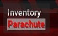
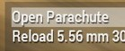
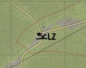
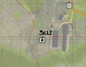
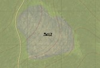

# 4.3. Paradrop

    :fontawesome-solid-user: Auteur: **R. Hoods** | :material-calendar-plus: Aangemaakt: **26-08-2025** | :material-calendar-edit: Laatste update: **N/A** door **N/A**

??? info
    In deze gids leer je over de van passagier in parachutist. Na het doornemen van deze gids en het volgen van de bijbehorende training heb je de volgende doelstellingen behaald en kun je veilig een kist in. Daarnaast ontvang je een trainingsvinkje in de ledenlijst.

    -	De cursist weet dat de GC/VTL één of meerdere LZ's intekent op de kaart waarnaar genavigeerd kan worden. Waar mogelijk rondom markante referentiepunten.

    -	De cursist weet dat de GC/VTL een drop-off locatie intekent op de kaart, welke helpt om het moment van springen te bepalen.

    -	De cursist weet dat de GC/VTL of loadmaster aftelt tot het moment van drop-off en het signaal 'Go-go-go' geeft waarop de parachutisten mogen springen.

    -	De cursist weet hoe automatische en niet automatische parachuten werken via het scroll-menu.

    -	De cursist weet dat er een risico op botsingen ontstaan, wanneer er teveel mensen tegelijkertijd parachuteren.

    -	De cursist kan door middel van kaartstudie en markante punten tijdens de parachutesprong refereren naar een aangegeven LZ. Zowel overdag als in het donker.

    -	De cursist weet dat smoke gebruikt kan worden om (opvallend) een LZ te markeren, wanneer er reeds grondtroepen in het gebied aanwezig zijn.

    -	De cursist weet dat je met lage snelheid de grond moet raken, omdat je anders gewond raakt.

## Paradrop
Paradroppen is via een parachute een gebied betreden. Vaak gebeurt dit vanuit een vliegtuig. Paradroppen kan vanaf lage en grote hoogte. Dit wordt door de GC of missiemaker bepaalt aan het begin van het scenario.

## Twee manieren van paradroppen
In Arma 3 zijn er twee manieren van paradroppen:

1. Automatisch paradroppen: paradroppen kan direct vanuit een voertuig via het scroll menu. Wanneer je de rode knop ‘Parachute’ gebruikt, zul je gelijk en automatisch uit het vliegtuig springen, een stuk vrije val maken en op een bepaalde hoogte automatische je parachute uitklappen. Je stuurt en navigeert dan naar de afgesproken LZ.

2. Handmatig paradroppen: Paradroppen kan ook handmatig met een parachute als rugzak. Zorg er dan wel voor dat deze op je rug zit.. Je springt dan eerst zelf uit een voertuig en selecteer dan via het scroll menu de knop ‘Open Parachute’ handmatig. Vervolgens stuur en navigeer je naar de afgesproken LZ.

## Plan van aanpak

1.	De GC of VTL tekent vooraf aan het springen één of meerdere LZ’s op de kaart en deelt deze met het team. Bij voorkeur rondom herkenbare punten, waardoor je gemakkelijk vanuit de lucht kun zien waar je naartoe moet navigeren (denk aan; watertoren/open vlakte in een bos/bij een splitsing van wegen/etc.)

2.	De GC of VTL tekent een drop-off locatie in op de kaart. Hiermee wordt een plek bepaald waarop het teken gegeven kan worden dat iedereen mag parachuteren.

3.	De GC, VTL of loadmaster telt tijdens de vlucht af, laat daardoor aan het team weten hoe lang het nog duurt en geeft aan wanneer iedereen klaar moet zijn voor de drop-off.

4.	De GC, VTL of loadmaster geeft het signaal ‘Go-go-go’ waarop alle parachutisten uit het voertuig springen. Houd daarbij rekening dat je niet in de lucht tegen elkaar aan botst!

5.	Open in de lucht (automatisch) je parachute op de afgesproken hoogte. Kijk en zoek naar herkenbare punten en navigeer in de lucht naar de afgesproken LZ. Stuur naar de LZ en landt daar zo dicht mogelijk in de buurt.

6.	Verminder je snelheid voor de landing. Wanneer je te hard land zal je gewond raken.

- 
- 
- 

## Gebruik van smoke en nachtelijke paradrops
Wanneer er al troepen op de grond zijn kunnen zij een LZ markeren met een kleur smoke. Dit maakt het vanuit de lucht gemakkelijker om naar de smoke te navigeren. 

Bij een nachtelijke operatie is het raadzaam om NVG’s mee te nemen om zo beter te kunnen oriënteren. Smoke kan in dit geval vervangen worden door een laserstraal in de lucht te richten of de IR strobes te gebruiken.

