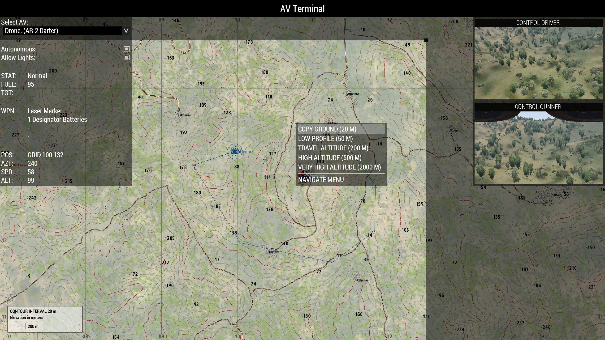

# 5.2. J-TAC

??? info
    In deze gids leer je over de rol van J-TAC. De J-TAC is communicatiespecialist, drone-operator en is de brug met alle support units om in te roepen. Deze gids geeft meer informatie over wat het betekent om de rol aan te nemen en wat de verantwoordelijkheden en verwachtingen zijn. Na het doornemen van deze gids en het volgen van de bijbehorende training heb je de volgende doelstellingen behaald. Na consistent bewezen resultaat ontvang je het trainingsvinkje.

    J-TAC training voorwaarde:

    -	De cursist bezit alle competenties uit de onderstaande trainingen (en de vinkjes), die voorwaarde zijn om aan de J-TAC-training te beginnen:

        - Een PC en/of GC vinkje.

    -   De cursist kan kort en krachtig communiceren, heeft uitgebreide SA en navigatieskills.    

    -	De cursist is bekend met de competenties en verantwoordelijkheden van een J-TAC.

    Vaardigheden:

    - De cursist kan zelfstandig opereren tussen de pelotonsgroep en de uitvoerende teams.

    - De cursist weet hoe de 3 verschillende radio's tegelijkertijd ingezet kunnen worden.
    
    - De cursist is bekend met het gebruik van Alive voor het inroepen van support.

    - De cursist is bekend met het gebruik van de UAV terminal.
    
    - De cursist weet hoe om te gaan met de besturing van de Darter-drone en de Reaper-drone.

    - De cursist weet drone-feed en intel te vertalen naar- en in te tekenen op de kaart.

    - De cursist kan speler of Alive support inroepen zoals; artillerie, heli-transport, medevac, CAS of supply drops.

    - De cursist kan doelen aangeven via laser.

    - De cursist kan in- en uitvlieg routes en LZ's markeren op de kaart en daarbij risico's minimaliseren.

## De verantwoordelijkheden en werzaamheden van de J-TAC
De J-TAC (Joint Terminal Attack Controller) is de specialist in communicatie, dronebesturing en het inroepen van allerlei soorten ondersteuning. De J-TAC opereert vanuit de pelotonsgroep (bij de Pelotonscommandant), maar kan ook met een team worden meegestuurd. Door de flexibele inzet staat de J-TAC in de ondersteuningsgroep (Echo). De J-TAC staat in contact met alle ondersteuningsgroepen en roept dit in op aangeven van de Pelotonscommandant, waardoor de Pelotonscommandant wordt ontlast en zich kan focussenn op het plan. Daarnaast kan de J-TAC met beschikbare drones intel verzamelen en dit via radio of kaart communiceren naar de teams. 

### Communicatie en SA
Het is van zeer groot belang dat de J-TAC uitgebreide communicatieskills heeft en kort en krachtig communiceert. Communicatie vindt vaak plaats in het heetst van de strijd. Communiceren zoals aangegeven onder 2.4 Communicatie is cruciaal.
Daarnaast moet de J-TAC beschikken over een goede situational awareness. Het is belangrijk dat je goed weet waar alle troepen zich bevinden en hoe het terrein hierin meespeelt. Zo kun je de support units zo goed mogelijk begeleiden en de taken effectief laten uitvoeren.

### De radio's
De J-TAC maakt gebruik van 3 radio's; de short-range, long-range en een extra long-range. Elke radio wordt voor een andere functie gebruikt. Door een extra long-range kan je als J-TAC met ondersteuningsmogelijkheden communiceren, zonder de groepscommandant en Pelotonscommandant te storen.

| Radio           | Soort       | Default-key           | Functie                                                                              |
|-----------------|-------------|-----------------------|--------------------------------------------------------------------------------------|
| AN/PRC-343      | Short-range | Capslock              | Communicatie binnen het eigen team, vaak de pelotonsgroep                            |
| AN/PRC-152      | Long-range  | Ctrl + Capslock       | Communicatie met groepscommandanten en de Pelotonscommandant                              |
| AN/PRC-117      | Long-range  | Alt + Capslock        | Communicatie met ondersteuningsmogelijkheden zoals heli's en artillerie              |

### Alive
Via Self-interact kan de tablet van Alive worden geopend. De trainer kan in-game toelichten hoe de tablet werkt. Afhankelijk van de missiemaker zitten hier verschillende mogelijkheden tot ondersteuning in. Het is aan de PC om te bepalen welke ondersteuning ingezet wordt. Als J-TAC kun je hier voorstellen in doen. Via Alive zijn de volgende opties mogelijk:

-	Transport heli: voertuig waarmee eigen troepen verplaatst kunnen worden via de lucht.

-	CAS: Close Air Support helikopter. Kan vuursteun geven op de aangewezen locatie.

-	Artillerie: Artillerie met verschillende munitietypen die in te roepen is op een aangewezen locatie. 

### UAV terminal en drones
De twee meest gebruikte drones voor de J-TAC zijn de AR-2 Darter en de MQ-9A Reaper. De AR-2 heeft vergelijkbare controls als bij een helikopter. De MQ-9A Reaper heeft vergelijkbare controls als bij een jet. Drones zijn te besturen in de driver slot en via de gunner slot kan de camera en eventuele wapensystemen ingezet worden.

-   De Darter is een kleine drone die gemakkelijk statisch boven het slagveld kan hangen. Deze is handig voor het verzamelen van intel en het aangeven van doelen via de laser.

-   De Reaper is een grote drone, vergelijkbaar als een klein vliegtuig. Deze drone kan op zeer grote hoogte opereren, maar niet statisch in de lucht hangen. Deze is handig voor het verzamelen van intel, aangeven van doelen via laser en het afvuren van beschikbare raketten.

Alle drones moeten gekoppeld worden aan een UAV terminal via het scroll-menu; 'connect Terminal to UAV'. Via het scroll-menu kun je ook de UAV terminal openen; 'Open UAV terminal'. In de UAV terminal selecteer je links bovenin de beschikbare drone. Rechts kun je kiezen voor besturing van de Driver of Gunner. Op de kaart kun je met ctrl + LMB de drone een waypoint geven. De drone gaat dan bewegen. Door met RMB op de waypoint te klikken krijg je opties voor het type, gedrag en de hoogte van de waypoint. Zo kun je de drone bijvoorbeeld later loiteren, hangen en de hoogte aanpassen. Door meerdere keren te klikken met ctrl + LMB geef je meerdere waypoint en daarmee een route aan. Waypoint kunnen met RMB ook geannuleerd worden.

Vijanden zien drones op grote afstand en zien dit als een serieuze dreiging. Ze zullen het vuur openen. Door beperkte armor is een drone snel kapot. Houd je drone dus op grote afstand van dreiging!

De Darter werkt op batterij. Deze kan via het ACE-interact menu vervangen worden als je een reserve batterij draagt. De Reaper werkt op brandstof en zal via een tankslang bijgevuld moeten worden.

### Doelen markeren
Via de laser op de drone kunnen ondersteuningsmogelijkheden zoals artillerie of CAS laser-guided raketten op jouw laser afvuren. Door je laser statisch op het doel te houden, kun je de ondersteuning op het doel praten en uitschakelen. Dit kan ook met jouw laser-designator.
Uiteraard kun je ook de coördinaten van een doel uitroepen of het doel markeren op de kaart. Wanneer je op de kaart werkt, doe je dit met een aparte J-TAC kleur. Zo valt de fire-mission op tussen alle tekeningen van GC en PC.

### Vuurmissies of ondersteuning aanvragen
Als je een vuurmissie of ondersteuning aanvraagt, doe je dit met korte en duidelijke communicatie volgens een aantal punten:
1.  Gebruik callsigns

2.  Beschrijf de opdracht, het doel en/of de locatie(s)

3.  Beschrijf de urgentie

4.  Beschrijf de markering

5.  Beschrijf de in- en uitvliegroute (en teken deze in)

Voor resupply aanvraag neem je contact op met 'Overlord' via long-range. De beschikbare admin zal dan de crates inroepen. Geef hierbij aan welke aanvliegroute het meest logisch is en welke kisten, voertuigen of wapensystemen je wil aanvragen. Dit zijn er maximaal 3.

Wanneer je een transport of vuurmissie aanvraagt voor een helikopter of vliegtuig, teken je ook met een opvallende kleur de voorgestelde vliegroute in. Jij weet tenslotte waar de dreigingen zitten. Houd hier rekening mee in het plan, zodat de piloot zo veilig mogelijk in- en uit kan vliegen. Het plan moet uiteraard uitvoerbaar zijn voor de piloot. Scherpe bochten en/of hoeken intekenen is natuurlijk niet uitvoerbaar.

!!! quote "Voorbeeld 1 (J-TAC naar taxi-heli):"
    Hier J-TAC voor Taxi.
    
    Verzoek tot pick-up op LZ Falcon naar RTB. Urgentie is hoog. LZ is heet en gemarkeerd met paarse smoke. Dreiging 12x pax vanuit het noorden. Voorgestelde vliegroute met witte lijn op kaart.
    
    Over.

!!! quote "Voorbeeld 2 (J-TAC naar taxi-heli):"
    Hier J-TAC voor Taxi.
    
    Verzoek tot transport van LZ Falcon naar LZ Papa. Urgentie is laag. LZ is veilig en gemarkeerd met gele smoke. Voorgestelde vliegroute met paarse lijn op kaart.
    
    Over.

!!! quote "Voorbeeld 3 (J-TAC naar CAS-heli):"
    Hier J-TAC voor Buizerd.
    
    Verzoek tot vuurmissie op BTR. Urgentie is hoog. BTR gemarkeerd met laser. Voorgesteld vliegroute met witte lijn op kaart.
    
    Over.

!!! quote "Voorbeeld 4 (J-TAC naar CAS-heli):"
    Hier J-TAC voor Buizerd.
    
    Verzoek tot vuurmissie op 20 pax ten westen van de kerk. Urgentie is hoog. Units zijn gemarkeerd met witte Splash-marker. Friendlies pinned down en danger close. Voorgesteld aanvliegroute met gele lijn op kaart.
    
    Over.

!!! quote "Voorbeeld 5 (J-TAC naar Artillerie):"
    Hier J-TAC voor Schoorsteen.
    
    Verzoek tot vuurmissie 6x HE op tankbasis ten oosten van Brovnic. Urgentie is laag. Voertuigen zijn gemarkeerd met gele Splash-marker in GRID 107 135.
    
    Over.

!!! quote "Voorbeeld 6 (J-TAC naar Artillerie):"
    Hier J-TAC voor Mortar team.
    
    Verzoek tot vuurmissie 1x Laser Guided op Kajman heli west op het vliegveld. Urgentie is laag. Voertuig is gemarkeerd via laser in GRID 104 246.
    
    Over.

!!! quote "Voorbeeld 7 (J-TAC naar Overlord):"
    Hier J-TAC voor Overlord.
    
    Verzoek tot resupply op de resupply marker. Graag 1x medium ammo crate, 1x medical crate en 1x comms crate. Aanvliegroute van Noord naar Zuid.
    
    Over.

### Wapensystemen
De CAS en artillerie hebben diverse wapensystemen. Tijdens de training kunnen de meest voorkomende worden besproken. Denk hierbij aan hellfire, hydra's, laser-guided, HE, etc.