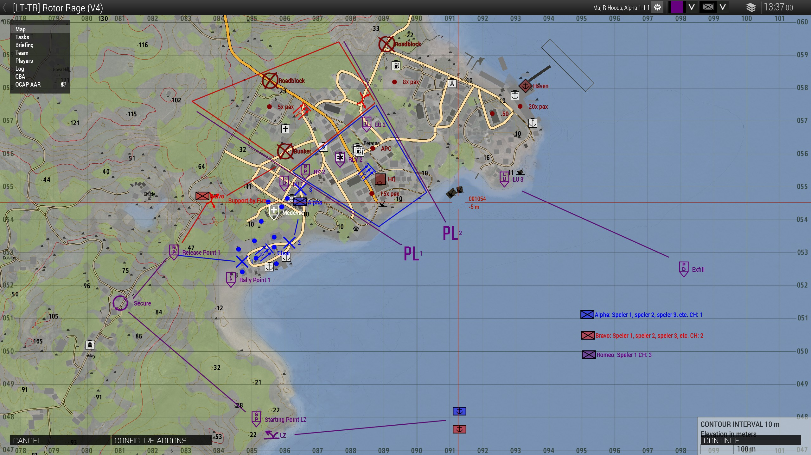

# 6.1. Groepscommandant

    :fontawesome-solid-user: Auteur: **N/A** | :material-calendar-plus: Aangemaakt: **26-08-2025** | :material-calendar-edit: Laatste update: **N/A** door **N/A**

??? info
    In deze gids leer je over de rol van Groepscommandant, oftewel GC. De Groepscommandant is de hoogst leidinggevende rol van een spelersgroep van LowTac. Deze gids geeft meer informatie over wat het betekent om de rol aan te nemen en wat de verantwoordelijkheden en verwachtingen zijn. De GC slot kan enkel geslot worden als je op de hoogte bent van dit trainingsdocument in combinatie met een begeleid traject, waarbij een begeleider meerdere keren ondersteunt en samen met je evalueert. Na consistent bewezen resultaat ontvang je het trainingsvinkje.

    GC training voorwaarde:

    -	De cursist bezit alle competenties uit de onderstaande trainingen (en de vinkjes), die voorwaarde zijn om aan de GC-training te beginnen:

        - Alle basisvaardigheden

        - Grenadier, Anti-tank en Engineer

        - Voertuigen, Fastrope en Paradrop

    -	De cursist is bekend met de competenties en verantwoordelijkheden van een groepscommandant.

    Leiderschap:

    -	De cursist weet sturing te geven aan het slotten en weet met welke aspecten daarbij rekening gehouden moet worden.

    -	De cursist kan aan het begin van een sessie een briefing verzorgen (verwachtingsmanagement uitspreken) en dit door (laten) briefen naar de spelers om alle neuzen dezelfde kant op te krijgen.

    -	De cursist weet hoe een briefing en debriefing georganiseerd wordt.

    -	De cursist kan kort en bondig communiceren en leiding geven. 

    -	De cursist weet hoe die zelf veilig kan opereren in missiegebied, zodat hij te allen tijde sturing kan blijven geven. 

    -	De cursist kan zijn Situational Awareness vergroten door SITREPS en AMCAS op te vragen.

    -	De cursist behoudt Situational Awareness, kan adequaat inspelen op contact, behoudt helikopterview en neemt de lastige beslissingen waar nodig.

    -	De cursist blijft adequaat reageren en valt niet stil, ook als er grote stress-factoren optreden.

    -	De cursist kan inspelen op reservisten (respawners en te laat komers). 

    -	De cursist doet aan tijdbewaking, vertrekt op tijd en zorgt in samenwerking met de admin dat de missie volgens eindtijd stopt.

    -	De cursist weet hoe gekloot voorkomen kan worden en spreekt aan waar nodig of schakelt staf in.

    -	De cursist kan effectief de mogelijkheden van Alive inzetten. 
     
    Planning:

    -	De cursist weet hoe die zich inleest en voorbereid op de sessie.

    -	De cursist kan (aanvals)plannen maken en intekenen op de kaart en daarbij gebruik maken van de Lowtac symbolen. De cursist kan daarbij het terrein lezen en inspelen op mogelijke dreigingen. 

    -	De cursist kan op verschillende manier verplaatsingen organiseren.

    -	De cursist kan vooruit plannen, inspelen op nieuwe intel en de snelheid in de sessie behouden.

    -	De cursist kan Linkup Points opzetten en waar nodig een resupply organiseren.

## Competentie
Als groepscommandant ben je verantwoordelijk voor het speelplezier van de groep. Houd daarom de volgende zaken in je achterhoofd:

1.	Jouw stemming straalt uit naar de rest van de groep. Ben je die avond niet jezelf? Laat het dan aan een ander gekwalificeerd lid over. Hier tellen ego’s of schaamte niet. Het spelplezier van de spelers gaan voor op die van jou. 

2.	Afgetekende competentie. Dat wil zeggen dat je de training gevolgd moet hebben.  Dit is het bewijs en de geruststelling naar anderen dat je niet alleen competent bent, maar ook de juiste mindset hebt om de spelers een leuke avond te bezorgen.

3.	Een natuurlijke autoriteit zijn. Jij leidt de missie. Jij bent de leider, maar niet de baas. Een leider geeft altijd het goede voorbeeld.

4.	Een natuurlijke rust onder stresvolle situaties. “No plan survives first contact” is niet voor niets een bekend gezegde. Bewaar je rust. Neem indien nodig een of twee extra tellen voordat je je commando’s doorgeeft aan de vuurteamleiders. Geef het dan door. Duidelijk, luid en als een commando. Houd de communicatie kort en duidelijk.

5.	Een sterk aanpassingsvermogen. Inhakend op punt 4. Je zal altijd ergens door verrast worden. Neem geen te grote risico’s. Houd alle zaken in het achterhoofd. Reservegroepen, onvervangbare voertuigen, beperkte munitie. Houd er rekening mee dat het altijd anders verloopt dan jij je had voorgesteld en acteer daar kundig op.

6.	Bereid te zijn om onconventionele, maar tactische besluiten te maken. Wees daarin een autoriteit. In zulke situaties is er geen tijd en ruimte voor overleg en discussie. Maar sta wel open voor nieuwe informatie gepresenteerd door de VTL’s.

7.	Last but not least. Maak geen misbruik van je rol. Vergeet niet dat dit een spel is waar mensen eenmaal per week voor gaan zitten. Ondanks dat realisme een belangrijke factor is, zitten we niet echt in militaire dienst. Wees een leider, maar behandel mensen met respect.  

## De rol van de groepscommandant (GC)
De Groepscommandant is de hoogst speelbare rol binnen LowTac, callsign ‘Romeo’. Deze rol leidt de sessie en bepaalt welke rollen er geslot worden, wijst focuspunten voor de sessie aan, maakt de (aanvals)plannen voor- en tijdens de missie, zet deze uit bij de vuurteamleiders (VTL’s), houdt het tactisch overzicht en stuurt bij waar nodig en organiseert in-game een debrief als de sessie klaar is.

De groepscommandant fungeert niet als frontsoldaat. Als GC beweeg je op veilige afstand mee met de teams om aan te kunnen sturen en Situational Awareness te behouden. Hij is wel degelijk capabel en uitgerust om te kunnen vechten, echter is dit enkel voor zelfbescherming. Als een GC neer gaat, kan dit grote impact hebben op het verloop van de missie. Het is dan alsof je ‘het hoofd ergens vanaf haalt’. Mocht dit toch gebeuren dan neemt een aangewezen 2IC (Second in Command), callsign ‘Echo’, de leiding tijdelijk over. Als echo niet geslot is, dan is de eerstvolgende VTL (vaak Alpha) de 2IC.

## De verantwoordelijkheden en werkzaamheden van de groepscommandant (GC)
De groepscommandant is als hoogste in rang verantwoordelijk voor het speelplezier en de snelheid van de sessie. De beslissingen die je maakt hebben hier een direct invloed op. Ervaring op verschillende gebieden is vereist. Denk hierbij aan onder andere; (radio)communicatie, maken en intekenen van het tactisch plan, briefen aan VTL’s, adequaat reageren op contact en veranderende situaties, navigatie, situational awareness (SA), gebruik maken van Alive, verschillende vormen van verplaatsen en voertuigkennis.

Elke sessie kent dezelfde opzet, fasen en afloop. Deze zijn hieronder in chronologische volgorde beschreven. Daarbij ligt het accent op de verantwoordelijkheden en werkzaamheden van de groepscommandant. Na fases zal er nog dieper worden ingegaan op specifieke onderwerpen.

### Voorbereidingsfase – Voor de sessie

1.	Als je groepscommandant wil spelen, dan plaats je het Lowtac-logo onder de missiebriefing. Daarmee geef je aan dat je de rol op je wil nemen en alvast een plan gaat maken buiten de sessie.

2.	De GC leest de missiebriefing op Discord. Zorg dat je vroegtijdig op de hoogte bent van alle beschikbare informatie, zodat je aan het begin van de sessie zo snel mogelijk een plan kan maken, intekenen en bespreken. De spelersgroep wil zo snel mogelijk in actie komen.

    -	Wie zijn wij als spelersgroep en welke middelen hebben we tot onze beschikking?

    -	Wie is de vijand, wat is de motivatie, welke middelen heeft de vijand tot zijn beschikking?

    -	Wat is de verwachting qua burgers in het missiegebied?

    -	Wat kan je verwachten qua terrein?

    -	Wat zijn de missiedoelen en onder welke condities zijn deze geslaagd?

    -	Welke ondersteuning heb je tot je beschikking?

3.	Zorg voor pen en papier op je bureau om aantekeningen te kunnen maken.

### Voorbereidingsfase – Tijdens de sessie

1.	Het slotten. Als GC bepaal je aan de hand van de briefing en de beschikbare intel welke teams en sloten je mee wil nemen. Denk hierbij aan: 

    -	Is een engineer vereist? 

    -	Heb je voertuigdreiging en dus mogelijk AT nodig? 

    -	Slot altijd één of meerdere vuurteamleiders die de aansturing van het team oppakken.

    -	Vergeet de medics niet. Behoud zelf het overzicht. Voorkom dat je zelf een dubbelrol als VTL/GC hebt. 

    -	Zorg ervoor dat aspiranten bij hun begeleider zitten als buddy.

2.	In-game teken je jouw plan in op de kaart:

    -	(Mogelijke) dreigingen en doelen

    -	Omgevingsfactoren

    -	Verplaatsing

    -	Aanvalsplan

### Voorbereidingsfase – Briefing
1.	Roep in-game alle VTL’s bij elkaar en bespreek in ieder geval de volgende checklist:

    -	Teams, kleurcoderingen en callsigns intekenen op de kaart (Blueforce tracker). 

    -	Stem communicatie op de short- en longrange met elkaar af en test de longrange.

    -	Stel een 2IC aan. Bepaal daarnaast per team wie de back-up VTL is.

    -	Bespreek aandachtspunten, bijvoorbeeld; contact uitroepen op longrange, reageren op AMCAS/SITREPS, geclearde huizen markeren met punt, aandachtspunten uit trainingen, etc.

    -	Bespreek de missiedoelen en bijzonderheden.

    -	Bepaal welke missie specifieke gereedschappen en wapensystemen meegenomen moeten worden.

    -	Bespreek rearm, repair en respawn mogelijkheden.

    -	Bepaal welke eventuele voertuigen er per team meegenomen worden, wat de konvooisnelheid is, wat de tussenafstand is en wat de route is.

2.	De GC bespreekt het aanvalsplan en aandachtspunten met de VTL’s. Bespreek in ieder geval de volgende checklist:

    -	Bepaal beweeg- en aanvalsroutes. Houdt rekening met het terrein.

    -	Bepaal mogelijke dreigingen en ‘killing zones’.

    -	Bepaal Release Points (RP), Linkup Points (LU), Rally Points (RLY), etc.

    -	Controleer of de VTL’s het plan begrijpen.

    -	Laat de VTL’s het plan briefen aan hun vuurteam.

    -	Laat de VTL’s omroepen als ze klaar zijn voor vertrek. 

!!! warning "Vergeet niet.. ‘No plan survives first contact!’"

### Uitvoeringsfase 
1.	Verplaatsing; Bepaal de vorm van verplaatsing tussen de objectives en laat de teams dit uitvoeren.

2.	Contact; Zorg dat de VTL’s het contact doorgeven en speel adequaat in op de dreiging (laat teams elkaar ondersteunen, richt waar nodig een medic post in, trek terug indien vereist en zet ondersteunende middelen in).

3.	Behoud Situational Awareness; Vraag met regelmaat SITREP en AMCAS op bij VTL’s.

4.	Plan vooruit; Zorg dat jouw plannen up-to-date zijn, zodat je deze kunt briefen als de situatie hier om vraagt.

5.	Gevechtspauze; Leg 360 graden beveiliging aan, lap gewonden op, bevoorraad de teams en brief het nieuwe plan door aan de VTL’s.

6.	Start opnieuw met een verplaatsing of start met de afrondingsfase.

### Afrondingsfase – Debriefing
Cirkel up! Aan het einde van de sessie organiseer je in-game een korte debriefing volgens onderstaand stappenplan:

1.	Blik zelf terug op de sessie vanuit GC oogpunt. Wat ging goed? Waar was er ruimte voor verbetering? Hoe kunnen we hier op inspelen?

2.	Laat de VTL’s aan het woord om aan te vullen.

3.	Bepaal waar nodig focuspunten voor de volgende sessie.

4.	Call de missie via de admin.

### Afrondingsfase – Afsluiting staf
Na de sessie zal de staf het overnemen. Jouw rol als GC zit erop. De ‘Gouden Pik’ en waar nodig de ‘Lul van de week’ worden bepaald. Het missieverloop wordt via OCAP opgeslagen en is inzichtelijk voor reflectie en evaluatie. De sessie wordt afgesloten door de GC en de missiemaker te bedanken. Daarna zal de staf eventuele staf-updates of opmerkingen bespreken.

## Onderwerpen in detail
### Verplaatsing
De GC bepaalt de navigatie en route. In grote lijnen kies je een route over het terrein. Echter hoef je dit niet te micromanagen. Maak gebruik van het overzicht van de VTL’s en laat ze hun eigen veilige routes bepalen. Vraag om updates en stel bij waar nodig. Als GC bewaak je het overzicht en zorg je ervoor dat de team niet te ver uit elkaar gaan. Ze moeten elkaar kunnen blijven ondersteunen.

1.	Te voet: Bepaal de verplaatsingsvolgorde, eventuele formaties en de route. Teken dit in op de kaart. 

2.	Rijdend: Bepaal de voertuigvolgorde, konvooi snelheid, tussenafstand tussen voertuigen en de route. Teken dit in op de kaart. Stel voertuigcommandanten aan en bepaal communicatiemiddelen. Bespreek uitwijk- en aanvalsopstellingen vóór het contact.

3.	Helikopter: Bepaal in samenspraak met de piloot de vliegroute, een Landing Zone (LZ) en teken deze in. Bepaal uitwijkmogelijkheden zoals back-up LZ’s. Bespreek uitwijk- en aanvalsmogelijkheden vóór het contact. Bespreek hoe de LZ beveiligd wordt en welke looproute gevolgd gaat worden, zie ‘Te voet’. Bespreek met de VTL’s wanneer je fastroped wanneer en hoe dit gebeurt. De fastrope documentatie gaat hier dieper op in.

4.	Vliegtuig: Bepaal in samenspraak met de piloot de vliegroute; de aanvliegroute (IP), het drop-off punt en exit punt (EGRESS). Bespreek uitwijk- en aanvalsmogelijkheden vóór het contact. Bespreek hoe het drop-off punt beveiligd wordt en welke looproute gevolgd gaat worden, zie ‘Te voet’. Bespreek met de VTL’s wanneer je paradropt wanneer en hoe dit gebeurt. De paradrop documentatie gaat hier dieper op in.

### Contact

1.	Een VTL moet doorgeven als er contact is volgens het RAD-principe; Richting – Afstand – Doel. Deze informatie helpt bij jouw Situanional Awareness (SA), aangezien je vaak niet in de frontlinie opereert. Op basis van de beschikbare informatie ga je reageren!

    - Blijven de teams in hun eigen sector? 

    - Moet het andere team ondersteunen? 

    - Moet een team dekkingsvuur geven of juist over het andere team heen springen?

    - Is flanken een optie? Of moeten de teams juist dicht  bij elkaar blijven? 

    - Is er een mass-cass situatie? Moet de ene medic de andere medic oplappen? Moet er een medic post worden ingericht?

    - Is er ondersteuning nodig van  voertuigen, artillerie of CAS (via Alive)? 

    - Moeten de VTL’s direct met elkaar communiceren om friendly fire te voorkomen?

2.	Elk contact en elke situatie vraagt om een eigen aanpak. Het is aan de GC om de helikopterview te bewaren, adequaat te reageren en bij te sturen waar nodig. Zorg er in ieder geval voor dat de teams elkaar altijd kunnen ondersteunen. Voel per situatie aan of je de grote lijnen voor de VTL’s kan blijven bepalen of dat je directief in moet springen en moet micromanagen. Probeer micromanagen als GC te voorkomen als het niet nodig is.

3.	Als de situatie verkeerd dreigt te lopen is het ook aan de GC om terug te trekken, bijvoorbeeld wanneer de vijanddreiging te groot is of als er te veel gewonden zijn om effectief te blijven.
In dit soort gevallen gebruik je een afgesproken Rally Point en kun je waar nodig een medic post inrichten voor de triage op meerdere gewonden. Voorkom squad wipes.
Let erop dat een slimme vijand gebruik maakt van het terrein of je in ‘killing zones’ te lokken.

4.	Lees het terrein, speel in op risico’s en maak geen overhaaste beslissingen. Blijf rustig en voorkom dat je stil valt. Blijf aansturen, ook als het ingewikkeld wordt. Jouw rust en sturing helpt de VTL’s die middenin het contact zitten. Door de drukte kan het soms even duren voordat ze tijd hebben om te reageren. 

### SITREP en AMCAS
Als GC wil je een goede helikopterview en SA houden. Dit kun je doen door regelmatig een update te vragen bij de VTL’s. Dit kan via SITREP (Situation Report) of AMCAS (Ammunition en Casualties).

SITREP: Een SITREP  kun je tijdens contact opvragen om meer helderheid te krijgen over de huidige stand van zaken. 

!!! info "Bijvoorbeeld:" 
    ‘Hier SITREP Alpha; In contact, gebouw ingenomen noordoost zijde locatie zie kaart, .50 dreiging westen locatie onbekend, pinned down.’

AMCAS: Een AMCAS vraag je doorgaans na contact op om SA te krijgen op munitie en gewonden.

!!! info "Bijvoorbeeld:"
    ‘Hier AMCAS Alpha; 2 gewonden, medic is neer, ammo is geel, AT is zwart.’

### Vooruit plannen

1.	Als GC is het belangrijk om  vooruit te plannen. Teken dit in. Je bent verantwoordelijk voor de snelheid en het succes van de sessie. Plan tijdens een aanval alvast vooruit. Door het intekenen kun je kort en krachtig het nieuwe plan toelichten aan de VTL’s. Het is voor spelers vervelend als ze lang op jouw plan moeten wachten. Dit vergroot de kans op onwenselijk gekloot door spelers. Houd het tempo in de sessie, maar voorkom overhaaste beslissingen die negatief uit kunnen pakken.

2.	Teken de route naar een objective. Stel een Release Point vast waar de teams uit elkaar gaan. Teken details in over de aanval. Stel een Link Up Point vast waar de teams na de aanval bij elkaar komen. Stel een Rally Point vast waar de teams eventueel naartoe kunnen terugtrekken.

3.	Het is de taak van de GC om in te spelen op beschikbare intel en nieuwe tasks. Wanneer er intel gevonden wordt geef jij de GO wanneer dit opgepakt mag worden, zodat je zeker weet dat je deze informatie goed binnen krijgt. Lees je goed in op de tasks en informatie op de kaart en stel het plan bij waar nodig.

### Gevechtspauze

1.	Na een gevecht of wanneer terugtrekken noodzakelijk is kom je bij elkaar op een Linkup Point (LU). Het is de taak van de GC om vooruit gedacht te hebben. De plannen kunnen immers gewijzigd zijn. Je geeft een korte briefing aan de VTL’s (dit kan ook kort via radio). De VTL’s briefen dit door naar de spelersgroep.

2.	Terwijl je dit doet zorg je ervoor dat de VTL’s een 360 uitzetten (zorg dat de verschillende dreigingshoeken/windrichtingen beveiligd worden).

3.	Laat de VTL’s de eventuele gewonden oplappen via de medics.

4.	Resupply waar nodig. Laat de teams dit gefaseerd doen, zodat er altijd vuurlijnen zijn. Maak gebruik van beschikbare kisten of voertuig inventory. Wanneer dit niet afdoende is kan je via ‘Overlord’ oftewel een admin een resupply kist aanvragen als de missie dit toelaat. Doe dit op tijd, want een kist inroepen vergt tijd. Je moet wachten op de aanvliegroute en tot de kisten geland zijn. Bij voorkeur heb je dit al gedaan wanneer de spelers aankomen op het Linkup Point.
Teken de LZ voor de kisten in en vraag maximaal 3 crates aan. Je hebt o.a. keuze uit:

    - Small/Medium/Large ammo crate

    - Medical crates

    - Explosive /mine crate

    - Communication crate

    - NVG crate

5.	Laat de VTL’s omroepen als ze klaar zijn voor vertrek. 

### Reservisten
Reservisten oftewel spelers die te laat komen of spelers die opnieuw gespawnd zijn, wil je niet als kip zonder kop over de map laten rennen. Dit is ongeorganiseerd, ze lopen kans (opnieuw) gedood te worden, hebben geen steun of laten mogelijk triggers af gaan.

Spelers die bekend te laat zijn kun je een bericht (laten) sturen welke slot ze mogen pakken.

Het is belangrijk dat reservisten zich melden bij spawn, zodat je als GC een route kan uitstippelen en spelers dit gezamenlijk kunnen volgen. Het kan zijn dat ze via de bewezen route met een voertuigen kunnen komen, maar als de situatie het toelaat kan de GC ook regelen dat ze een lift krijgen via een helikopter. Waar nodig kan je via de admin een teleport (TP) aanvragen.

### Tijdbewaking
Samen met de admin bewaak je de tijd. De inloop is vanaf 19.30 uur. Om 20.00 uur start de sessie. Probeer jouw plan zo snel mogelijk samen te stellen en de spelersgroep in beweging te krijgen. Mik op vertrek tussen 20.15 en 20.30 uur. De sessie eindigt tussen 22.30 en 23.00 uur. Pas je plan aan waar nodig. Soms moet je een objective of deel van de missie overslaan om de eindtijd te behalen.

### Voorkom gekloot
Samen met de admin ben je verantwoordelijk voor het speelplezier van de gehele groep. Voorkom onrealistische of onhaalbare doelen en zorg ervoor dat je vooruit plant om lang wachten te voorkomen. Doorgaans voorkomt dit zware verliezen of eindeloos wachten, wat het speelplezier van anderen geen goed doet.

Het is niet de bedoeling dat spelers gaan kloten. Er is ruimte voor een grapje, maar de YOLO-sfeer moet voorkomen worden. Jouw acties helpen bij het voorkomen hiervan. Spreek spelers aan die buiten het boekje gaan of meldt dit bij de staf. 

Daarnaast is het niet de bedoeling dat spelers ongevraagd looten. Als GC bepaal je of er extra middelen uit kisten, voertuigen of van vijanden gepakt mogen worden. Enkel wanneer het niet anders kan geef je toestemming om van vijanden te looten; bijvoorbeeld als alle AT op is terwijl je wel actieve voertuig dreiging hebt.

### Alive
Via Self-interact kan de tablet van Alive worden geopend. De trainer kan in-game toelichten hoe de tablet werkt. Afhankelijk van de missiemaker zitten hier verschillende mogelijkheden tot ondersteuning in. Het is aan de GC om deze ondersteuning in te roepen waar nodig:

-	Transport heli: voertuig waarmee eigen troepen verplaatst kunnen worden via de lucht.

-	CAS: Close Air Support helikopter. Kan vuursteun geven op de aangewezen locatie.

-	Artillerie: Artillerie met verschillende munitietypen die in te roepen is op een aangewezen locatie. 

## Intekenen van een aanvalsplan
Bij het intekenen van jouw aanvalsplan houd je rekening met de volgende aandachtspunten:

### (Mogelijke) dreigingen en doelen

-	Dreigingen en doelen verkrijg je via de briefing, tasks, intel of scouting. Gebaseerd op de dreiging pas je hier de geweldsmiddelen op aan. 

-	Laat de teams dreigingen ook intekenen op de kaart voor een goede SA.

-	Teken deze dreigingen en doelen in met de OPFOR kleur.

-	Anticipeer op verwachte dreigingen zoals een mogelijke ambush locatie of versterking. 

### Omgevingsfactoren

-	Terreinverkenning: hoogteverschillen, trechtervorming, open terrein, etc.

-	Dekking en beschutting: Gebouwen, muren, rotsen, greppels, bebossing, etc.

-	Meteorologie: dag, nacht, mist, regen, wind, etc.

-	Tijdslimiet: tijd tot aankomst versteking, resterende tijd tot einde sessie, etc.

### Verplaatsing

-	Bepaal de inzet van beschikbare verplaatsingsmiddelen.

-	Locaties van Landing Zones (LZ’s), parkeerplaatsen of drop-off punten.

-	Teken grove verplaatsingsroutes in. Laat de VTL’s detailroutes maken via cover (veiligheid).

-	Teken belangrijke verplaatsingspunten in: Release Points (RP), Linkup Points (LU) en Rally Points (RLY), Exfill (PD)

## Aanvalsplan
In het onderstaande overzicht is een specifiek aanvalsplan ingetekend ter illustratie.

In het bovenstaande aanvalsplan is te zien:

-	Om te beginnen:

    - Bepaal kleurgebruik per team.

    - Laat de VTL’s de teams en middelen intekenen op de kaart.

    - Bepaal radiogebruik en radiokanalen per team.

-	Starting Point LZ tot aan Release Point 1:

    - Startpunt is het punt waar de missie begint.

    - De paarse GC lijn geeft een gezamenlijke grove route aan die naar het eerste Release Point gaat. Daar splitsen de teams op.

-	Release Point 1 tot aan Linkup Point 1:

    - Alpha zuivert de kleine haven en markeert alle huizen die gezuiverd zijn met een punt.

    - Bravo biedt dekkingsvuur via een hoger gelegen punt. 

    - Beide teams komen na het zuiveren aan op Linkup Point 1.

    - Als terugtrekken nodig is trekken de teams naar Rally Point 1.

    - Bij meerdere gewonden kan een Medic Post worden ingetekend zoals aangegeven met de witte marker. 

-	Release Point 2 tot aan Linkup Point 2:

    - Vanaf Release Point 2 splitsen beide teams op en gaan een eigen sector zuiveren. Deze zijn aangegeven met een blauwe en rode box.

    - VTL’s bepalen zelf via welke aanvalsroute zij de box zuiveren. Stuur hierbij ook op de risico’s van vuur op eigen troepen.

-	Na Phaseline 2 tot aan Exfill:

    - Hier is een situatie geschetst waar de GC nog geen plan heeft kunnen maken. Tijdens de aanval tussen PL1 en PL2 kan de GC hieraan werken. De GC moet vooruit plannen.

Een beschrijving van de markers die we gebruiken vind je hier: [Steam Community :: Gids :: Markersplus Usage Guide](https://steamcommunity.com/sharedfiles/filedetails/?id=3365010538)

