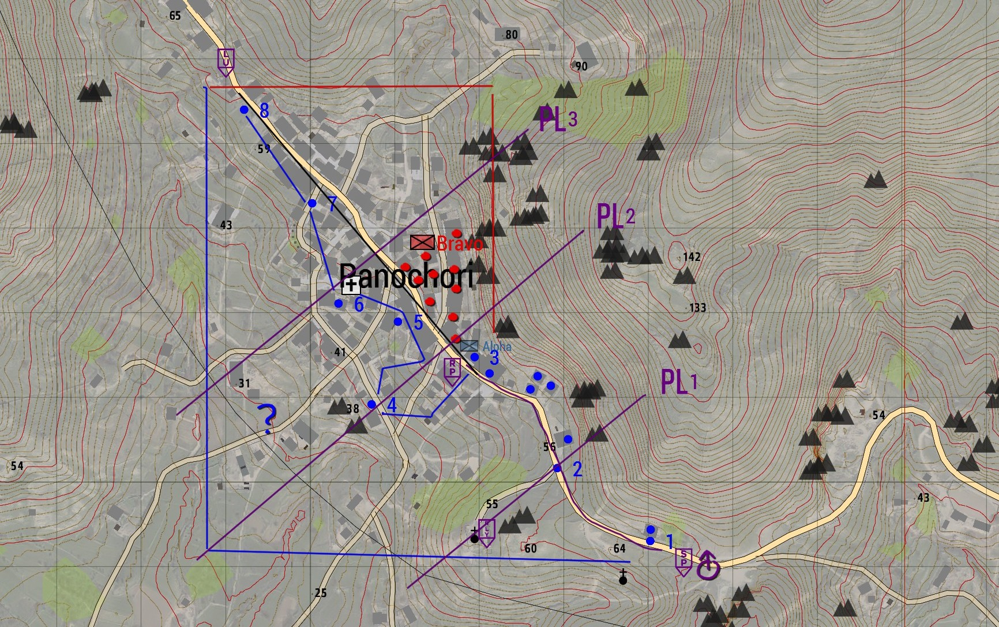

# 6.2. Vuurteamleider

    :fontawesome-solid-user: Auteur: R.Hoods | :material-calendar-plus: Aangemaakt: **12-10-2025** | :material-calendar-edit: Laatste update: 12-10-25 door Pek

??? info
    In deze gids leer je over de rol van vuurteamleider, oftewel VTL. De vuurteamleider leidt een team van 6 tot 8 infanteristen en opereert onder het command van de groepscommandant. Deze gids geeft meer informatie over wat het betekent om de rol aan te nemen en wat de verantwoordelijkheden en verwachtingen zijn. De VTL slot kan enkel geslot worden als je op de hoogte bent van dit trainingsdocument in combinatie met een begeleid traject, waarbij een begeleider meerdere keren ondersteunt en samen met je evalueert. Na consistent bewezen resultaat ontvang je het trainingsvinkje.

    GC training voorwaarde:

    -	De cursist bezit alle competenties uit de onderstaande trainingen (en de vinkjes), die voorwaarde zijn om aan de GC-training te beginnen:

        - Alle basisvaardigheden

        - Grenadier, Anti-tank en Engineer

        - Voertuigen, Fastrope en Paradrop

    -	De cursist is bekend met de competenties en verantwoordelijkheden van een vuurteamleider.

    Leiderschap:

    -	De cursist kan meedenken met de GC bij het slotten en weet de sloten van het vuurteam af te stemmen op de inhoud van de missie.

    -	De cursist na de briefing van de GC doorbriefen naar het vuurteam om zo verwachtingen af te stemmen en alle neuzen dezelfde kant op te krijgen. 

    -	De cursist kan blueforce tracker updaten en het team op de kaart zetten.

    -	De cursist kan kort en bondig communiceren en leiding geven. 

    -	De cursist weet sturing te geven aan het vuurteam, zonder zelf onnodig gevaar te lopen, zodat er zoveel mogelijk sturing gegeven kan worden. 

    -	De cursist kan het vuurteam laten verplaatsen in meerdere formaties en met de verschillende wapencommando’s.

    -	De cursist heeft Situational Awareness, kan adequaat inspelen op contact, behoudt helikopterview over het vuurteam, houdt het team bij elkaar en neemt lastige beslissingen onder druk.

    -	De cursist kan SITREPS en AMCAS antwoorden voor het vuurteam.

    -	De cursist blijft adequaat communiceren en valt niet stil, ook als er contact of grote stress-factoren optreden. Dit zowel op de short- als longrange radio.

    -	De cursist kan de omgeving of het terrein lezen en hier tactische keuzes op aanpassen. Waar nodig met advies aan de groepscommandant.

    -	De cursist weet hoe gekloot voorkomen kan worden en spreekt aan waar nodig of schakelt staf in.

    -	De cursist kan effectief de mogelijkheden van Alive aanvragen. 

    -	De cursist kan uit zichzelf 360 graden beveiliging laten aanleggen.

    Planning:

    -	De cursist weet hoe die zich inleest en voorbereid op de sessie.

    -	De cursist kan (aanvals)plannen vertalen naar praktische handelingen voor het vuurteam. De cursist kan daarbij het terrein lezen en inspelen op mogelijke dreigingen. 

    -	De cursist kan op verschillende manier verplaatsingen voor het vuurteam organiseren.

## Competentie
Als vuurteamleider ben je verantwoordelijk voor het speelplezier van een vuurteam. Houd daarom de volgende zaken in je achterhoofd:

1.	Jouw stemming straalt uit naar de rest van de groep. Ben je die avond niet jezelf? Laat het dan aan een ander gekwalificeerd lid over. Hier tellen ego’s of schaamte niet. Het spelplezier van de spelers gaan voor op die van jou. 

2.	Afgetekende competentie. Dat wil zeggen dat je de training gevolgd moet hebben.  Dit is het bewijs en de geruststelling naar anderen dat je niet alleen competent bent, maar ook de juiste mindset hebt om de spelers een leuke avond te bezorgen.

3.	Een natuurlijke autoriteit zijn. Jij leidt een vuurteam. Jij bent de leider, maar niet de baas. Een leider geeft altijd het goede voorbeeld.

4.	Een natuurlijke rust onder stresvolle situaties. “No plan survives first contact” is niet voor niets een bekend gezegde. Bewaar je rust. Als het contact er is, luistert het vuurteam naar jouw sturing. Maak keuzes, houdt het team zo veilig mogelijk en communiceer! Houd de communicatie kort en duidelijk.

5.	Een sterk aanpassingsvermogen. Inhakend op punt 4. Je zal altijd ergens door verrast worden en staat er als vuuteamleider gelijk bovenop. Neem geen te grote risico’s. Houd alle zaken in het achterhoofd. Schiethoeken, vuurkracht, gewonden, ammo-count, afstand tot eigen troepen, ondersteuningsmogelijkheden. 

6.	Bereid te zijn om onconventionele, maar tactische besluiten te maken. Wees daarin een autoriteit. In zulke situaties is er geen tijd en ruimte voor overleg en discussie. Luister naar het command van de groepscommandant en stuur bij als jouw SA een betere route of plan geeft.

7.	Last but not least. Maak geen misbruik van je rol. Vergeet niet dat dit een spel is waar mensen eenmaal per week voor gaan zitten. Ondanks dat realisme een belangrijke factor is, zitten we niet echt in militaire dienst. Wees een leider, maar behandel mensen met respect.  

## De rol van de vuurteamleider (VTL)
De vuurteamleiders, zijn naast de groepscommandant en de 2IC, belangrijke rollen die leiding geven aan een vuurteam zoals Alpha of Bravo. De vuurteamleider vertaalt de (aanvals)plannen van de groepscommandant naar directe acties in de praktijk en is de communicatielijn naar de GC en andere eenheden. Vuurteamleiders staan in de frontlinie met hun team en handelen dreigingen vaak als eerste af. Een vuurteamleider beweegt zich zo veilig mogelijk binnen het vuurteam, maar is ook goed uitgerust om contacten waar nodig aan te grijpen. 

Wanneer er geen 2IC in de peletonsgroep is geslot, is de vuurteamleider van het eerste aanvalteam (vaak Alpha), degene die het command krijgt als de groepscommandant neer gaat. Daarmee ontstaat er een tijdelijke dubbelrol om zowel het vuurteam als de andere eenheden aan te sturen.

## De verantwoordelijkheden en werkzaamheden van de vuurteamleider (VTL)
De vuurteamleider is als leider van een vuurteam verantwoordelijk voor het speelplezier van de vuurteamleden tijdens de sessie. De beslissingen die je maakt hebben hier een direct invloed op. Ervaring op verschillende gebieden is vereist. Denk hierbij aan onder andere; (radio)communicatie, vertalen en intekenen van het tactisch plan, briefen aan teamleden, adequaat reageren op contact en veranderende situaties, navigatie, situational awareness (SA), aanvragen van ondersteuning, verschillende vormen van verplaatsen en voertuigkennis.

Elke sessie kent dezelfde opzet, fasen en afloop. Deze zijn hieronder in chronologische volgorde beschreven. Daarbij ligt het accent op de verantwoordelijkheden en werkzaamheden van de vuurteamleider. Na fases zal er nog dieper worden ingegaan op specifieke onderwerpen.

### Voorbereidingsfase – Voor de sessie

1.	De VTL heeft kennis van de missiebriefing nodig, om tijdens de sessie adequate beslissingen te kunnen nemen. Zorg dat je vroegtijdig op de hoogte bent van alle beschikbare informatie, zodat je samen met de GC snel een plan kunt maken, intekenen en bespreken. De spelersgroep wil zo snel mogelijk in actie komen.

    -	Wie zijn wij als spelersgroep en welke middelen hebben we tot onze beschikking?

    -	Wie is de vijand, wat is de motivatie, welke middelen heeft de vijand tot zijn beschikking?

    -	Wat is de verwachting qua burgers in het missiegebied?

    -	Wat kan je verwachten qua terrein?

    -	Wat zijn de missiedoelen en onder welke condities zijn deze geslaagd?

    -	Welke ondersteuning heb je tot je beschikking?

2.  Als je vuurteamleider wil spelen, dan maak je dit kenbaar tijdens het slotten. 

3.	Zorg voor pen en papier op je bureau om aantekeningen te kunnen maken.

### Voorbereidingsfase – Tijdens de sessie

1.	Het slotten. De groepscommandant besluit welke rollen er worden meegenomen en hoeveel man er in jouw vuurteam komen. Als VTL mag je voor jouw team meedenken. Denk hierbij aan: 

    -	Is het mogelijk om een even aantal vuurteamleden te hebben voor buddyparen?

    -   Heb je een medic in jouw team?

    -   Heb je voldoende specialisten in jouw team om de verwachte dreiging uit te schakelen?

    -   Zijn de vuurteams in balans? Is ervaring voldoende verdeeld?

    -   Zorg ervoor dat aspiranten bij hun begeleider zitten als buddy.

2.	In-game zet je jouw vuurteam op de kaart:

    -	Callsign van Blueforce tracker aanpassen; Alpha 1-3 wordt 'Alpha'.

    -	Opsomming van de spelers, loopvolgorde, rollen en short-range radiokanaal: Alpha: Speler 1 (AR) | Speler 2 (GRE) | Speler 3 (VTL) | Speler 4 (M) | Speler 5 (AT) | Speler 6 (R) CH: 1

    -   Geef de opsomming de kleur waarmee jij later jouw sub-plannen intekent op de kaart.

3.  Bekijk alvast het plan wat de GC op de kaart aan het intekenen is, zodat de briefing soepeler verloopt.

### Voorbereidingsfase – Briefing
1.	Als de groepscommandant klaar is met intekenen kom je met de leiding bij elkaar voor de briefing en bespreek je de volgende punten:

    -	Teams, kleurcoderingen en callsigns intekenen op de kaart (Blueforce tracker). 

    -	Stem communicatie op de short- en longrange met elkaar af en test de longrange.

    -	Stel een 2IC aan. Bepaal daarnaast per team wie de back-up VTL is.

    -	Bespreek aandachtspunten, bijvoorbeeld; contact uitroepen op longrange, reageren op AMCAS/SITREPS, geclearde huizen markeren met punt, aandachtspunten uit trainingen, etc.

    -	Bespreek de missiedoelen en bijzonderheden.

    -	Bepaal welke missie specifieke gereedschappen en wapensystemen meegenomen moeten worden.

    -	Bespreek rearm, repair en respawn mogelijkheden.

    -	Bepaal welke eventuele voertuigen er per team meegenomen worden, wat de konvooisnelheid is, wat de tussenafstand is en wat de route is.

2.	De GC bespreekt het aanvalsplan en aandachtspunten met de VTL’s. Je krijgt informatie over de volgende punten:

    -	De beweeg- en aanvalsroutes, rekening houdend met het terrein.

    -	De mogelijke dreigingen en ‘killing zones’.

    -	De Release Points (RP), Linkup Points (LU), Rally Points (RLY), etc.

    -	Als VTL teken je, in jouw afgesproken kleur, jouw missiespecifieke orders meer gedetailleerd in voor jouw vuurteam.

3.  Roep jouw vuurteam bij elkaar en geef een vuurteam-specifieke briefing:

    -   Deel de hoofd objectives, de specifieke taken, beschikbare middelen en de manier van verplaatsing van jouw vuurteam met de leden.

    -   Maak buddyparen, geeft ze via team management gekoppelde kleuren en stel een 2IC voor het vuurteam aan (geef die extra longrange waar mogelijk).

    -   Deel jouw verwachtingen en aandachtspunten met de leden.

    -   Doe een short-range radiocheck en laat iedereen in (vertrek)positie komen.

4.  Geef het door aan de groepscommandant als jouw vuurteam klaar voor vertrek is.

!!! warning "Vergeet niet.. ‘No plan survives first contact!’"

### Uitvoeringsfase 
1.	Verplaatsing; Organiseer vorm van verplaatsing tussen de objectives voor jouw vuurteam.

2.	Contact; Je speelt adequaat in op contact, behoudt helikopterview over het vuurteam, houdt het team bij elkaar en neemt lastige beslissingen onder druk. Je blijft communiceren binnen en buiten het vuurteam en houdt iedereen zoveel mogelijk in veiligheid. Lap gewonden op waar mogelijk, maar     blijf het initiatief in het vuurgevecht behouden.

3.	Behoud Situational Awareness; Laat contacten uitroepen via RAD, weet waar dreiging is, hoe je het terrein tot jouw voordeel kunt gebruiken, waar jouw teamleden en andere teams zijn en hoe je jouw team zo veilig mogelijk kunt laten opereren.

4.	Plan vooruit; Zorg dat jouw vuurteam-specifieke taken en plannen ingetekent zijn, zodat je jouw team effectief kan sturen en jij hun SA vergroot.

5.	Gevechtspauze; Laat 360 graden beveiliging aanleggen, lap gewonden op, vraag re-arm aan waar nodig, haal het nieuwe plan op bij de GC en brief dit door aan jouw team.

6.	Start opnieuw met een verplaatsing of sluit aan in de afrondingsfase.

### Afrondingsfase – Debriefing
Cirkel up! Aan het einde van de sessie organiseert de groepscommandant een debriefing:

1.	Er wordt teruggeblikt. Wat ging goed? Waar was er ruimte voor verbetering? Hoe kunnen we hier op inspelen?

2.	Als vuurteamleider mag je namens jouw team het woord doen.

3.	Bepaal waar nodig focuspunten voor de volgende sessie met elkaar.

4.	De missie wordt gecalld.

### Afrondingsfase – Afsluiting staf
Na de sessie zal de staf het overnemen. De ‘Gouden Pik’ en waar nodig de ‘Lul van de week’ worden bepaald. Vanuit jouw vuurteam kun je mensen aandragen. Het missieverloop wordt via OCAP opgeslagen en is inzichtelijk voor reflectie en evaluatie. De sessie wordt afgesloten door de GC en de missiemaker te bedanken. Daarna zal de staf eventuele staf-updates of opmerkingen bespreken.

## Onderwerpen in detail
### Verplaatsing
De GC bepaalt de navigatie en route. De grote specifieke lijnen specificeer jij voor jouw vuurteam. Lees het terrein en stem hier jouw verplaatsing op af; Waar zit de dreiging? Waar heb je cover? Hoe zorg je voor zoveel mogelijk hard cover? Hoe minimaliseer je risico's? Hoe snel kun je verplaatsen? Hoe blijf je binnen ondersteuningsafstand van andere teams? Op de kaart kan een plan van de GC er top uitzien, maar soms blijkt in het veld dat je beter andere keuzes kan maken. Maak deze keuzes en stem ze af met de groepscommandant en andere teams.

1.	Te voet: Teken de route voor jouw team in op de kaart. Bepaal waar nodig 'checkpoints/nummers'. Roep de loopvolgorde, formatie en wapencommando uit. Stuur het team mondeling. Vergeet niet dat vuurteamleden vaak geen GPS-mogelijkheden en daarom verminderde SA hebben. Het helpt als jij regelmatig het team updates geeft en de route bijsteld. De loopvolgorde is afhankelijk van de soort dreiging; bijvoorbeeld AT voorop bij voertuigdreiging of AR voorop bij veel pax dreiging. 

2.	Rijdend: Stem met GC af welke voertuigen je ter beschikking hebt. Verdeel jouw teamleden over de beschikbare voertuigen en belangrijke posities zoals gunners en drivers. Benoem de konvooi snelheid, tussenafstanden en de route. Bepaal per voertuig wie de voertuigcommandant is en zorg voor voldoende communicatie tussen voertuigen. Bespreek uitwijk- en aanvalsopstellingen vóór het contact.

3.	Helikopter: Van de piloot of GC ontvang je het vluchtplan, de Landing Zone (LZ) en eventuele uitwijkmogelijkheden. Je hoort van de GC wie de leiding neemt bij het fastropen. Geef jouw vuurteamleden allemaal een nummer en laat uitsteigen wanneer dit wordt aangegeven. De fastrope documentatie gaat hier dieper op in. Zorg na de landing voor 360 graden beveiliging door jouw vuurteam.

4.	Vliegtuig: Van de piloot of GC ontvang je het vluchtplan, het drop-off punt, het exit punt (EGRESS) en eventuele uitwijkmogelijkheden. Geef jouw vuurteamleden allemaal een nummer, refereer naar een herkenningspunt/LZ en laat springen wanneer dit wordt aangegeven. De paradrop documentatie gaat hier dieper op in. Zorg na de landing voor 360 graden beveiliging door jouw vuurteam.

### Contact

1.	Laat iedereen twee keer vuren op het doel. 

2.  Zorg dat de vuurteamleden knielen/liggen en 'hard cover' zoeken terwijl er voldoende vuur gegeven blijft worden.

3.  Laat jouw vuurteamleden contacten uitroepen via het RAD-principe; Richting – Afstand – Doel. Zo weten jij en jouw teamleden waar het contact is en vergroot dit de algemene SA.

4.  Geef door aan de groepscommandant dat je in contact bent en geef daarmee een korte SITRAP.

5.  Op basis van de beschikbare informatie ga je reageren!

    - Is er voldoende hard cover? Kan ik voordelen behalen uit het terrein of de omgeving?

    - Kan ik het contact met alleen mij eigen vuurteam aan of moet ik ondersteuining inroepen?

    - Wat is de dreiging? Moet ik een specialist inzetten zoals; grenadier, AT of engineer?
    
    - Kan ik een flankerende beweging in (laten) zetten?

    - Moeten er gewonden in veiligheid gebracht worden? Kan ik dit (laten) doen, terwijl we initiatief in het vuurgevecht houden? 

    - Hoe laat ik iedereen zo veilig mogelijk verplaatsen?

    - Met welke vuurlijnen moeten we rekening houden? Waar zijn andere teams?

Elk contact en elke situatie vraag om een eigen aanpak. Het is aan jou om de helikoptervier over het team te bewaren, te weten waar iedereen is en bij te sturen waar nodig. Zorg ervoor dat buddyparen elkaar altijd kunnen ondersteunen. Geef kort en duidelijke commando's aan het vuurteam en zie erop toe dat de taken op de juiste manier worden uitgevoerd. Probeer te voorkomen dat je zelf te veel in contact komt. Dit vergroot het risico dat je neer gaat, waardoor er minder effectieve sturing optreedt. Doorgaans loop je niet voorop, maar samen met de medic in het midden of achter.

Als de situatie verkeerd dreigt te lopen is het ook aan de jou om op tijd terug te trekken of extra ondersteuning te vragen, bijvoorbeeld wanneer de vijanddreiging te groot is of als er te veel gewonden zijn om effectief te blijven.
In dit soort gevallen gebruik je een afgesproken Rally Point en kun je waar nodig een medic post inrichten voor de triage op meerdere gewonden. Hiermee voorkom een squad wipe voor jouw team.
Let erop dat een slimme vijand gebruik maakt van het terrein of je in ‘killing zones’ te lokken.

Lees het terrein, speel in op risico’s en maak geen overhaaste beslissingen. Blijf rustig en voorkom dat je stil valt. Blijf aansturen, ook als het ingewikkeld wordt. Jouw rust en sturing helpt de teamleden die het contact aangrijpen.  

### SITREP en AMCAS
Het is goed om de GC op de hoogte te houden van de ontwikkelingen, zodat diegene het plan en middelen hierop af kan stemmen. Dit kan via SITREP (Situation Report) of AMCAS (Ammunition en Casualties).

SITREP: Een SITREP kun je tijdens contact geven om meer helderheid over de huidige stand van zaken.

!!! info "Bijvoorbeeld:" 
    ‘Hier SITREP Alpha; In contact, gebouw ingenomen noordoost zijde locatie zie kaart, .50 dreiging westen locatie onbekend, pinned down.’

AMCAS: Een AMCAS geef je doorgaans na contact op om te informeren over munitie en gewonden.

!!! info "Bijvoorbeeld:"
    ‘Hier AMCAS Alpha; 2 gewonden, medic is neer, ammo is geel, AT is zwart.’

### Vooruit plannen

Jouw vuurteamleden hebben vaak geen GPS en verminderde SA. Teken de vuurteam-specifieke plannen in en vergroot daarmee de SA. Vaak doe je dit tijdens de briefing van de GC en stel je tijdens het contact bij waar nodig. Teken met jouw teamkleur.
Maak de looproute, checkpoint/nummers, doelen, zones om te clearen en dreiging duidelijk op de kaart.

### Gevechtspauze

Gevechtspauze; Laat 360 graden beveiliging aanleggen, lap gewonden op, vraag re-arm aan waar nodig, haal het nieuwe plan op bij de GC en brief dit door aan jouw team.

1.	Na een gevecht of wanneer terugtrekken noodzakelijk is kom je bij elkaar op een afgesproken punt. De komt met de GC en andere VTL's bij elkaar om de volgende fase te bespreken.

2.	Terwijl je dit doet zorg je ervoor dat vuurteamleden een 360 uitzetten (zorg dat de verschillende dreigingshoeken/windrichtingen beveiligd worden).

3.	Laat eventuele gewonden oplappen via de medic.

4.	Resupply waar nodig. Laat het team dit gefaseerd doen, zodat er altijd vuurlijnen zijn. Maak gebruik van beschikbare kisten of voertuig inventory. Wanneer dit niet afdoende is, vraag je de GC om een resupply.

5.	Geef het aan bij de GC wanneer jouw team klaar is om te vertrekken.

### Voorkom gekloot
Als vuurteamleider heb je ook een verantwoordelijkheid voor het speelplezier van de gehele groep. Het is niet de bedoeling dat spelers gaan kloten. Er is ruimte voor een grapje, maar de YOLO-sfeer moet voorkomen worden. Jouw acties helpen bij het voorkomen hiervan. Spreek spelers aan die buiten het boekje gaan of meldt dit bij de staf. 

Daarnaast is het niet de bedoeling dat spelers ongevraagd looten. De GC bepaalt of er extra middelen uit kisten, voertuigen of van vijanden gepakt mogen worden. Enkel wanneer het niet anders kan krijg je toestemming om van vijanden te looten; bijvoorbeeld als alle AT op is terwijl je wel actieve voertuig dreiging hebt.

### Alive
Via Self-interact kan de tablet van Alive worden geopend. De trainer kan in-game toelichten hoe de tablet werkt. Afhankelijk van de missiemaker zitten hier verschillende mogelijkheden tot ondersteuning in. Het is aan de GC om deze ondersteuning in te roepen waar nodig. In sommige gevallen moet je het als vuurteamleider ook kunnen:

-	Transport heli: voertuig waarmee eigen troepen verplaatst kunnen worden via de lucht.

-	CAS: Close Air Support helikopter. Kan vuursteun geven op de aangewezen locatie.

-	Artillerie: Artillerie met verschillende munitietypen die in te roepen is op een aangewezen locatie. 

### ROE, formaties en wapencommando's
Hoofdstuk 2.4 'Reageren op contact' beschrijft uitgebreid hoe hiermee om te gaan en wat de rol van de vuurteamleider daarbij is.

## Intekenen voor het vuurteam
De grote lijnen worden door de groepscommandant ingetekent. Als vuurteamleider teken je de vuurteam-specifieke zaken voor jouw team in. Dit doe je in jouw teamkleur. Denk hierbij aan:

-   Specifieke verplaatsingsroutes

-   Specifiek aanvalsplan voor jouw teamleden

-   Eventueel nummers om zones of sectoren aan te geven

-   Geclearde gebouwen

-   Uitgeroepen dreigingen in OPFOR-kleur

**Voorbeeld:**
In onderstaande afbeelding zijn de paars-zwarte verplaatsings- en phaselijnen door de GC ingetekend. Beide teams moeten zich vanaf insertion/startpoint (SP) verplaatsen via de paarse lijn tot de release point (RP). Daar splitsen ze op en moeten ze beide eigen sectoren clearen om vervolgens op het Linkup point (LU) weer bij elkaar te komen. De Alpha vuurteamleider heeft de verplaatsingsroute via de blauwe lijn ingetekend. Daarmee is het aanvalsplan ook gelijk duidelijk, het clearen van de huizen. Middels nummers is aangegeven wanneer een volgende sector start. Het team is tot sector 3 gekomen en heeft de geclearde huizen met blauwe stippen gemarkeerd. Er zijn nog geen vijanden gezien en gemarkeerd. De vuurteamleider heeft een `?` geplaatst in een sector met meer afstand die in de gaten gehouden moet worden.

Een beschrijving van de markers die we gebruiken vind je hier: [Steam Community :: Gids :: Markersplus Usage Guide](https://steamcommunity.com/sharedfiles/filedetails/?id=3365010538)

