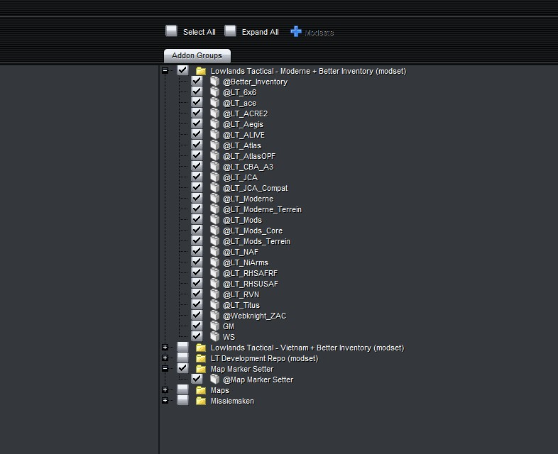
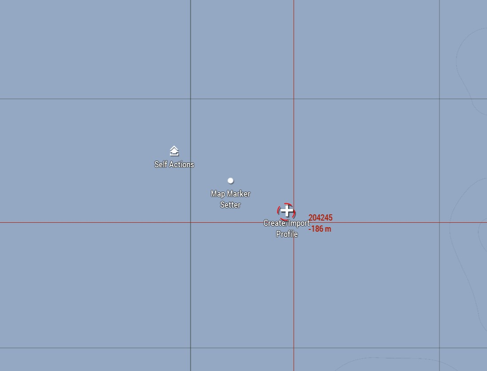
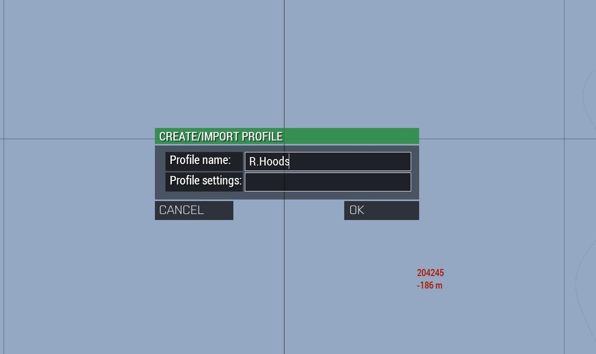
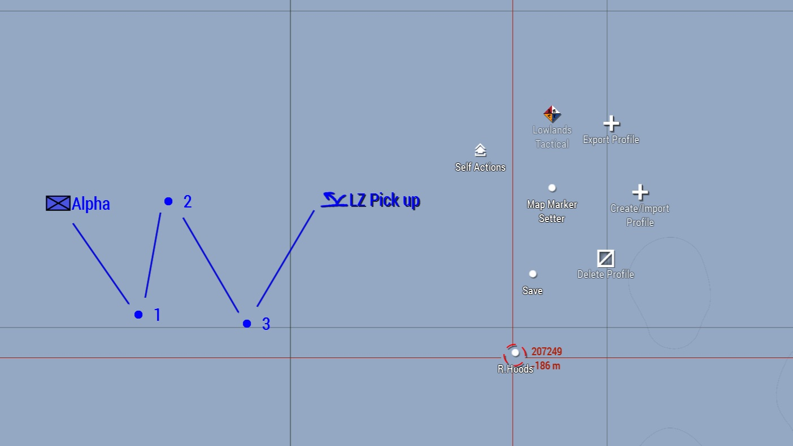
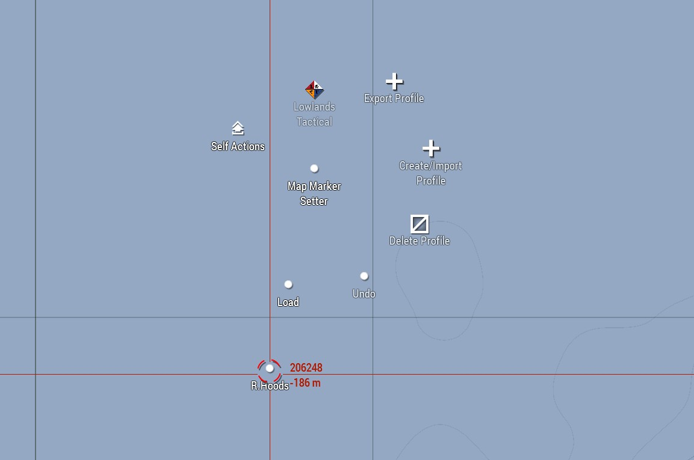
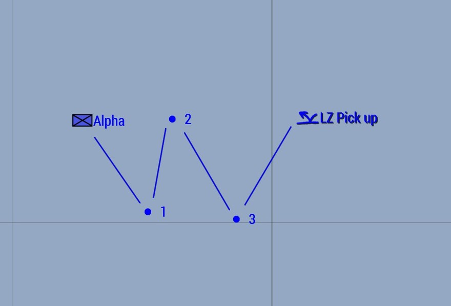

# 6.3. Map Marker Setter

    :fontawesome-solid-user: Auteur: R.Hoods | :material-calendar-plus: Aangemaakt: **14-10-2025** | :material-calendar-edit: Laatste update: n.v.t.

Map Marker Setter is een hulpmiddel voor leidinggevende rollen (voornamelijk groepscommandant) om vóór de sessie het plan alvast in te tekenen, zodat dit tijdens de sessie ingeladen kan worden.
Dit scheelt aan het begin van de sessie veel tijd en er kan aanzienlijk sneller worden overgegaan tot het briefen. De spelers zijn hierdoor sneller in actie.

## Hoe het werkt
1.  Je voegt de mod 'Map Marker Setter' toe aan de geselecteerde modset. Deze staat in '!LT_Modset_Core' onder 'LT_Mods_Optional'. Maak onder 'Addon Groups' een extra mapje aan en vink deze mee. 

2.  Je opent de map die overeenkomt met de sessie die je gaat leiden. Let op: tekeningen laden niet goed in als je op een andere map intekent!

3.  Open de map en ga via ACE self-interact naar 'Create/Import Profile'.

4.  Maak een profiel aan. Profile settings kun je leeg laten.

5.  Teken jouw plan in op de kaart.

6.  Ga naar 'Save' en selecteer het gewenste profiel (R.Hoods in het voorbeeld).

7.  Wacht nu tot het vrijdag is. Slot met elkaar en laadt de missie door.

8.  Klik aan het begin van de sessie op 'Load' en selecteer het gewenste profiel (R.Hoods in het voorbeeld).

9.  Jouw eerder gemaakte tekeningen worden nu ingeladen.

10. Aanvullend: Je kunt meerdere profielen/tekeningen voorbereiden. 'Undo' werkt alleen voor de laatst geselecteerde tekening. Een profiel weer verwijderen spreekt voor zich.