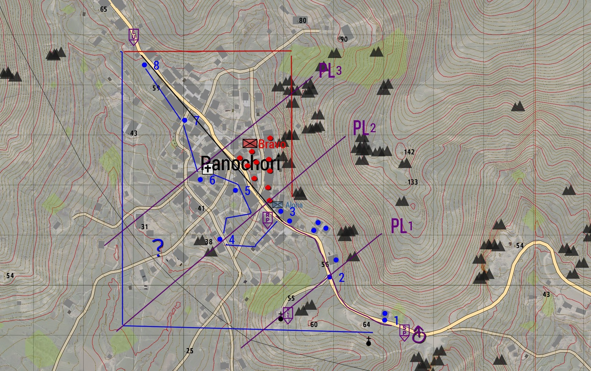

# 6.3. Vuurteamleider

    :fontawesome-solid-user: Auteur: R.Hoods | :material-calendar-plus: Aangemaakt: **12-10-2025** | :material-calendar-edit: Laatste update: **05-04-2026** door **R.Hoods**

??? info
    In deze gids leer je over de rol van vuurteamleider, oftewel VTL. De vuurteamleider is de 2IC van een vuurteaem en opereert onder het command van de groepscommandant. Deze gids geeft meer informatie over wat het betekent om de rol aan te nemen en wat de verantwoordelijkheden en verwachtingen zijn. De VTL slot wordt gezien als opstapje naar de rol van Groepscommandant. In de rol heb je wat meer leidinggevende verantwoordelijkheid dan andere rollen en stuur je soms een mini-team aan. De rol mag daarom ook zonder GC trainingsvinkje worden geslot, mits je kennis hebt over de volgende zaken en voldoet aan de voorwaarden:

    Voorwaarden om te slotten:

    -	De cursist bezit alle competenties uit de onderstaande trainingen (en de vinkjes):

        - Alle basisvaardigheden

        - Grenadier, Anti-tank en Engineer

        - Voertuigen, Fastrope en Paradrop

    -	De cursist is bekend met de onderstaande 'leiderschap' en 'planning'competenties, zodat deze vaardigheden tijdens de sessies versterkt kunnen worden.

    Leiderschap:

    -	De cursist kan kort en bondig communiceren en leiding geven. 

    -	De cursist weet sturing te geven aan het vuurteam, zonder zelf onnodig gevaar te lopen, zodat er zoveel mogelijk sturing gegeven kan worden. 

    -	De cursist kan het vuurteam laten verplaatsen in meerdere formaties en met de verschillende wapencommando’s.

    -	De cursist heeft Situational Awareness, kan adequaat inspelen op contact, behoudt helikopterview over het vuurteam, houdt het team bij elkaar en neemt lastige beslissingen onder druk.

    -	De cursist kan SITREPS en AMCAS antwoorden voor het vuurteam.

    -	De cursist blijft adequaat communiceren en valt niet stil, ook als er contact of grote stress-factoren optreden. Dit zowel op de short- als longrange radio.

    -	De cursist kan de omgeving of het terrein lezen en hier tactische keuzes op aanpassen. Waar nodig met advies aan de Peletonscommandant.

    -	De cursist kan effectief de mogelijkheden van Alive aanvragen. 

    -	De cursist kan uit zichzelf 360 graden beveiliging laten aanleggen.

    Planning:

    -	De cursist weet hoe die zich inleest en voorbereid op de sessie.

    -	De cursist kan (aanvals)plannen vertalen naar praktische handelingen voor het vuurteam. De cursist kan daarbij het terrein lezen en inspelen op mogelijke dreigingen. 

    -	De cursist kan op verschillende manier verplaatsingen voor het vuurteam organiseren.

## Competentie
Als vuurteamleider ben je deels verantwoordelijk voor het speelplezier van een vuurteam. Houd daarom de volgende zaken in je achterhoofd:

1.	Jouw stemming straalt uit naar de rest van de groep. Ben je die avond niet jezelf? Laat het dan aan een ander gekwalificeerd lid over. Hier tellen ego’s of schaamte niet. Het spelplezier van de spelers gaan voor op die van jou. 

2.	Afgetekende competentie. Dat wil zeggen dat je voldoende basiskennis hebt om de rol te proberen. 

3.	Een natuurlijke autoriteit zijn. Jij leidt een deel van het vuurteam. Jij bent een leider, maar niet de baas. Een leider geeft altijd het goede voorbeeld.

4.	Een natuurlijke rust onder stresvolle situaties. “No plan survives first contact” is niet voor niets een bekend gezegde. Bewaar je rust. Als het contact er is, luistert het vuurteam naar jouw sturing. Maak keuzes, houdt het team zo veilig mogelijk en communiceer! Houd de communicatie kort en duidelijk.

5.	Een sterk aanpassingsvermogen. Inhakend op punt 4. Je zal altijd ergens door verrast worden en staat er als vuuteamleider gelijk bovenop. Neem geen te grote risico’s. Houd alle zaken in het achterhoofd. Schiethoeken, vuurkracht, gewonden, ammo-count, afstand tot eigen troepen, ondersteuningsmogelijkheden. 

6.	Bereid te zijn om onconventionele, maar tactische besluiten te maken. Wees daarin een autoriteit. In zulke situaties is er geen tijd en ruimte voor overleg en discussie. Luister naar het command van de groepscommandant en stuur bij als jouw SA een betere route of plan geeft.

7.	Last but not least. Maak geen misbruik van je rol. Vergeet niet dat dit een spel is waar mensen eenmaal per week voor gaan zitten. Ondanks dat realisme een belangrijke factor is, zitten we niet echt in militaire dienst. Wees een leider, maar behandel mensen met respect.  

## Positie binnen een vuurteam
Als Vuurteamleider heb je de volgende positie binnen een vuurteam. In het onderstaande voorbeeld is 'Alpha' gebruikt:

**Team Alpha**
A1: Groepscommandant (Lead)
A1: Autorifleman
A1: Grenadier
A1: Medic

**A2: Vuurteamleider (2IC)**
A2: Autorifleman
A2: Anti-tank
A2: Medic

## De rol van de vuurteamleider (VTL)
De vuurteamleider is de 2IC van een vuurteam, na de Groepscommandant. Samen geef je leiding aan een vuurteam zoals Alpha of Bravo. De Groepscommandant vertaalt de (aanvals)plannen van de Peletonscommandant naar directe acties in de praktijk en is de communicatielijn naar de PC en andere eenheden. De vuurteamleider heeft hierin een ondersteunende rol. Als de Groepscommandant neer gaat, neem je de leiding over het vuurteam over. Ook stel je de PC in kennis. Ook kun je de leiding krijgen over een sub-team als het vuurteam uit elkaar moet opereren.

Elke sessie kent dezelfde opzet, fasen en afloop. Deze zijn hieronder in chronologische volgorde beschreven. Daarbij ligt het accent op de verantwoordelijkheden en werkzaamheden van de vuurteamleider. Na fases zal er nog dieper worden ingegaan op specifieke onderwerpen.

### Voorbereidingsfase – Voor de sessie

De VTL heeft kennis van de missiebriefing nodig, om tijdens de sessie adequate beslissingen te kunnen nemen. Zorg dat je vroegtijdig op de hoogte bent van alle beschikbare informatie. Zo kun je adequaat de leiding overnemen als dit nodig is.
    
    - 	Wie zijn wij als spelersgroep en welke middelen hebben we tot onze beschikking?

    -	Wie is de vijand, wat is de motivatie, welke middelen heeft de vijand tot zijn beschikking?

    -	Wat is de verwachting qua burgers in het missiegebied?

    -	Wat kan je verwachten qua terrein?

    -	Wat zijn de missiedoelen en onder welke condities zijn deze geslaagd?

    -	Welke ondersteuning heb je tot je beschikking?

### Voorbereidingsfase – Tijdens de sessie
Wanneer de PC en GC's het plan gaan voorbereiden, kun jij alvast je long-range radio goed zetten. Tevens houd je zicht op het team, totdat de GC terug is.

### Voorbereidingsfase – Briefing
De GC zal het grove plan doorbrieven aan jou en het vuurteam. Zorg dat je goed op de hoogte bent van de details van het plan en de rol van jouw vuurteam. Deze informatie heb je nodig om adequaat de leiding over te nemen, mocht het mis gaan.

### Uitvoeringsfase 
1.	Verplaatsing; De Groepscommandant organiseert de verplaatsing tussen de objectives voor jouw vuurteam.

2.	Contact; Je speelt adequaat in op contact, behoudt helikopterview, helpt het team bij elkaar te houden en neemt lastige beslissingen onder druk. Je blijft communiceren binnen en buiten het vuurteam en houdt iedereen zoveel mogelijk in veiligheid. Lap gewonden op waar mogelijk, maar     blijf het initiatief in het vuurgevecht behouden.

3.	Behoud Situational Awareness; Laat contacten uitroepen via RAD, weet waar dreiging is, hoe je het terrein tot jouw voordeel kunt gebruiken, waar jouw teamleden en andere teams zijn en hoe je jouw team zo veilig mogelijk kunt laten opereren.

4.	Plan vooruit; Zorg dat de vuurteam-specifieke taken en plannen ingetekent zijn, zodat het team effectief aangestuurd blijft met goede SA.

5.	Gevechtspauze; Laat 360 graden beveiliging aanleggen, lap gewonden op, laat rearm aan waar nodig inroepen en houd zicht op het vuurteam als de GC en PC een vervolgplan gaan maken.

6.	Start opnieuw met een verplaatsing of sluit aan in de afrondingsfase.

### Afrondingsfase – Debriefing
Cirkel up! Aan het einde van de sessie organiseert de Peletonscommandant een debriefing:

1.	Er wordt teruggeblikt. Wat ging goed? Waar was er ruimte voor verbetering? Hoe kunnen we hier op inspelen?

2.	De Groepscommandant doet voor jouw vuurteam het woord.

3.	Bepaal waar nodig focuspunten voor de volgende sessie met elkaar.

4.	De missie wordt gecalld.

### Afrondingsfase – Afsluiting staf
Na de sessie zal de staf het overnemen. De ‘Gouden Pik’ en waar nodig de ‘Lul van de week’ worden bepaald. Vanuit jouw vuurteam kun je mensen aandragen. Het missieverloop wordt via OCAP opgeslagen en is inzichtelijk voor reflectie en evaluatie. De sessie wordt afgesloten door de GC en de missiemaker te bedanken. Daarna zal de staf eventuele staf-updates of opmerkingen bespreken.

## Onderwerpen in detail
### Verplaatsing
De GC bepaalt de navigatie en route. Lees het terrein en stem hier de verplaatsing op af; Waar zit de dreiging? Waar heb je cover? Hoe zorg je voor zoveel mogelijk hard cover? Hoe minimaliseer je risico's? Hoe snel kun je verplaatsen? Hoe blijf je binnen ondersteuningsafstand van andere teams? Op de kaart kan een plan van de PC er top uitzien, maar soms blijkt in het veld dat je beter andere keuzes kan maken. Maak deze keuzes en stem ze af met de groepscommandant en andere teams.

### Contact

1.	Laat iedereen twee keer vuren op het doel. 

2.  Zorg dat de vuurteamleden knielen/liggen en 'hard cover' zoeken terwijl er voldoende vuur gegeven blijft worden.

3.  Laat de vuurteamleden contacten uitroepen via het RAD-principe; Richting – Afstand – Doel. Zo weten jij en jouw teamleden waar het contact is en vergroot dit de algemene SA.

4.  Geef door aan de groepscommandant dat je in contact bent en geef daarmee een korte SITRAP.

5.  Op basis van de beschikbare informatie ga je reageren!

    - Is er voldoende hard cover? Kan ik voordelen behalen uit het terrein of de omgeving?

    - Kan ik het contact met alleen mij eigen vuurteam aan of moet ik ondersteuining inroepen?

    - Wat is de dreiging? Moet ik een specialist inzetten zoals; grenadier, AT of engineer?
    
    - Kan ik een flankerende beweging in (laten) zetten?

    - Moeten er gewonden in veiligheid gebracht worden? Kan ik dit (laten) doen, terwijl we initiatief in het vuurgevecht houden? 

    - Hoe laat ik iedereen zo veilig mogelijk verplaatsen?

    - Met welke vuurlijnen moeten we rekening houden? Waar zijn andere teams?

Elk contact en elke situatie vraag om een eigen aanpak. Het is aan de GC en jou om de helikoptervier over het team te bewaren, te weten waar iedereen is en bij te sturen waar nodig. Zorg ervoor dat buddyparen elkaar altijd kunnen ondersteunen. Geef kort en duidelijke commando's aan het vuurteam en zie erop toe dat de taken op de juiste manier worden uitgevoerd. Probeer te voorkomen dat je zelf te veel in contact komt. Dit vergroot het risico dat je neer gaat, waardoor er minder effectieve sturing optreedt. Doorgaans loop je niet voorop, maar samen met de medic in het midden of achter.

Als de situatie verkeerd dreigt te lopen is het ook aan de jou om op tijd terug te trekken of extra ondersteuning te vragen, bijvoorbeeld wanneer de vijanddreiging te groot is of als er te veel gewonden zijn om effectief te blijven.
In dit soort gevallen gebruik je een afgesproken Rally Point en kun je waar nodig een medic post inrichten voor de triage op meerdere gewonden. Hiermee voorkom een squad wipe voor jouw team.
Let erop dat een slimme vijand gebruik maakt van het terrein of je in ‘killing zones’ te lokken.

Lees het terrein, speel in op risico’s en maak geen overhaaste beslissingen. Blijf rustig en voorkom dat je stil valt. Blijf aansturen, ook als het ingewikkeld wordt. Jouw rust en sturing helpt de teamleden die het contact aangrijpen.  

### SITREP en AMCAS
Wanneer het team is opgesplitst, is het goed om de GC op de hoogte te houden van de ontwikkelingen, zodat diegene het plan en middelen hierop af kan stemmen. Dit kan via SITREP (Situation Report) of AMCAS (Ammunition en Casualties).

SITREP: Een SITREP kun je tijdens contact geven om meer helderheid over de huidige stand van zaken.

!!! info "Bijvoorbeeld:" 
    ‘Hier SITREP Alpha 2; In contact, gebouw ingenomen noordoost zijde locatie zie kaart, .50 dreiging westen locatie onbekend, pinned down.’

AMCAS: Een AMCAS geef je doorgaans na contact op om te informeren over munitie en gewonden.

!!! info "Bijvoorbeeld:"
    ‘Hier AMCAS Alpha 2; 2 gewonden, medic is neer, ammo is geel, AT is zwart.’

### Vooruit plannen

De vuurteamleden hebben vaak geen GPS en verminderde SA. Teken de vuurteam-specifieke plannen in en vergroot daarmee de SA. Teken met jouw teamkleur.
Maak de looproute, checkpoint/nummers, doelen, zones om te clearen en dreiging duidelijk op de kaart.

### Gevechtspauze

Gevechtspauze; Laat 360 graden beveiliging aanleggen, lap gewonden op, laat rearm aan waar nodig inroepen en houd zicht op het vuurteam als de GC en PC een vervolgplan gaan maken.

1.	Na een gevecht of wanneer terugtrekken noodzakelijk is kom je bij elkaar op een afgesproken punt. De PC en GC's komen bij elkaar om de volgende fase te bespreken.

2.	Terwijl zij dit doen zorg je ervoor dat vuurteamleden een 360 uitzetten (zorg dat de verschillende dreigingshoeken/windrichtingen beveiligd worden).

3.	Laat eventuele gewonden oplappen via de medic.

4.	Resupply waar nodig. Laat het team dit gefaseerd doen, zodat er altijd vuurlijnen zijn. Maak gebruik van beschikbare kisten of voertuig inventory. Wanneer dit niet afdoende is, vraag je de GC om een resupply.

5.	Geef het aan bij de GC wanneer het team klaar is om te vertrekken.

### Alive
Via Self-interact kan de tablet van Alive worden geopend. Een trainer kan in-game toelichten hoe de tablet werkt. Afhankelijk van de missiemaker zitten hier verschillende mogelijkheden tot ondersteuning in. Het is aan de PC om deze ondersteuning in te roepen waar nodig. In sommige gevallen moet je het als vuurteamleider ook kunnen:

-	Transport heli: voertuig waarmee eigen troepen verplaatst kunnen worden via de lucht.

-	CAS: Close Air Support helikopter. Kan vuursteun geven op de aangewezen locatie.

-	Artillerie: Artillerie met verschillende munitietypen die in te roepen is op een aangewezen locatie. 

### ROE, formaties en wapencommando's
Hoofdstuk 2.2 'Reageren op contact' beschrijft uitgebreid hoe hiermee om te gaan en wat de rol van de vuurteamleider daarbij is.

## Intekenen voor het vuurteam
De grote lijnen worden door de Peletonscommandant ingetekent. De Groepscommandant doet dit voor de gehele groep. De vuurteamleider kan dit voor een sub-groep doen als het team wordt opgesplitst. Dit doe je in jouw teamkleur. Denk hierbij aan:

-   Specifieke verplaatsingsroutes

-   Specifiek aanvalsplan voor jouw teamleden

-   Eventueel nummers om zones of sectoren aan te geven

-   Geclearde gebouwen

-   Uitgeroepen dreigingen in OPFOR-kleur

**Voorbeeld:**
In onderstaande afbeelding zijn de paars-zwarte verplaatsings- en phaselijnen door de GC ingetekend. Beide teams moeten zich vanaf insertion/startpoint (SP) verplaatsen via de paarse lijn tot de release point (RP). Daar splitsen ze op en moeten ze beide eigen sectoren clearen om vervolgens op het Linkup point (LU) weer bij elkaar te komen. De Alpha vuurteamleider heeft de verplaatsingsroute via de blauwe lijn ingetekend. Daarmee is het aanvalsplan ook gelijk duidelijk, het clearen van de huizen. Middels nummers is aangegeven wanneer een volgende sector start. Het team is tot sector 3 gekomen en heeft de geclearde huizen met blauwe stippen gemarkeerd. Er zijn nog geen vijanden gezien en gemarkeerd. De vuurteamleider heeft een `?` geplaatst in een sector met meer afstand die in de gaten gehouden moet worden.

Een beschrijving van de markers die we gebruiken vind je hier: [Steam Community :: Gids :: Markersplus Usage Guide](https://steamcommunity.com/sharedfiles/filedetails/?id=3365010538)

