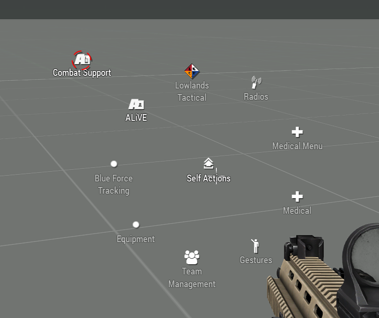
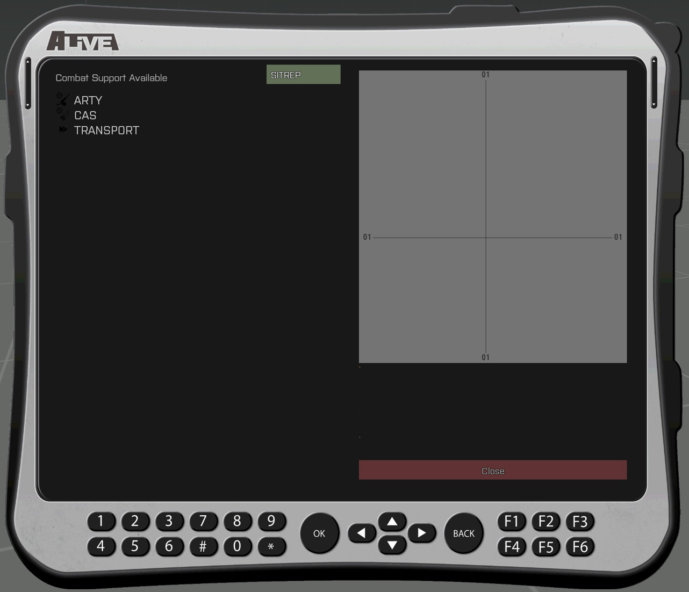
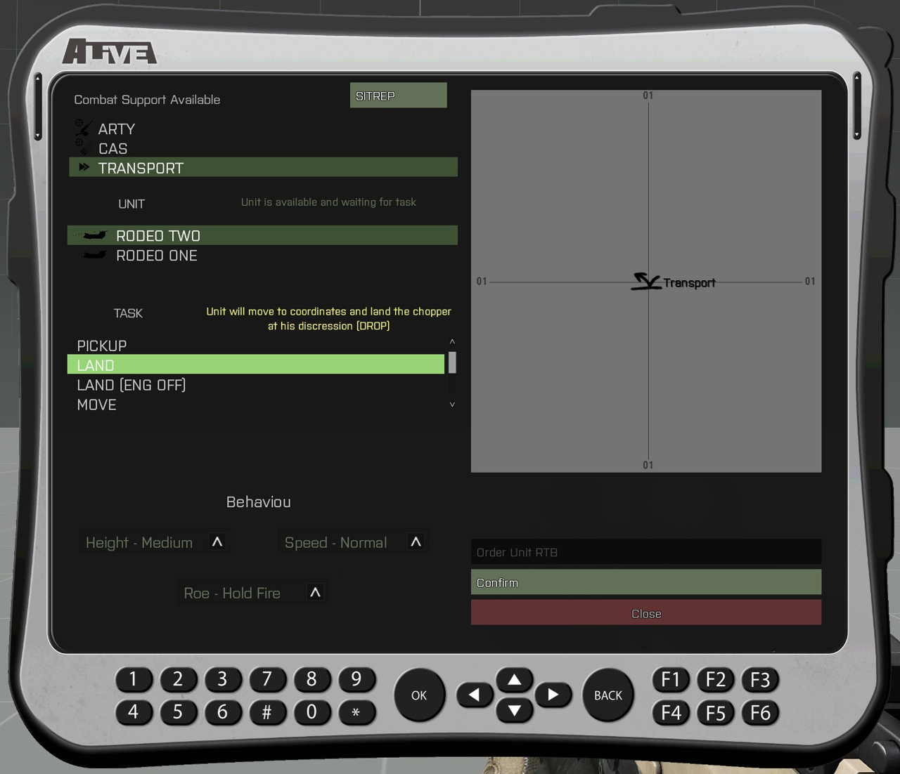
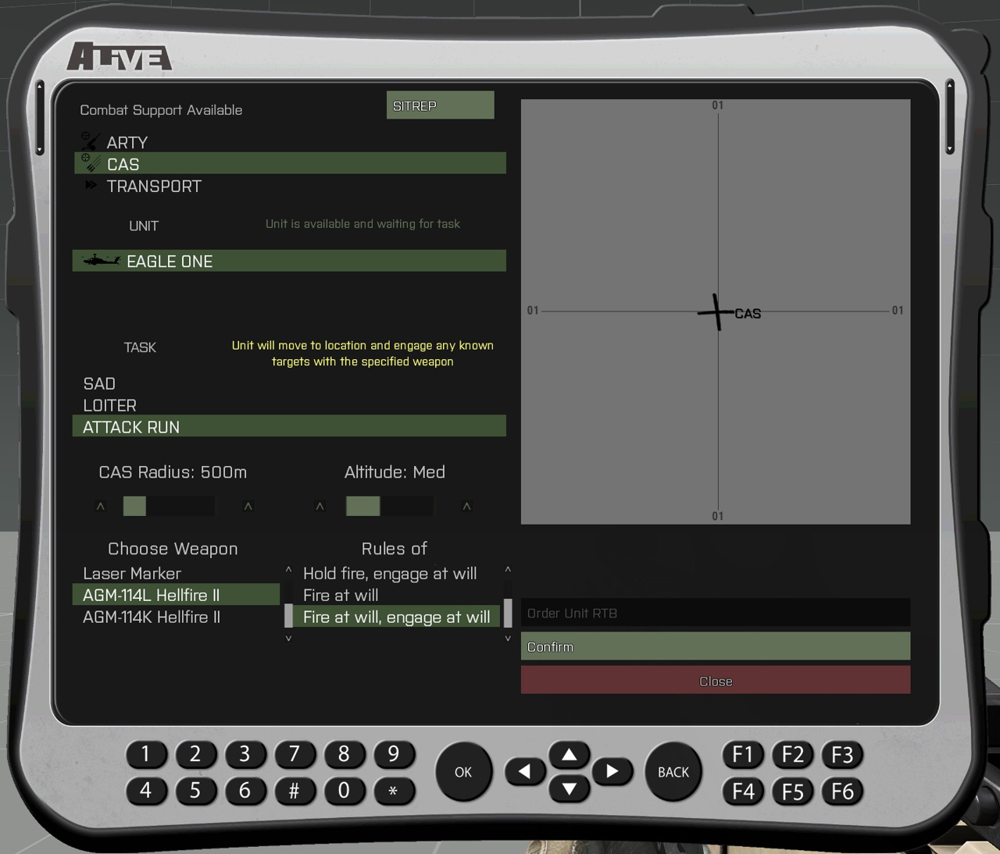
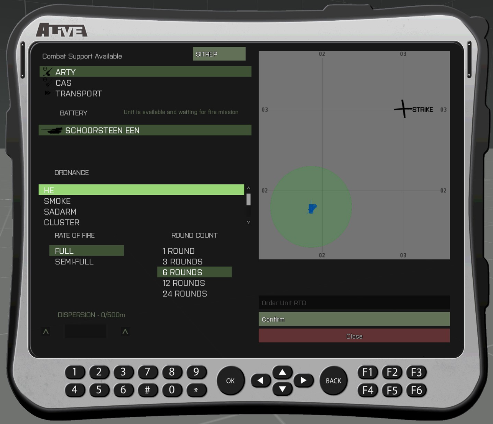

# 6.5. Alive Combat Support

Alive Combat Support een een tablet die leidinggevende rollen en de J-TAC tot hun beschikking hebben. Via de tablet kunnen verschillende AI gestuurde ondersteuningseenheden inroepen:

- Transport helikopters
- Close Air Support (CAS) helikopter
- Artillerie

De missiemaker bepaalt welke eventuele ondersteuning passend is binnen het scenario en kan besluiten om modules aan te passen of te verwijderen. De missiemaker kan ook de soort unit aanpassenin in de module. De beschikbare assets worden in de missiebriefing weergegeven.

## Hoe het werkt

Allereerst open je de tablet via ACE self-interact. Kies voor Alive en daarna Combat Support.

Je krijgt nu het volgende menu te zien. Hier kun je een keuze maken tussen de beschikbare support units en de tablet weer sluiten via 'Close'. 

## Transport Helikopters

1. Kies de unit die je wil inzetten.
2. Selecteer een locatie op de kaart in het rechter venster.
3. Selecteer de taak:
    - Pickup - (Unit vliegt naar locatie, wacht op smoke die jij popt + een bevestiging via de tablet en zal daarna landen)
    - Land - (Unit vliegt naar locatie en zal de heli landen met wieken aan)
    - Land (ENG OFF) - (Unit vliegt naar locatie en zal de heli landen met wieken uit)
    - Move - (Unit vliegt naar de locatie en blijft daar hangen in de lucht)
    - Circle - (Unit vliegt naar de locatie en zal daar rondvliegen binnen de aangegeven radius)
    - Insertion - (Unit vliegt naar de locatie en zal daar stil in de lucht hangen op de aangegeven hoogte voor een fast rope instertion)
    - Onder Unit RTB - (Unit vliegt terug naar de positie van de module en zal daar landen met wieken uit)
4. Selecteer het gedrag zoals hoogte, snelheid en ROE.
5. Druk op "Confirm".

## Close Air Support (CAS) Helikopter

1. Kies de unit die je wil inzetten.
2. Selecteer een locatie op de kaart in het rechter venster.
3. Selecteer de taak:
    - SAD - (Unit vliegt naar locatie en zal alle gemarkeerde doelen gaan aangrijpen)
    - Loiter - (Unit vliegt naar locatie en zal daar rondvliegen zonder doelen aan te grijpen)
    - Attack Run - (Unit vliegt naar locatie en zal bekende doelen aangrijpen met het geselecteerde wapensysteem)
4. Vul de opdracht-specifieke gegevens in.
5. Druk op "Confirm".

## Artillerie

1. Kies de unit die je wil inzetten.
2. Selecteer een locatie op de kaart in het rechter venster. *Let op!* Binnen de groene cirkel kun je NIET vuren, omdat dit te dichtbij het vuurplatform is.
3. Selecteer het munitietype.
4. Selecteer de vuursnelheid.
5. Selecteer het aantal schoten.
6. Selecteer de spreiding van de schoten.
7. Druk op "Confirm".

