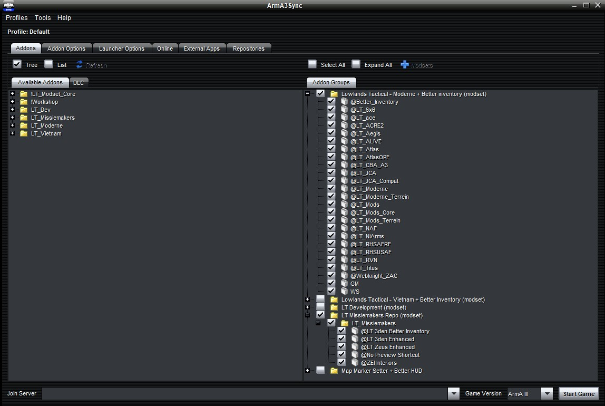

# 7.2. Missiemaker repo

    :fontawesome-solid-user: Auteur: **R.Hoods** | :material-calendar-plus: Aangemaakt: **06-04-2026** | :material-calendar-edit: Laatste update: 06-04-2026 door R.Hoods

## Missiemaker repositorie
Op Arma3sync is er voor missiemakers een aparte repositorie gemaakt (LT Missiemakers Repo). Hierin zitten handige tools voor missiemaken.
In de Discord 'Helpdesk' onder 'Repo's' staat de autoconfig die je nodig hebt om de repo binnen te halen.
Vervolgens start je Arma 3 op met de modset waarin je gaat bouwen + de missiemakers repo.
Hieronder een voorbeeld voor de moderne repo + missiemakers repo:

## Inhoud
De inhoud van de repo wordt nog wel eens aangepast, maar denk aan tools als:

- 3den Enhanced (o.a. uitbreiding van de missiemaker tools onder attributes van units/voertuigen)
- Zeus Enhanced (uitbreiding van Zeus mogelijkheden)
- ZEI Interiors (gemakkelijker gebouwen vullen met PAX of spullen)

## Dependencies
De missiemaker repo laat dependencies achter in je missie. Je kan de missie alleen aanpassen als de missiemaker repo ^^AAN^^ staat. Als je dit niet doet, dan bestaat de kans dat je de repo specifieke instellingen verliest!
Als je jouw missie op de server gaat testen, zet dan ^^**alleen**^^ de bijbehorende repo aan (zoals 'Moderne').