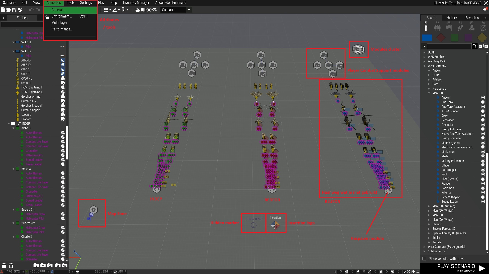
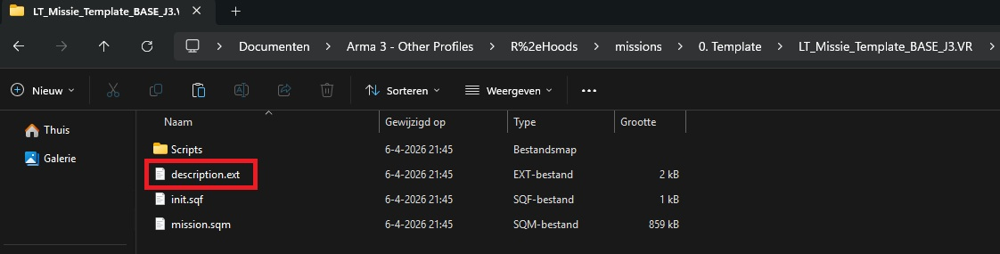

# 7.3. Scenario Eisen

    :fontawesome-solid-user: Auteur: **R.Hoods** | :material-calendar-plus: Aangemaakt: **26-08-2025** | :material-calendar-edit: Laatste update: 06-04-2026 door R.Hoods

## Eisen voor een missie
LowTac stelt redelijk hoge eisen aan onze missies/scenario's. Het speelplezier van alle leden hangt hier natuurlijk van af.
We vinden het belangrijk dat de basis van elke missie op dezelfde manier is opgebouwd en dat de missie technisch in orde is. Hierdoor is de kans op storingen zo klein mogelijk en kan de sessie snel van start gaan. Dit bevordert het speelplezier.
Een LowTac missie moet voldoen aan de volgende eisen:

### Missie benaming en versienummering
Bij het aanmaken van een missie is de naam en versienummering erg belangrijk. Hierdoor kan staff de scenario's en versies goed uit elkaar houden.

- Zorg dat de naam en versie op twee plekken in orde is:
    - Naam van de folder in de map 'missions'
    - Naam in de editor onder 'Attributes'
- De naam van de folder mag geen spaties bevatten. Gebruik in plaats daarvan een underscore `_`.
- De opbouw van een missienaam is altijd gelijk. We beginnen met LT van Lowlands Tactical, daarna de soort missie afkorting, de missienaam en het versienummer. Bijvoorbeeld `LTOP_Missienaam_v0`.
    - OP staat voor een vrijdagavond cooperatief scenario (player versus AI).
    - OPC staat voor een vrijdagavond cooperatief scenario (player versus AI), maar dan een campaign. Dit zijn meerdere opeenvolgende delen die meerdere weken achter elkaar gespeeld moeten worden.
    - PD staat voor 'PermaDeath' scenario. Dit is een kort warming up scenario met een hoge moeilijkheidsgraad en bevat geen respawns.
    - FUN gebruiken we voor Zeus scenarios of FUN scenario's
    - TR staat voor 'Trainingscenario'. Deze missies zijn speciaal gemaakt om skills te trainen.
- De versienummering begint altijd met een 'v' van versie en vervolgens het nummer. Elke keer wanneer je een nieuwe versie op de server moet zetten om te testen, pas je de versienummering aan naar boven; v0 > v1 > v2. Dit doe je in de **folder naam** en bij de missie naam onder **attributes**.
- Wanneer je een campaign maakt, zorg dan dat de benamingen er als volgt uitzien:
    1. `LTOPC_campaignnaam_01_missienaam_v0`
    2. `LTOPC_campaignnaam_02_missienaam_v0`
    3. `LTOPC_campaignnaam_03_missienaam_v0`

### Gebruik de template / ORBAT
LowTac heeft een eigen missie template en ORBAT. Deze zijn te vinden op onze github (link rechts onderaan deze pagina).
Door de template worden alle LowTac specifieke zaken ingeladen zoals; wapens, gear, missieinformatie, markers, vulling van kisten en voertuigen, etc.
De ORBAT oftewel gevechtorde bepaalt welke sloten er gekozen kunnen worden door de spelers.

- Haal na het aanmaken van de missiefolder (in de editor) de factions uit de missie die je niet gebruikt.
- Als missiemaker heb je de vrijheid om sommige units uit de ORBAT te verwijderen. Voorbeeld: Gebruik je geen voertuigen? Haal ze eruit. OF Laat het scenario een MMG/MAT team niet toe? Haal ze eruit.
- Gebruik zoveel mogelijk pre-made vulling voor kisten en voertuigen. In de template staat er per team een 'Squadkist'. Hier zit voor één team resupply spullen in. De 'Peletonskist' geeft de groep mogelijkheid tot zwaardere wapens en specialistische spullen. Je hebt de volgende mogelijkheden:
    - Peleton Ammocrate (specialistische wapens en spullen voor de gehele groep)
    - Squad Ammocrate (resupply voor één squad)
    - Small Ammocrate (voertuig inventory)
    - Medium Ammocrate (voertuig inventory)
    - Large Ammocrate (voertuig inventory)
    - Expolives Crate (krat met explosieven)
    - Mine Crate (krat met mijnen)
    - Medical Crate (krat met medische spullen)
    - Weapons Crate (krat met alle beschikbare wapens, zoals samengesteld)
    - NVG Crate (krat met night vision, flares en IR strobes)
    - Communication Crate (krat met maps, GPS, radio's)
    - Aircrew Ammocrate (2 tassen met aircrew gear)
    - UAV Crate (krat met spullen voor de J-TAC)
- Insertion logo: Plaats dit logo op de plaats waar we met de groep starten.
- Respawn position module: Plaats deze module bij de base/insertion. Vul zelf aan met extra respawn punten of een mobiele respawn op een voertuig.
- 'UITLEG TEKST': Dit zijn hidden markers ('System' > 'Empty') die alleen de zeus kan zien. Leg met deze markers uit waar bijzonderheden in jouw missie zitten, zoals triggers en de manier waarop deze af gaan.
- Player Combat Support modules: Deze modules kun je gebruiken of verwijderen. Het zijn Alive modules die AI gestuurde voertuigen genereren. Standaar staan er:
    - Twee transport helikopters
    - Eén CAS helikopter
    - Eén artilleriestuk (3 voertuigen)
- Modules cluster: In de hoek van de map staat aan cluster modules. Deze laat je staan. De twee 'Create Diary Record' modules vul je met de missiebriefing. Dit wordt later verder uitgelegd.
- Map zone: Met de trigger geef je aan in welk gebied de spelers mogen komen. Het gebied buiten de trigger wordt donker gemaakt bij spelers.

### Pas de 'description.ext' folder aan
In de folder van jouw missie vind je het bestand 'description.ext'. Dit bestand bevat een aantal parameters die door de missiemaker aangepast moeten worden. Deze corresponderen met de waarden uit de [Lowlands Tactical - Database](https://1drv.ms/x/s!AsNeKjX9qHZFhGHxOqZeBxqJJwtA?e=uA6DE1) op het tabblad 'Missie parameter settings NAF'. Door de juiste nummers in te vullen, geef je pre-made wapens, gear, radio's, NVG, attachments, scopes en de missie timer mee. Er kan ook gekozen worden voor customgear of custom weapons. Je dient dan zelf de volledige gear/wapenset bij elkaar te klikken. Vraag een ervaren missiemaker hierbij om hulp. 

De nummers uit het onderstaande rijtje kunnen aangepast worden:

    // Pre defined names to change params
    #define BLUE_GEAR 13
    #define BLUE_WEAPON 8
    #define RED_GEAR 2
    #define RED_WEAPON 2
    #define GREEN_GEAR 3
    #define GREEN_WEAPON 3
    #define SHORT_RADIO 0
    #define LONG_RADIO 0
    #define GEAR_NVG 0
    #define WEAPON_ATT 5
    #define WEAPON_SCOPE 1
    #define MISSION_TIMER 1

### Attributes vullen in de editor
De 'Attributes' van elke missie moeten gevuld worden. Attributes vind je in de bovenste balk van de editor en bestaat uit 4 delen: General | Environment | Multiplayer | Performance. Veel staat al ingesteld. Je moet zelf nog het volgende regelen:

- General: Titel invullen | Jouw naam bij auteur | Meme bij loading screen | Independents Allegiance (wie INDEP aanvalt)
- Environment: Maak het hier dag/nacht, pas eventueel weerverwachtingen aan.
- Multiplayer: Geef bij 'Summary' aan welke specifieke sloten benodigd zijn.

### Tools
Je kunt gebruik maken van enkele 'Tools':

- Lobby Manager: Sla altijd je missie eerst op voordat je deze tool gebruikt!! Met de Lobby Manager kun je de ORBAT herinrichten, mocht deze door de war raken.
- Deformer: Een tool die je kan gebruiken om kleine aanpassingen te doen in het landschap.

### Scenario Eisen
We houden de volgende overige eisen aan waar een staflid jouw missie ook op zal testen:

- De meest recente versie van het Template en de ORBAT worden gebruikt.
- De geselecteerde weapon en gearsets (description.ext) is in orde.
- Er zijn maximaal 200 units tegelijkertijd actief in de missie (zie: `count AllUnits`).
- Er zijn geen script errors.
- De missie is niet van Zeus afhankelijk. We kunnen er niet vanuit gaan dat de missie maker er altijd is bij het spelen van de missie.
- De twee modules 'Create Diary Record' zijn volledig gevuld met de missiebriefing (Situation en Mission). Het template hiervoor staat in de modules.
- De Insertion is aangegeven.
- Bijzonderheden in de missie en hoe de triggers werken wordt aangegeven met 'UITLEG TEKST' markers (hidden markers).
- De Peletons en Squad kisten staan bij de Insertion als het missiescenario dit toelaat.
- De beschikbare kisten/voertuigen zijn gevuld waar nodig en hebben doordacht wel/geen respawn.
- De respawns zijn in orde, waardoor spelers die dood gaan relatief dicht bij de frontlinie kunnen respawnen.
- De missie is natuurlijk goed gevuld. Er zijn zo min mogelijk loze momenten en/of lange reistijd waardoor de missie niet als 'saai' aanvoelt.
- Routes/patrouilles zijn gecontroleerd waardoor er zo min mogelijk glitches zijn.
- De missie is gebalanceerd en afgestemd op het missie idee. De wapens/voertuigen van LowTac zijn in balans met die van de AI.
- De Objectives zijn goed gevuld. Ga hierbij uit van een gemiddelde van 15 spelers op vrijdagavond (+3/-3)
- Wanneer er veel objecten worden gebruikt, wordt alles waar geen interactie mee is gezet op 'Simple object' of de 'Simulation/damage' vinkjes worden uitgezet. Dit scheelt capaciteit op de server.
- De missie is te spelen in 2.5 à 3 uur. We starten om 20.00 uur en de eindtijd is tussen 22.30 en 23.00 uur. 
- Laat de missie niet te liniair aanvoelen. Geef de PC de mogelijkheid om een zelf gekozen plan te maken, zonder dat alles van tevoren is bepaald. Verwacht dat routes genomen worden die je zelf nooit had bedacht.

## Testen van de missie
LowTac missie worden uitvoerig getest, zodat de kans op errors zo klein mogelijk is.

1. Test als missiemaker jouw eigen missie lokaal. Dit doe je in de editor via 'Play' > 'Play in multiplayer (MP)'. Zorg dat alles lokaal zo goed mogelijk werkt!
2. Push de missie naar MP door er een `pbo` bestand van te maken. Dit doe je in de editor via 'Scenario' > 'Multiplayer' > 'Export to multiplayer'. In je MPMissions folder vind je nu het PBO bestand terug. Pas de versie aan naar V1.
3. Test zelf de missie op de server. Vraag aan een staflid hoe je dit zelfstandig kunt doen. Via 'Filezilla' kun je jouw missie op de server zetten. In de Discord 'Helpdesk' onder 'Missiemaker FTP' staat hoe je dit doet.
4. Maak waar nodig zelfstandig aanpassingen, pas de versienummering aan en doe dit net zo lang tot je helemaal tevreden bent.
5. Vraag een staflid om de missie samen af te testen. Het staflid zal alle zaken uitvoerig (stress)testen. Waar nodig doe jij nog aanpassingen in een nieuwe versie. Als het staflid groen licht geeft kan de missie gespeeld worden.