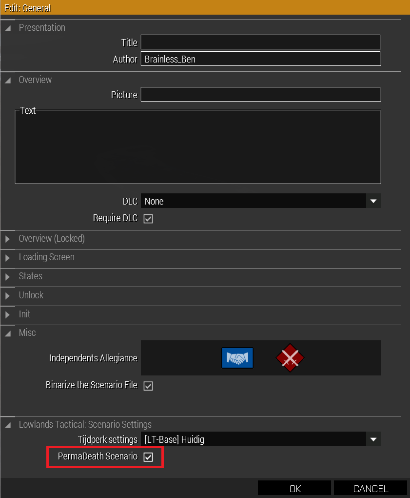
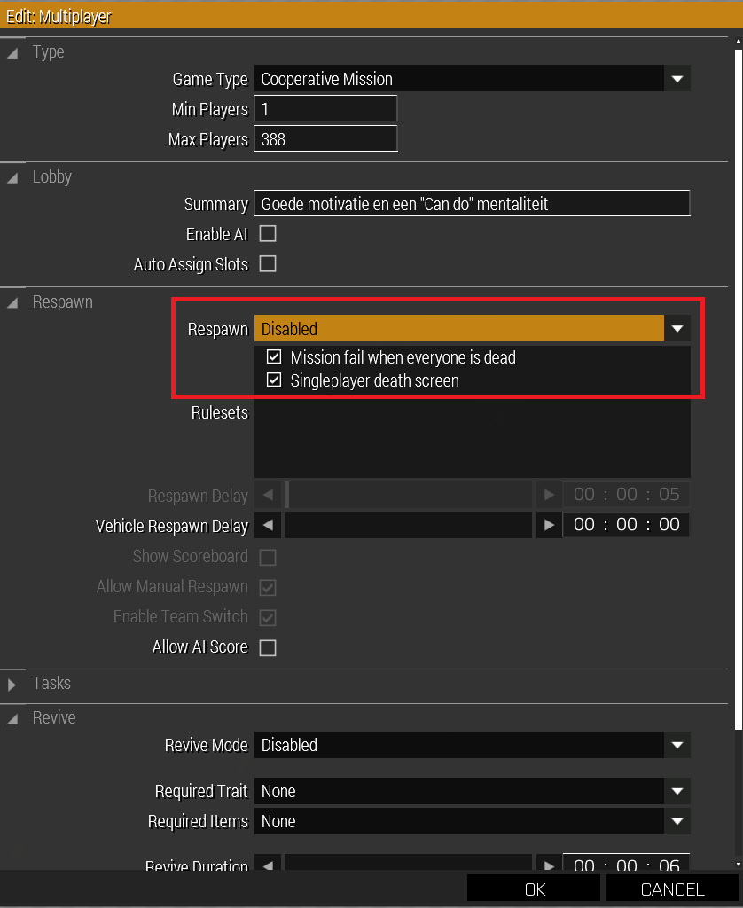

# 7.4. Tips en Tricks

    :fontawesome-solid-user: Auteur: **R.Hoods** | :material-calendar-plus: Aangemaakt: **26-08-2025** | :material-calendar-edit: Laatste update: **06-04-2026** door **R.Hoods**

## Missiemakers kanaal - Discord
Op Discord is een speciaal kanaal aangemaakt voor missiemakers. Als missiemaker heb je hiervoor aparte rechten. Veel dingen die je wil maken, zijn in het verleden al door een ander gemaakt.
Je hoeft het wiel niet opnieuw uit te vinden. Gebruik het kanaal om tips te vragen als je ergens niet uitkomt of om een script te delen die je nodig hebt.
We bouwen allemaal voor LowTac en het speelplezier. Gebruik elkaars hulp!

## PermaDeath (PD) aanmaken
Om een PermaDeath (PD) scenario te maken, moet je aantal dingen goed zetten:

1. Zet het PD vinkje aan bij 'Attributes' > 'Multiplayer' > 'Lowlands Tactical' > 'Scenario Settings' > Vinkje 'PermaDeath Scenario AAN'

2. Disable Respawn en zet de vinkje 'Mission fail when everyone is dead' en 'Singleplayer death screen' AAN via Attributes > Multiplayer > Respawn.

