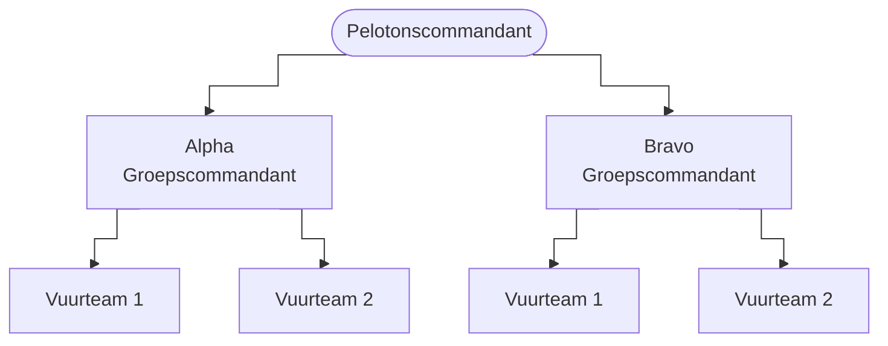

# Mermaid Diagram Setup

## Boilerplate

Every diagram starts with the `%%{init}%%` directive for step-style edges:

````markdown

````

`TD` = top-down. `LR` = left-to-right.

---

## Node shapes

| Syntax | Shape |
|--------|-------|
| `A[Text]` | Rectangle |
| `A(Text)` | Rounded rectangle |
| `A([Text])` | Stadium/pill |
| `A{Text}` | Diamond (decision) |
| `A((Text))` | Circle |

---

## Edges

| Syntax | Result |
|--------|--------|
| `A --> B` | Arrow |
| `A -- Label --> B` | Arrow with label |
| `A --- B` | Line, no arrow |

---

## Image nodes (Mermaid v11)

Use `@{ }` syntax on a node:

```
A@{ img: "/path/to/image.png", label: "Caption", w: 80, h: 80, pos: "t" }
```

| Property | Description |
|----------|-------------|
| `img` | URL of image — must be root-relative or absolute |
| `label` | Text below/above the image |
| `w` / `h` | Width / height in pixels |
| `pos` | Label position: `"t"` (top) or `"b"` (bottom) |

### Image URL paths

Images in `docs/` are served from the site root. Example:

| File on disk | URL to use in diagram |
|---|---|
| `docs/2_basisvaardigheden/img/foo.jpg` | `/2_basisvaardigheden/img/foo.jpg` |
| `docs/img/lt_logo.png` | `/img/lt_logo.png` |

### Full example with image node

````markdown
```mermaid
%%{init: {"flowchart": {"curve": "step"}}}%%
flowchart TD
    PC@{ img: "/img/lt_logo.png", label: "Pelotonscommandant", w: 60, h: 60, pos: "b" }
    PC --> A["Alpha\nGroepscommandant"]
    PC --> B["Bravo\nGroepscommandant"]
```
````

---

## Multi-line text in nodes

Use `\n` inside the quotes:

```
A["Regel één\nRegel twee\nRegel drie"]
```

---

## Decision branching

```
A{Vraag?} -- Ja --> B[Actie]
A -- Nee --> C[Stop]
```

---

## Full working example (ORBAT-style)

````markdown

````
